# Checking running process with management command

## Here is the command and below its output -- `ps, ps aux, top, htop, pgrep`
The ps (short for process status) command is a fundamental Linux utility used to display a static snapshot of the currently active processes on your system

## `ps` and `ps aux` output
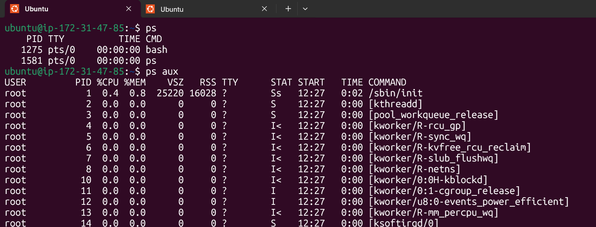

## `Top` Command Output
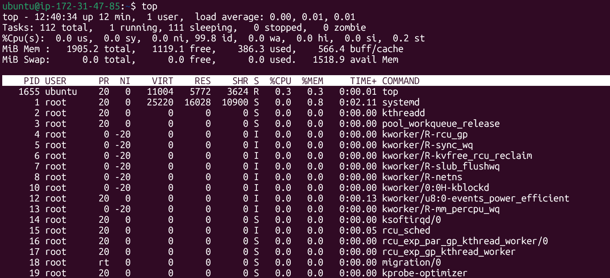

## `htop` output
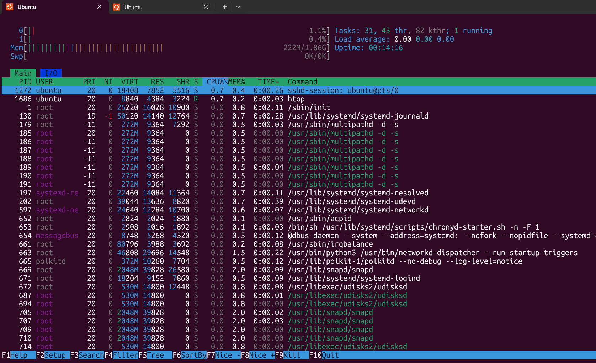

## `pgrep systemd` output

The pgrep command is a command-line utility in Linux used to search for running processes and return their Process IDs (PIDs) based on specific criteria like names, users, or other attributes

Unlike the standard ps | grep pipeline, pgrep is purpose-built to return just the PIDs, making it cleaner for use in shell scripts.

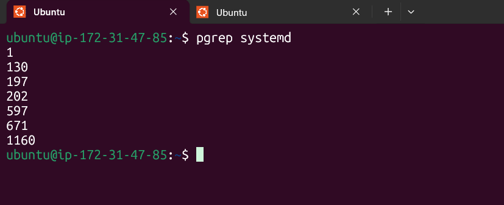

# Inspect one systemd service

## with `systemctl status nginx.service`, cheking nginx process and status 

 the systemctl command is the primary tool used to control and inspect the systemd system and service manager. It serves as the modern standard for managing background processes (daemons), system states, and boot-time behavior across most major distributions like Ubuntu, Fedora, and Debian

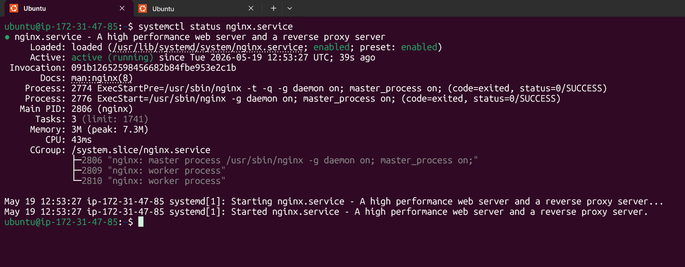

## `systemctl status`
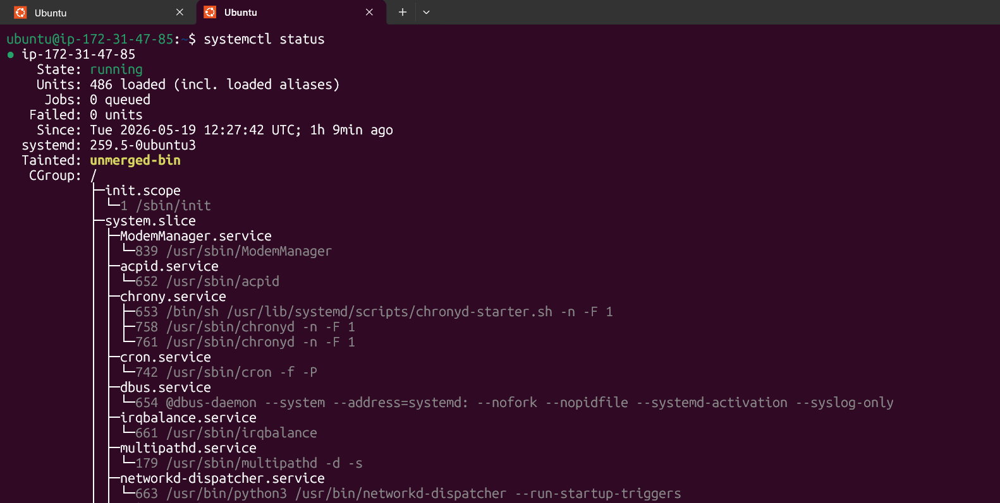

## `systemctl status | head -n 25`
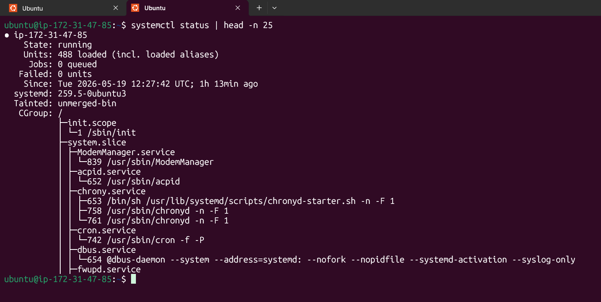

## `df -h`
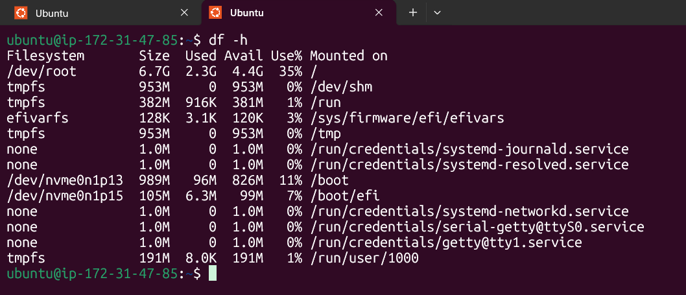

## `head` command `systemctl list-units | head -n 10`

The head command is a command-line utility in Unix-like operating systems (such as Linux and macOS) used to display the first part of a file or data stream

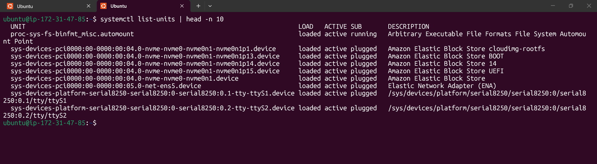

## `tail' command `systemctl list-units | tail -n 20`

The tail command is a command-line utility used to display the final part (the "tail") of one or more files or piped data. By default, it outputs the last 10 lines of the specified file

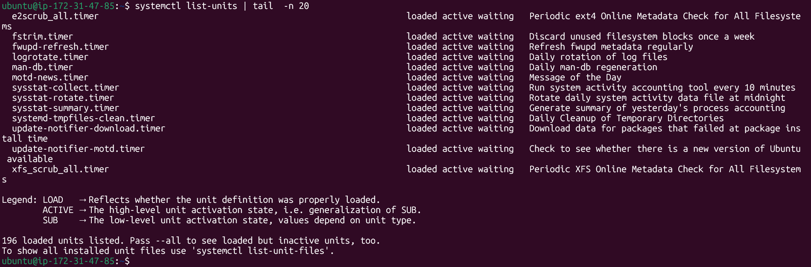

## SSH daemon is actively running and listening for connections using systemctl
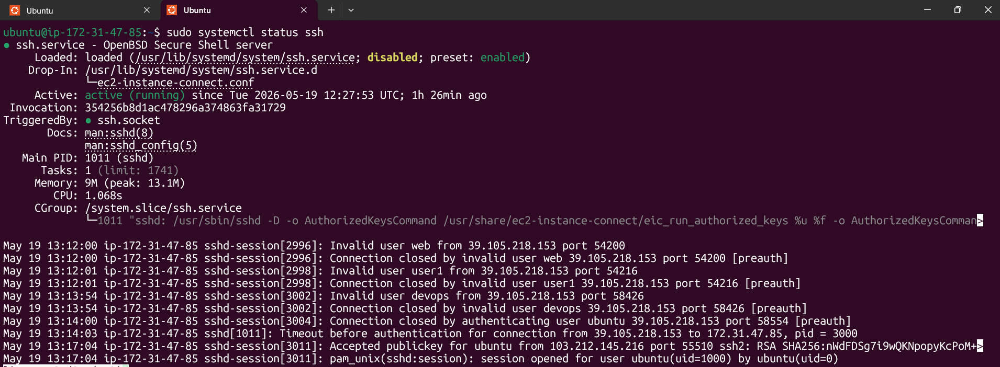

# Process Check
`ps` 
`ps aux`
`top `
`htop`
`pgrep`
`kill`
`kill -9`

# Service Check

## check service -- `systemctl status "service-name"`

## Start Service --	`systemctl start "service-name"`

## Stop Service -- `systemctl stop "service-name"`

## Restart Service -- `systemctl restart "service-name"`

## List of All service -- `systemctl list-units -- type=service` or `sudo systemctl list-units --type=service --all`

# Log checks
## steps is check log of any service --> go to `var/log/service_name/` --> `cat file.log` and read
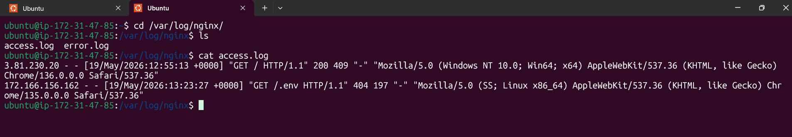

# Mini troubleshooting steps

## suppose here i'm getting issue with nginx then i will check status of service with `systemctl command` then --> if get any stop or any issue next --> restart that service.

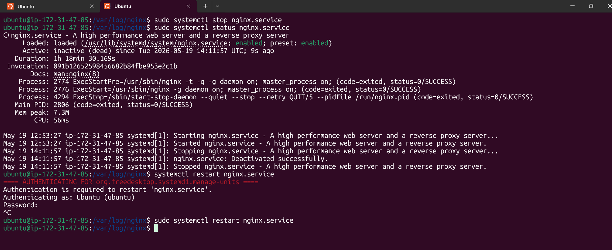