# Runbook assingment over SSH

### Troubleshooting steps for ssh if it goes down

# Enviroment basics:

### command `uname -a`
## Output:
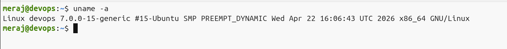

### command `lsb_release -a`
## Output:
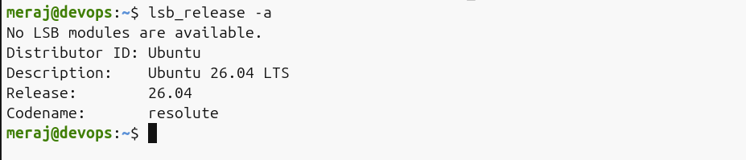

### command `cat /et/os-release`
## Output:
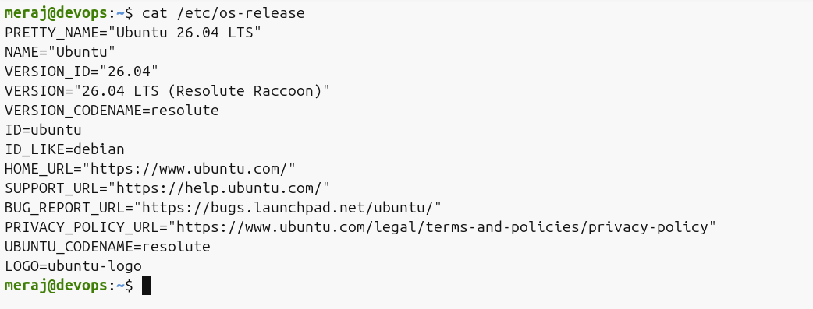

# Filesystem sanity:

### Step1: Create dir = `mkdir /tmp/runbook-demo`
### Step2: Copy Host file to path=`/tmp/runbook-demo`
### Step3: list the Copy host file or can we read that host file without touch main file.

## Output
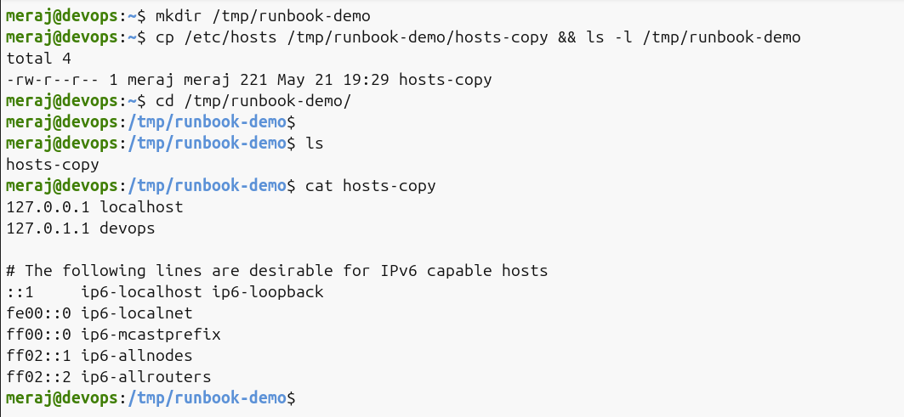

# CPU / Memory

### for checking running process of RAM & CPU:
- Command: `top`, `htop`

### Output of first 10 Lines `top` command:
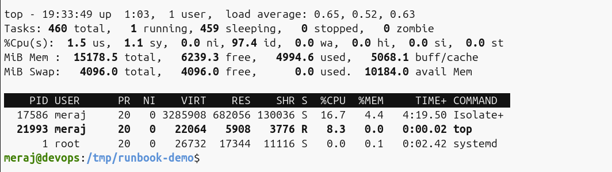

## Output of first 10 Lines `htop` command, before run htop need to install it in linux and press q for exit:
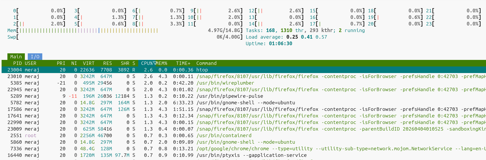

### Taking snapshot of memory, cpu, RAM etc:
## Output of Command `ps -o pid`, `ps -o pcpu`, `ps -o pmem`:
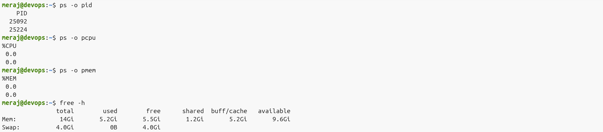

# Disk / IO

### Disk Usage and Input/Output Statistics(iostat), Virtual Memory Statistics(vmstat), and real-time system resource monitoring (dstat)

## Output of `df -h` `du -sh /var/log` `iostat` `vmstat` `dstat`
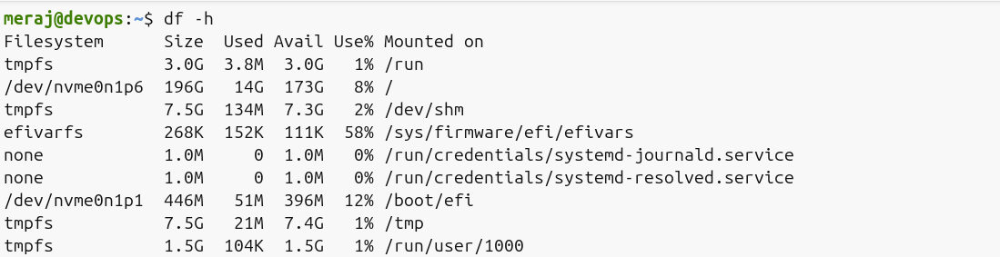

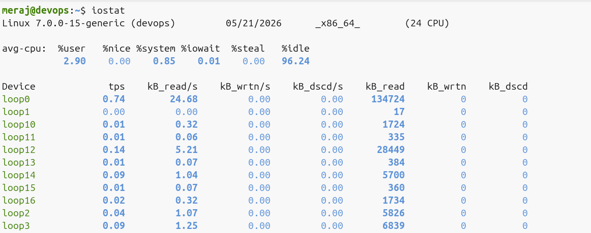
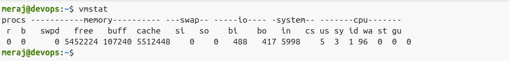
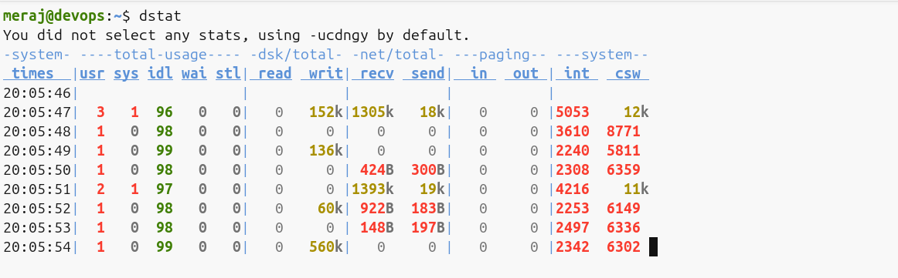

# Network
### Few networking Command that is showing system information about network bandwidth and interface configuration

## Output of Command `ss -tulpn/netstat`, `curl -I <service-endpoint>`, `ping`
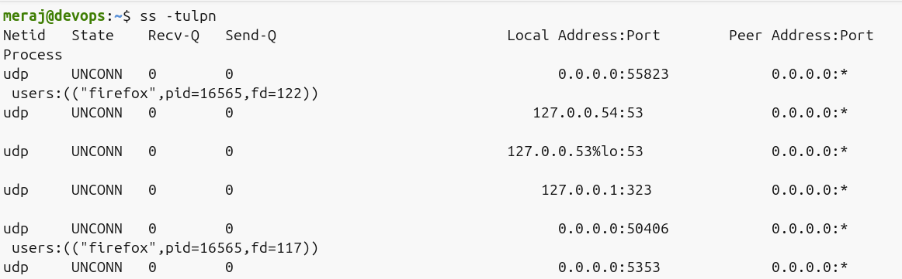
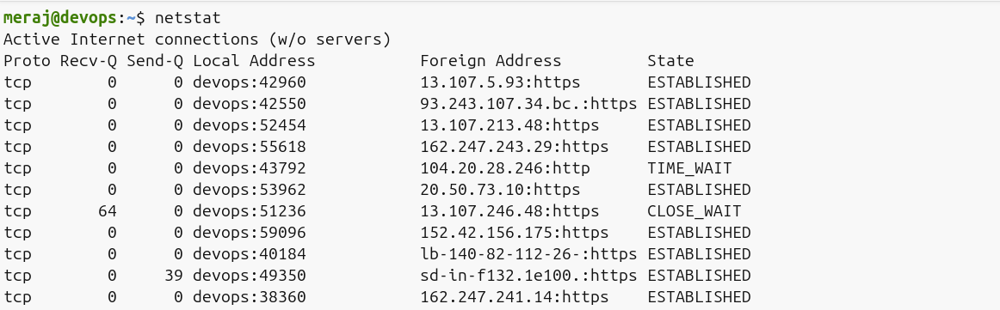
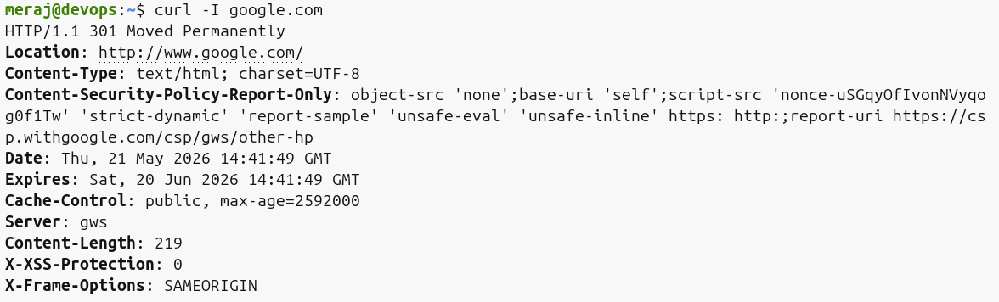

# Logs

### Here is few command that will help to find out service logs `journalctl -u <service> -n 50, tail -n 50 /var/log/<file>.log`

## Output
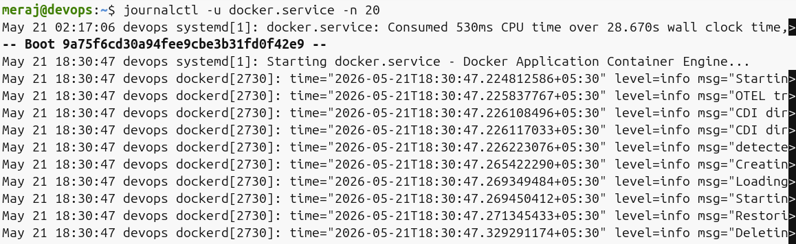
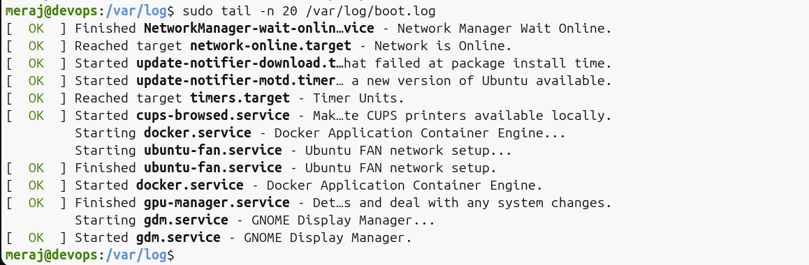