# Day 09 – Linux User & Group Management Challenge

--- 

# Task 1: Create Users
## Create three users with home directories and passwords:

- tokyo
- berlin
- professor

## verifying user has created (Verify: Check /etc/passwd and /home/ directory)
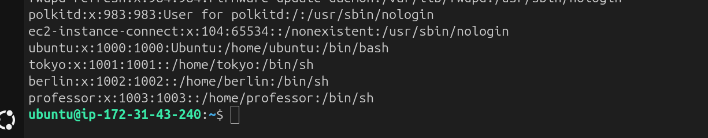

---

## Other user dir getting error because it has not any permission to ubuntu but access with sudo
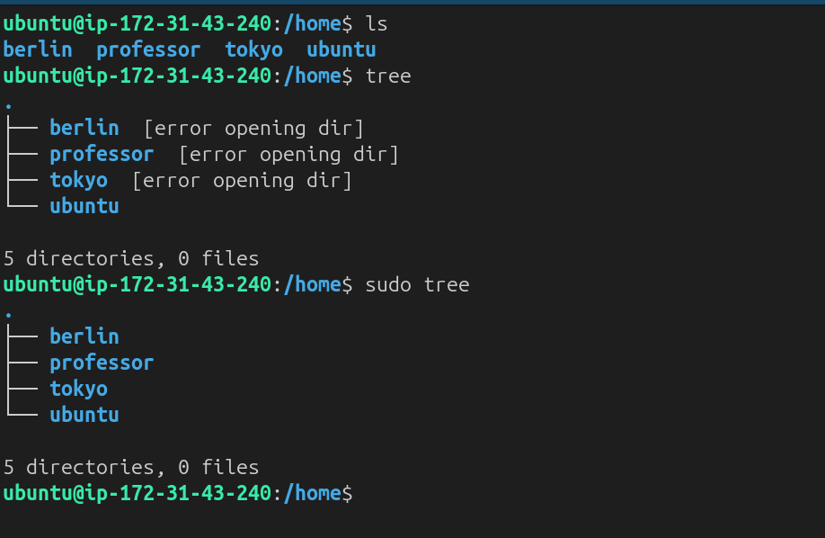

---

# Task 2: Create Groups

## Createting two groups:

- developers
- admin

---

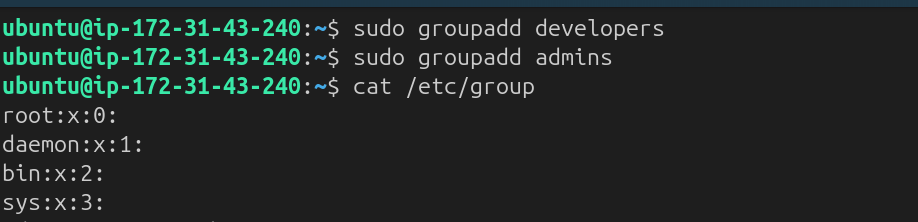
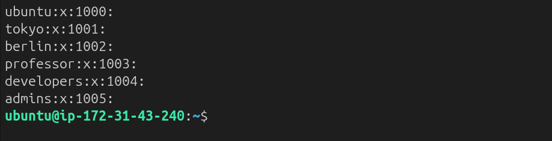

---

# Task 3: Assign to Groups

---

Assign users:
- `tokyo` → `developers`
- `berlin` → `developers` + `admins` (both groups)
- `professor` → `admins`

---

## Here we can see how to add users in groups

---

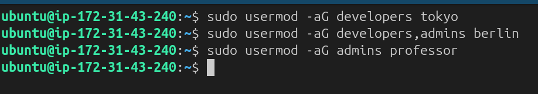

---

## Here we can see users groups:

---

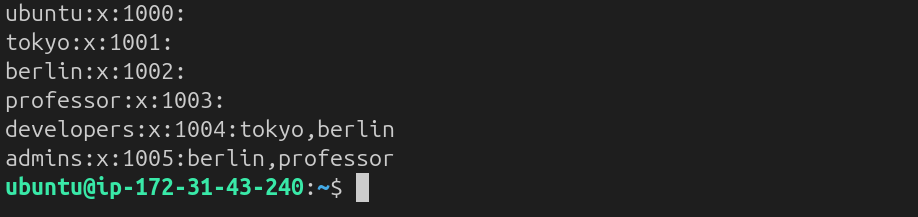

--- 

# Task 4: Shared Directory

## Create dir and assign to developers group

1. Create directory: `/opt/dev-project`
2. Set group owner to `developers`
3. Set permissions to `775` (rwxrwxr-x)
4. Test by creating files as `tokyo` and `berlin`

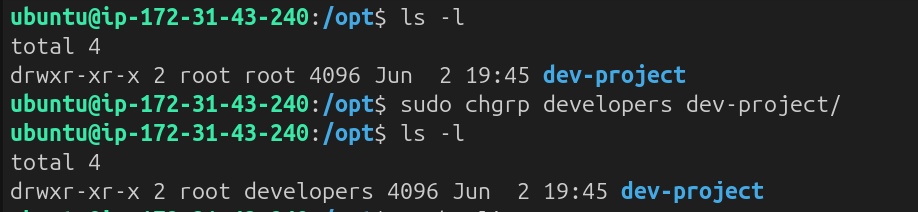
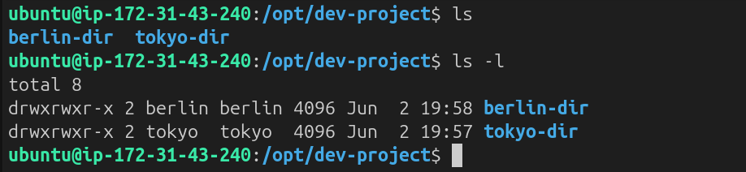

---

## Other User are not permitted to create dir
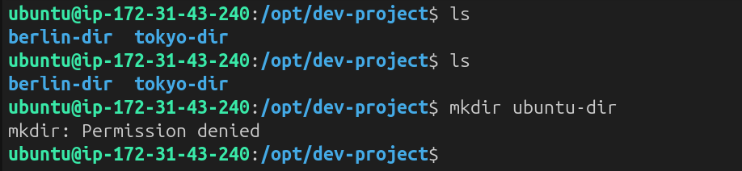

## Task 5: Team Workspace

1. Create user `nairobi` with home directory
2. Create group `project-team`
3. Add `nairobi` and `tokyo` to `project-team`
4. Create `/opt/team-workspace` directory
5. Set group to `project-team`, permissions to `775`
6. Test by creating file as `nairobi`

--- 

## User Created and added to respective groups:
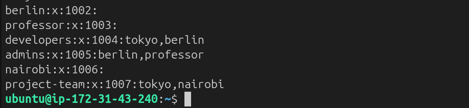

## Creat dir and allow permission change group owner:
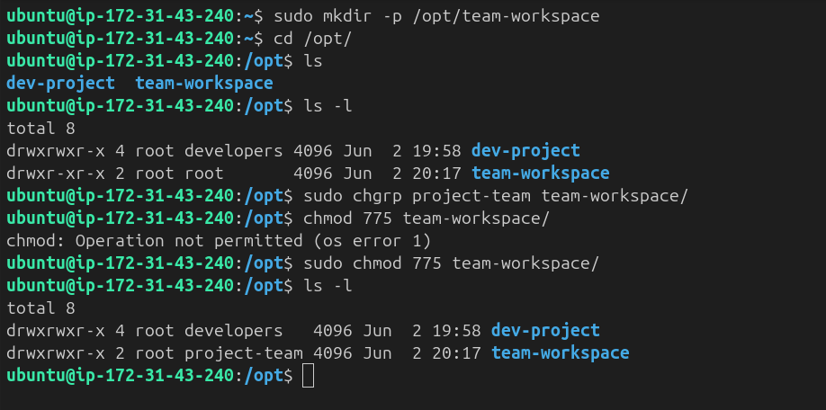
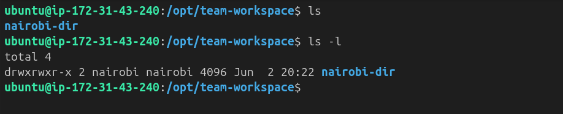