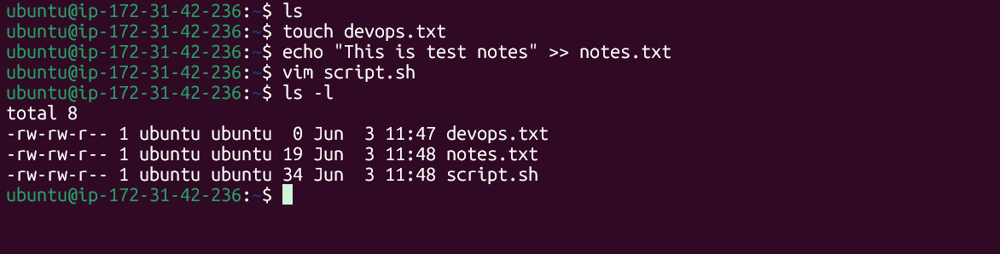
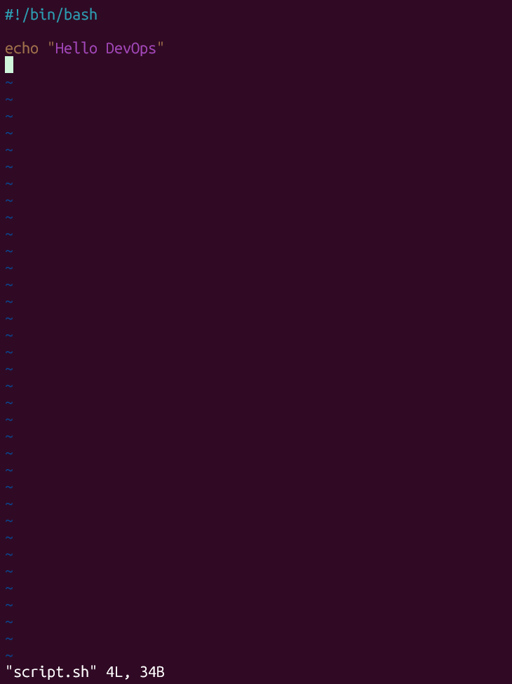
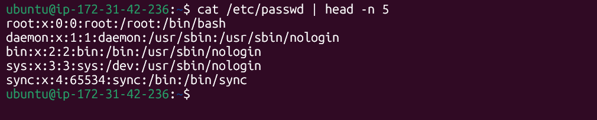
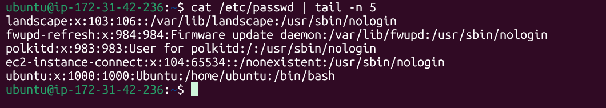
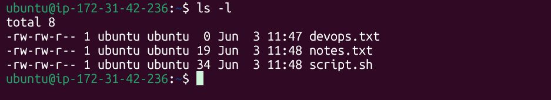
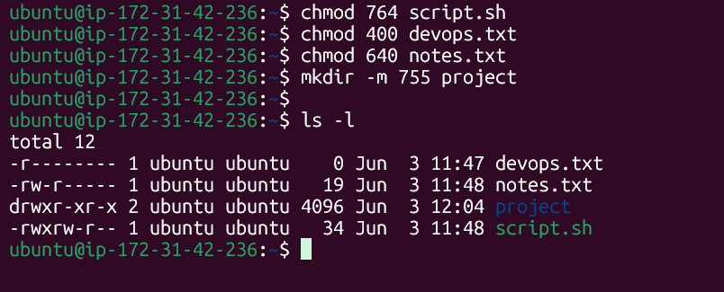

# Day 10 Challenge

# Files Created

# Read Files

## Read file using cat

## Read Script.sh file using vim as read file

## Display `cat /etc/passwd` using `head`:

## Display `cat /etc/passwd` using `tail`: 

## Permission Changes
- ubuntu Is Owner and Group
- owner and user has read & write permission, and other has only read pemission

## Modify Permissions:

## Commands Used
- touch devops.txt
- echo "This is test notes" >> notes.txt
- vim script.sh
- ls -l
- cat devops.txt
- cat notes.txt
- vim script.sh  
- cat /etc/passwd | head -n 5
- cat /etc/passwd | tail -n 5
- ls -l
- chmod 764 script.sh
- chmod 400 devops.txt
- chmod 640 notes.txt
- mkdir -m 755 project

# What I Learned

I learned how to create files using echo, touch, and vim, as well as how to manage file permissions. I now understand how permissions work across users, groups, owners, and others. Additionally, I learned how to create directories with custom permissions, which really enhanced my Linux command-line practice.