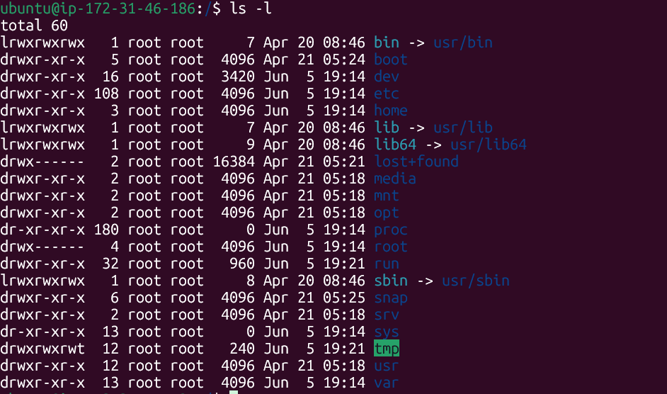
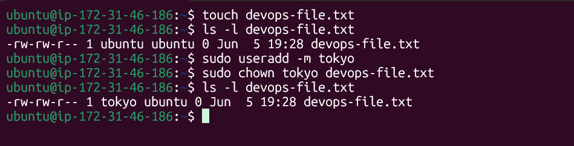
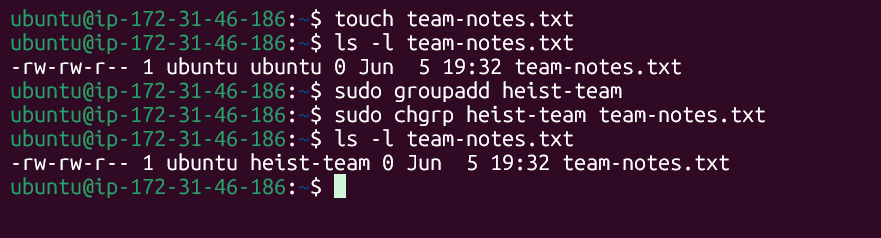
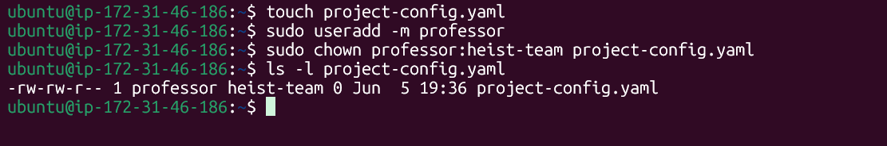
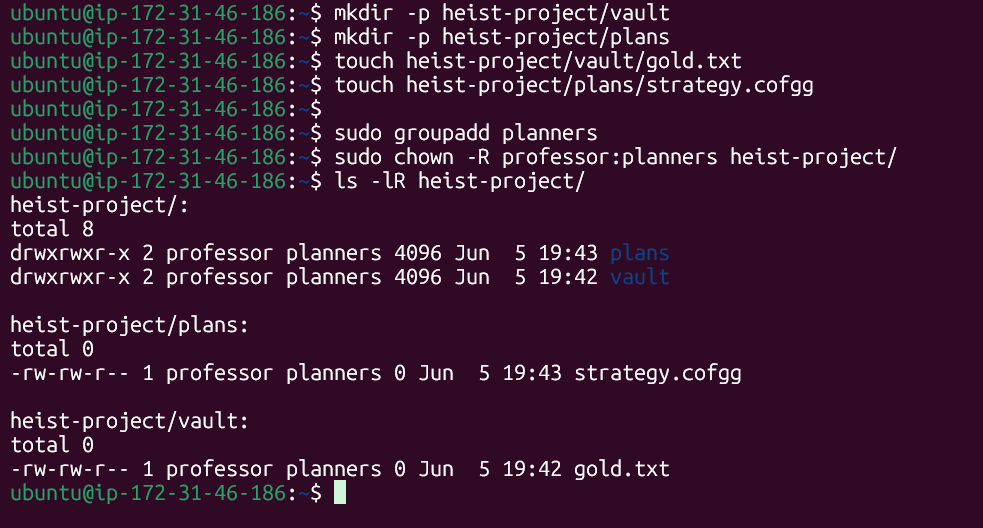
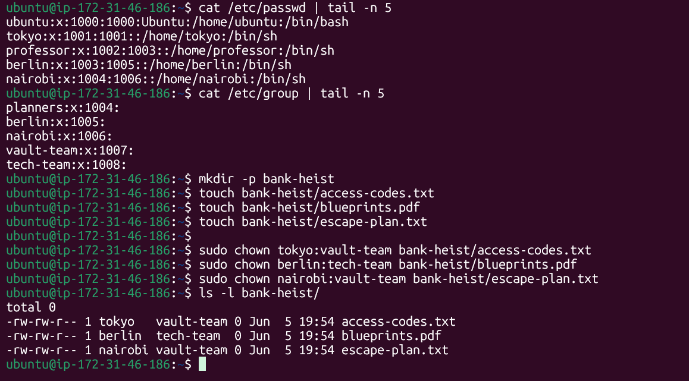

# Task 1: Understanding Ownership
## Here we can observe `owner` `user` and `other`

### An owner is an individual user account with primary authority over a file or resource, while a group is a collection of user accounts. The owner has unilateral control to set permissions and transfer ownership, whereas groups provide shared, collaborative access to multiple users at once

# Task 2: Basic chown Operations
## Here we can observe how files created and change owner using `chown`

# Task 3: Basic chgrp Operations
## Here we can observe how file created then change group using `chgrp`

# Task 4: Combined Owner & Group Change
## Here we can observe how to change owner and group using one command `sudo chown professor:heist-team project-config.yaml`

# Task 5: Recursive Ownership
## Here we can observe how to change owner and group recursivly using command `sudo chown -R professor:planners heist-project/`

# Task 6: Practice Challenge
## Here we can observe how to display group, owner and assign owner and group using command

