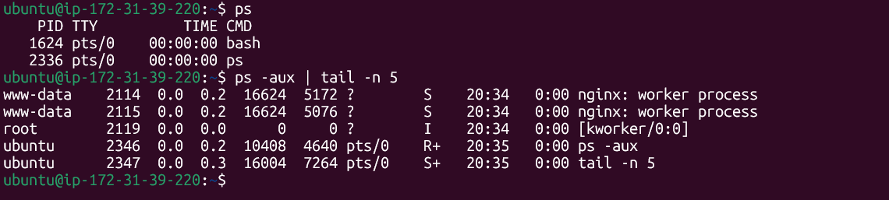
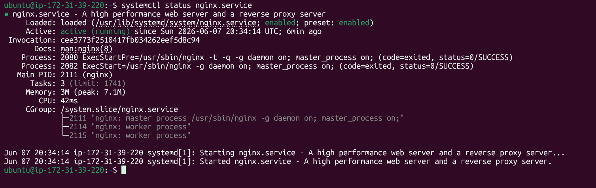
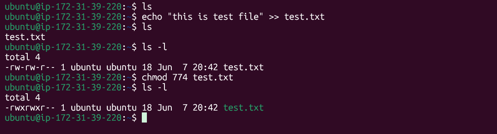
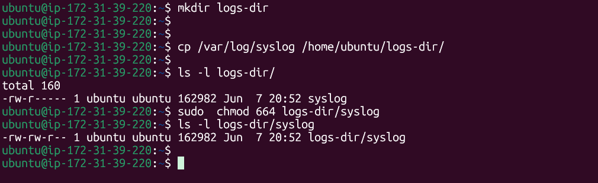

# Day 12 – Breather & Revision (Days 01–11)

# Mindset & plan: Goal of live about DevOps
## It is clear to work as a DevOps engineer and make life easy and contribute to the community

# Processes & services: `systemctl`, `ps`

## cheking sytem users log using `journalctl`

## Checking nginx serveice status using `systemctl`

# File skills:
## Create file using `echo` and apped `>>` content, then change file permission using `chmod` and permission execute to owner and Group, only read permission to others

## Create User with home dir using `useradd -m` then create dir using `mkdir` later change owner `ubuntu` to `meraj`

## Create a log dir in user dir then copy log file and change log file permission

# User/group sanity:

## create user and file then chage user owner and group

# Mini Self-Check

## Which 3 commands save you the most time right now, and why? 
I think few command that helps me lots
- `grep` -- for finding something
- `awk`  -- sorthing list
- `systemctl` -- for checking services

## How do you check if a service is healthy? List the exact 2–3 commands you’d run first.

- `systemctl status <services>` -- for cheking status
- `journalctl -u <service> -n 50 -f` -- for logs
- `curl -I http://localhost:80` -- for ports

## How do you safely change ownership and permissions without breaking access? Give one example command. 
- `sudo chown -R newuser:newgroup /path/to/director` 

## What will you focus on improving in the next 3 days?
- I will focus of practice previous and build logic in Bash Scripting & Networking