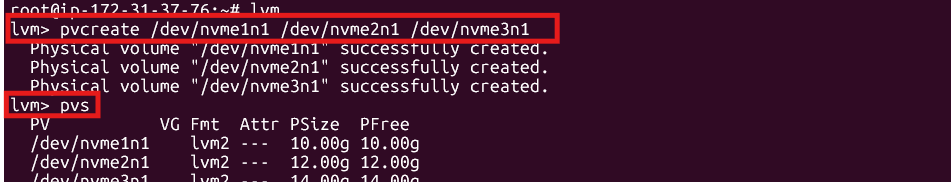
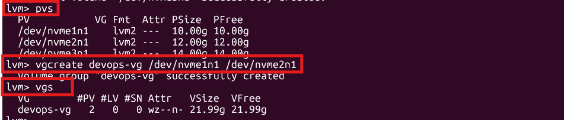
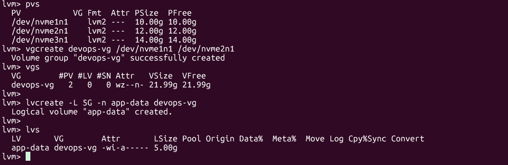

# Day 13 – Linux Volume Management (LVM)

## I'm doing this assignment using ec2 instance

# Task 1: Check Current Storage
## Here, I have created few volume/storage.

## Attached all volume to EC2 instance

# Task 2: Create Physical Volume
## now i created physical volume

# Task 3: Create Volume Group
## vloume group being created using `vgcreate`

# Task 4: Create Logical Volume
## logical volume being created using 
`mkfs.ext4 /dev/devops-vg/app-data`
`mkdir -p /mnt/app-data`
`mount /dev/devops-vg/app-data /mnt/app-data`
`df -h /mnt/app-data`

# Task 5: Format and Mount
## logical Volume now mounting to /mnt

# Task 6: Extend the Volume
## Extend the volume using `lvextend -L +200M /dev/devops-vg/app-data`, `resize2fs /dev/devops-vg/app-data`, `df -h /mnt/app-data`
