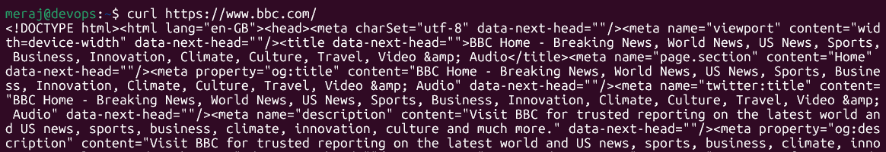
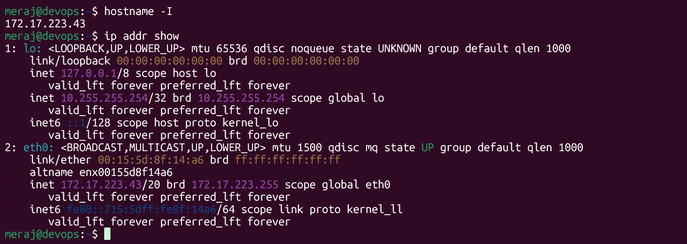
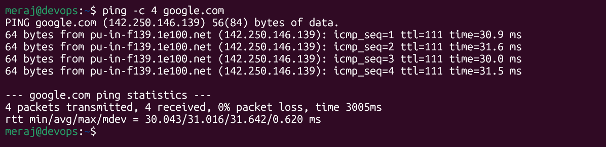
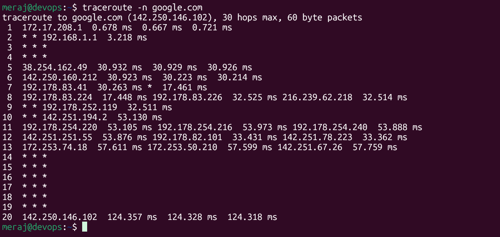
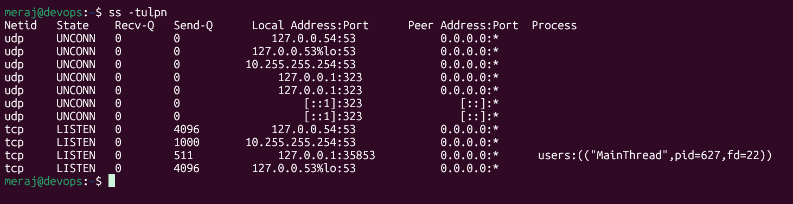
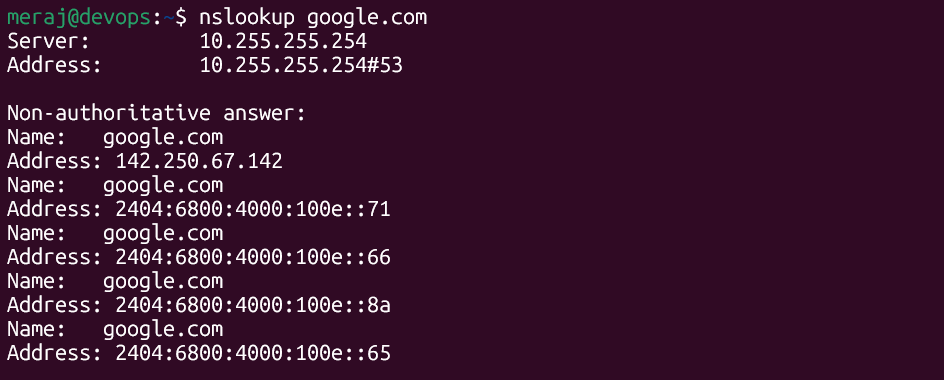
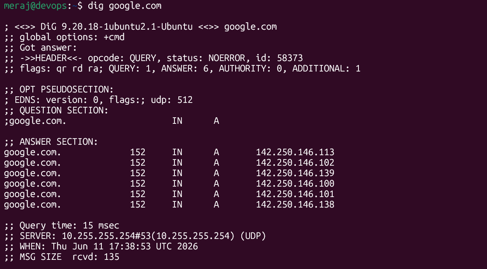
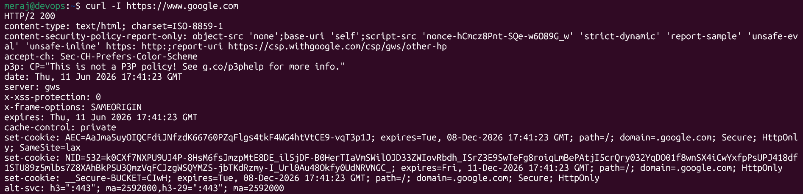
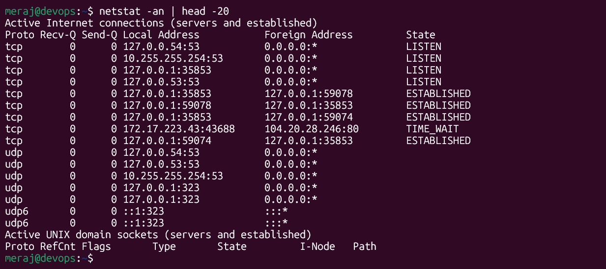

# Day 14 – Networking Fundamentals & Hands-on Checks

---

### OSI Model (L1–L7) vs TCP/IP Stack

| OSI Layer | Name         | TCP/IP Layer   | Protocols / Examples              |
|-----------|--------------|----------------|-----------------------------------|
| L7        | Application  | Application    | HTTP, HTTPS, DNS, FTP, SSH        |
| L6        | Presentation | Application    | TLS/SSL, encoding (UTF-8, JPEG)   |
| L5        | Session      | Application    | NetBIOS, RPC, sockets             |
| L4        | Transport    | Transport      | TCP, UDP                          |
| L3        | Network      | Internet       | IP (IPv4/IPv6), ICMP              |
| L2        | Data Link    | Link / Network | Ethernet, Wi-Fi (802.11), ARP     |
| L1        | Physical     | Link / Network | Cables, fibre, radio signals      |

**Key differences:**
- OSI is a **7-layer reference model** — great for troubleshooting conceptually; each layer has a clear job.
- TCP/IP is the **real-world 4-layer model** your OS actually implements; it collapses L5–L7 into "Application".

---

### Where Protocols Sit in the Stack

- **IP** → Network / Internet layer (L3) — handles addressing and routing packets between hosts.
- **TCP / UDP** → Transport layer (L4) — TCP adds reliability (handshake, ACKs); UDP is fire-and-forget.
- **HTTP / HTTPS** → Application layer (L7) — HTTPS = HTTP + TLS (which lives at L6 in OSI but is part of the Application layer in TCP/IP).
- **DNS** → Application layer (L7), typically UDP port 53 (falls back to TCP for large responses).

---

### One Real End-to-End Example

```
curl https://bbc.com
```

What actually happens:

```
[terminal / curl]
      ↓  L7 — HTTP GET request built
[TLS Handshake]
      ↓  L6/L5 — Encryption negotiated (TLS 1.3)
[TCP Three-way Handshake]
      ↓  L4 — SYN → SYN-ACK → ACK on port 443
[IP Routing]
      ↓  L3 — Packet addressed to x.x.x.x, routed hop-by-hop
[Ethernet/Wi-Fi Frame]
      ↓  L2 — MAC addresses used for local delivery
[Physical]
      ↓  L1 — Bits on the wire / air
```

**Short version:** `curl https://bbc.com` = **App layer (HTTP)** over **TLS** over **TCP** over **IP**.


---

## Hands-on Checklist

### 1. Identity — `hostname -I` / `ip addr show`

```bash
$ hostname -I
172.17.233.43
```

---

### 2. Reachability — `ping google.com`

```bash
$ ping -c 4 google.com
```


---

### 3. Path — `traceroute google.com`

```bash
$ traceroute -n google.com
```


---

### 4. Listening Ports — `ss -tulpn`

```bash
$ ss -tulpn
```


---

### 5. Name Resolution — `nslookup` / `dig`

```bash
$ dig google.com
$ nslookup google.com
```


---



---

### 6. HTTP Check — `curl -I`

```bash
$ curl -I https://google.com
```


---

### 7. Connections Snapshot — `netstat -an | head`

```bash
$ netstat -an | head -20
```

---

## Mini Task: Port Probe & Interpret

### Step 1 — Identify a listening port

From `ss -tulpn`: **SSH is listening on port 22** (`0.0.0.0:22`).

### Step 2 — Test it from the same machine

```bash
$ nc -zv localhost 22
```


### Step 3 — Interpretation

✅ **Port 22 is reachable.** The SSH service is up and accepting connections on localhost.

**If it had failed** (`Connection refused`), next checks would be:
1. `systemctl status sshd` — is the service actually running?
2. `ss -tulpn | grep 22` — is it bound to the expected address?
3. `iptables -L -n` or `ufw status` — is a firewall blocking the port?

---

## Reflection

### Which command gives the fastest signal when something is broken?

**`ping`** — it's the first reflex. It tells you in 1–2 seconds whether L3 connectivity exists between you and a target. If ping fails → check routing, firewall, or whether the host is even up.

Close second: **`curl -I`** — when L3 is fine but the app is broken, curl immediately tells you the HTTP status code.

---

### What layer would you inspect next if…

| Symptom            | Start at...             | Why                                                                 |
|--------------------|-------------------------|---------------------------------------------------------------------|
| **DNS fails**      | L3 (Network) first      | Can you ping the DNS server IP directly? If not, it's routing/firewall. If yes, DNS process may be down — check port 53 with `nc -zv <dns-ip> 53`. |
| **HTTP 500 shows** | L7 (Application)        | L3/L4 are fine (you got a response!). Go straight to app logs: `journalctl -u nginx`, `tail -f /var/log/app/error.log`. |

---

### Two follow-up checks in a real incident

1. **`curl -v <url>`** — verbose mode shows the full TLS handshake, DNS resolution, TCP connection, and headers. Pinpoints exactly which step fails (DNS? TCP connect? TLS? HTTP response?).
2. **`journalctl -u <service> --since "5 min ago"`** — grabs recent service logs. Any 500 or crash will have a stack trace or error message that a status code alone doesn't give you.

---