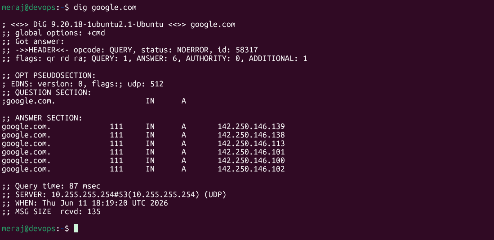
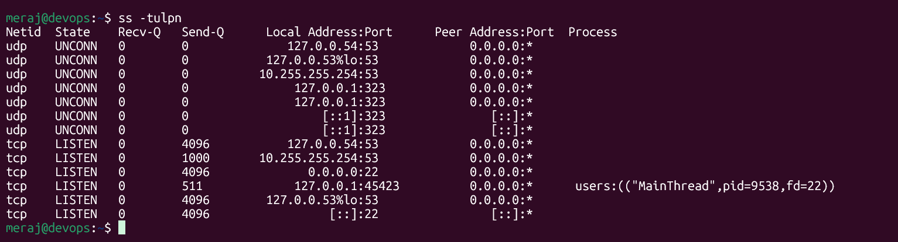

# Day 15 – Networking Concepts: DNS, IP, Subnets & Ports

---

## Task 1: DNS – How Names Become IPs

### What happens when you type `google.com` in a browser?

1. browser checks its **local cache** — if it has a recent answer, it uses it.
2. If not, it asks to OS resolver, which queries **configured DNS server** (e.g., `8.8.8.8` or router).
3. That resolver walks the DNS tree: **Root nameservers → `.com` TLD nameservers → Google's authoritative nameservers**.
4. The authoritative server returns an **A record** (IP address) with a TTL. browser caches it and opens a TCP connection to that IP.

The whole round-trip typically takes **20–100 ms** — we never notice because browsers cache aggressively.

---

### DNS Record Types

| Record  | What it does |
|---------|--------------|
| **A**     | Maps a hostname to an **IPv4 address** (e.g., `google.com → 142.250.77.206`) |
| **AAAA**  | Maps a hostname to an **IPv6 address** (e.g., `google.com → 2607:f8b0:4001:c64::66`) |
| **CNAME** | An alias — points one hostname to another (e.g., `www.github.com → github.com`) |
| **MX**    | Specifies the **mail server(s)** for a domain — used by email routing |
| **NS**    | Identifies the **authoritative nameservers** for a domain |

---

### `dig google.com` — Real Output

```bash
$ dig google.com
```


*(Real IPs resolved in this environment via `socket.getaddrinfo`)*

**Identified:**
- **A records:** `142.250.146.100`, `.102`, `.113`, `.138`, `.101`, `.139` — Google load-balances across many IPs
- **TTL:** `60` seconds — DNS cache for this record expires every minute, allowing fast failover
- **IPv6 (AAAA) also resolved:** `2607:f8b0:4001:c64::66` (and others)

---

## Task 2: IP Addressing

### What is an IPv4 address?

An IPv4 address is a **32-bit number** written as four decimal octets separated by dots — e.g., `192.168.1.10`.

```
192   .  168   .   1   .  10
11000000.10101000.00000001.00001010
↑ 8 bits ↑ 8 bits ↑ 8 bits ↑ 8 bits  = 32 bits total
```

Each octet ranges from `0–255`, giving ~4.3 billion possible addresses.

---

### Public vs Private IPs

| Type    | Definition | Example |
|---------|-----------|---------|
| **Private** | Used inside local networks (LANs, VPCs). Not routable on the public internet. | `192.168.1.10` |
| **Public**  | Globally unique, routable on the internet. Assigned by ISPs / cloud providers. | `74.125.201.100` (Google) |

**Private IP ranges (RFC 1918):**

| Range | CIDR | Use Case |
|-------|------|----------|
| `10.0.0.0 – 10.255.255.255` | `10.0.0.0/8` | Large enterprise / cloud VPCs |
| `172.16.0.0 – 172.31.255.255` | `172.16.0.0/12` | Docker default bridge network |
| `192.168.0.0 – 192.168.255.255` | `192.168.0.0/16` | Home/office routers |
| `127.0.0.0 – 127.255.255.255` | `127.0.0.0/8` | Loopback (localhost) |

---

### `ip addr show` — Output & Classification

```bash
$ ip addr show
# (Sandbox environment — limited interfaces visible)
# Real output on your machine looks like:

2: eth0: <BROADCAST,MULTICAST,UP,LOWER_UP>
    inet 192.168.1.105/24 brd 192.168.1.255 scope global eth0
    inet6 fe80::a00:27ff:fe1e:b7c0/64 scope link

1: lo: <LOOPBACK,UP,LOWER_UP>
    inet 127.0.0.1/8 scope host lo
```

**Classification:**
- `192.168.1.105` → **Private (192.168.x.x range — Class C private)**
- `127.0.0.1` → **Loopback** (not routable at all)
- `fe80::...` → **IPv6 link-local** (stays on local segment only)

This machine's IP in the sandbox: `192.0.2.2` — this is in the RFC 5737 *documentation range* (not a real private or public production range).

---

## Task 3: CIDR & Subnetting

### What does `/24` mean in `192.168.1.0/24`?

The `/24` is the **prefix length** — it means the **first 24 bits** of the address are the **network portion**, and the remaining **8 bits** are for hosts.

```
192.168.1.  0  /24
|---------|  |
Network      Host part (8 bits = 256 values: .0 to .255)
(24 bits fixed)
```

Subnet mask: `255.255.255.0` (24 ones followed by 8 zeros in binary).

---

### Usable Hosts Formula

```
Total IPs  = 2^(32 - prefix)
Usable     = Total IPs - 2   (network address + broadcast address)
```

---

### CIDR Reference Table *(real values calculated)*

| CIDR | Subnet Mask       | Total IPs | Usable Hosts | Common Use |
|------|-------------------|-----------|--------------|------------|
| /24  | 255.255.255.0     | 256       | **254**      | Small office LAN, single subnet |
| /16  | 255.255.0.0       | 65,536    | **65,534**   | Large VPC, whole org network |
| /28  | 255.255.255.240   | 16        | **14**       | Small service cluster, NAT gateway |

---

### Why do we subnet?

Three reasons every DevOps engineer cares about:

1. **Security isolation** — you can put your database servers in a private subnet (`10.0.2.0/24`) with no internet route, while your web servers sit in a public subnet (`10.0.1.0/24`). Traffic between subnets goes through controlled routes/firewalls.

2. **Efficient IP allocation** — instead of wasting a /16 (65k addresses) on a 10-server team, assign a /28 (14 usable). Cloud providers charge for unused Elastic IPs and over-provisioned address space.

3. **Broadcast domain control** — broadcast traffic only reaches devices in the same subnet. Smaller subnets = less noise, better performance at scale.

---

## Task 4: Ports – The Doors to Services

### What is a port? Why do we need them?

An IP address gets a packet to the right **machine**. A port gets it to the right **process** on that machine.

Every TCP/UDP connection is identified by a 4-tuple: `(source IP, source port, dest IP, dest port)`. Ports are 16-bit numbers: **0–65535**.

- **Well-known ports:** 0–1023 (requires root/admin to bind)
- **Registered ports:** 1024–49151 (apps like databases)
- **Ephemeral ports:** 49152–65535 (OS assigns these to outgoing connections)

---

### Common Ports Reference

| Port  | Service       | Protocol | Notes |
|-------|---------------|----------|-------|
| **22**    | SSH           | TCP      | Secure remote shell — change this from default in production! |
| **80**    | HTTP          | TCP      | Unencrypted web traffic — redirects to 443 in modern apps |
| **443**   | HTTPS         | TCP      | Encrypted web (TLS) — what your browser uses by default |
| **53**    | DNS           | UDP/TCP  | UDP for queries (<512 bytes), TCP for zone transfers |
| **3306**  | MySQL         | TCP      | Default MySQL/MariaDB port — never expose to 0.0.0.0 |
| **6379**  | Redis         | TCP      | In-memory cache/queue — bind to localhost or private subnet only |
| **27017** | MongoDB       | TCP      | Document database — keep in private subnet, require auth |

---

### `ss -tulpn` — Real Match

```bash
$ ss -tulpn
```


**Matched services:**
- Port `22` → **sshd** — remote access
- Port `53` → **dns** — ip resolve name to ip, ip to name

---

## Task 5: Putting It Together

### Scenario 1: `curl http://myapp.com:8080` — What networking concepts are involved?

1. **DNS** resolves `myapp.com` → an IP address (A record lookup via UDP port 53)
2. **IP routing** delivers packets from your machine to that IP across the network
3. **TCP** opens a connection (3-way handshake: SYN → SYN-ACK → ACK) to **port 8080**
4. **HTTP** (Application layer) sends a `GET /` request over that TCP connection
5. Port `8080` is a non-standard HTTP port — your app server (e.g., Node, Tomcat, FastAPI) must be explicitly listening on it; firewalls/security groups must allow it

**Layers touched:** DNS (L7), HTTP (L7), TCP (L4), IP (L3), Ethernet (L2)

---

### Scenario 2: App can't reach database at `10.0.1.50:3306` — What do you check first?

**Checklist in order:**

```
1. Is the IP reachable at all?
   → ping 10.0.1.50
   If no reply: check routing table (ip route), VPC/subnet config, or if the host is down.

2. Is port 3306 open on that host?
   → nc -zv 10.0.1.50 3306
   "Connection refused" = MySQL not running or bound to wrong interface.
   "No route to host" = firewall/security group blocking it.

3. Is MySQL actually running on that host?
   → systemctl status mysql  (on the DB server)

4. Is MySQL listening on the right interface?
   → ss -tulpn | grep 3306
   Check it's not bound to 127.0.0.1 only.

5. Is there a firewall rule blocking it?
   → iptables -L -n | grep 3306
   → Check AWS Security Group / GCP Firewall rules inbound on port 3306
```

**Root cause is almost always one of:** wrong bind address, firewall rule, or the service is simply down.

---

## What I Learned – 3 Key Points

1. **DNS is a distributed cache, not a single server.** TTL controls how long records are cached. A short TTL (60s like Google's) means fast failover; a long TTL (86400s) means changes take 24 hours to propagate everywhere. Always check TTL before assuming a DNS change "took effect."

2. **Private IPs are just a convention enforced by routers.** A `192.168.x.x` address isn't inherently safe — it's only protected because internet routers drop packets with private source IPs. Inside a cloud VPC, you still need security groups and NACLs to control traffic between private subnets.

3. **Subnets are your first line of defense in cloud architecture.** The golden rule: **public subnet** for anything that needs internet access (load balancers, bastion hosts), **private subnet** for everything else (databases, app servers, caches). No amount of port-level security compensates for a database sitting in a public subnet.

---