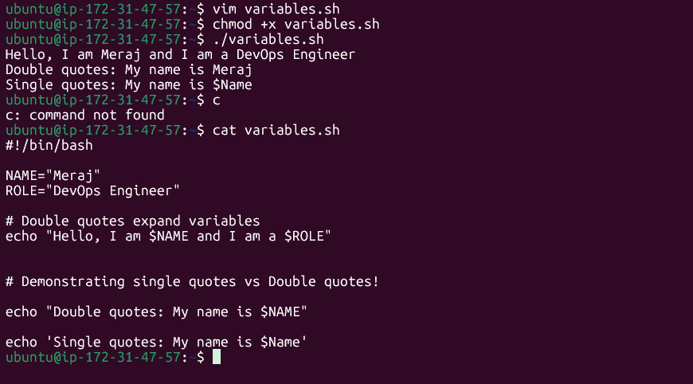
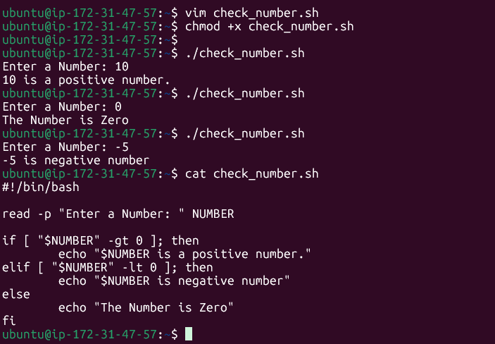
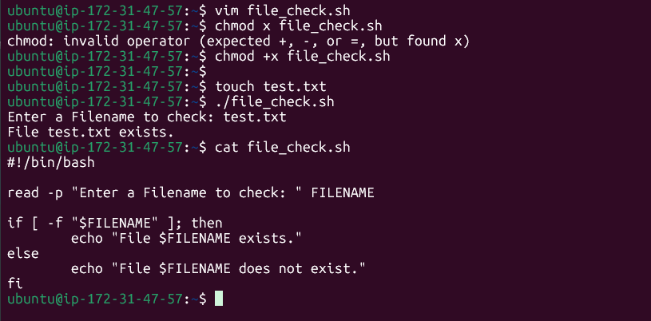

# Day 16 – Shell Scripting Basics

## Overview

This document covers the fundamentals of shell scripting in Bash — from writing your first script to working with variables, user input, and conditional logic.

---

## Task 1: Your First Script — `hello.sh`

### Script Code | How to give execute permission | How run shell script


### What Happens if You Remove the Shebang?

If you remove `#!/bin/bash`, the script still **usually works** when run from a Bash shell — because the current shell interprets it. However:

- The OS **cannot determine** which interpreter to use when running the script directly (e.g., `./hello.sh`)
- On some systems, it may fall back to `/bin/sh`, which is a more basic shell (dash on Ubuntu) — this can cause errors if you use Bash-specific syntax
- It's bad practice because the script behaviour becomes **environment-dependent**
- Always include the shebang for portability and clarity

---

## Task 2: Variables — `variables.sh`

### Script Code | Output



### Single Quotes vs Double Quotes

| Feature               | Double Quotes `"..."` | Single Quotes `'...'` |
|-----------------------|-----------------------|------------------------|
| Variable expansion    | ✅ Yes (`$NAME` → value) | ❌ No (literal `$NAME`) |
| Command substitution  | ✅ Yes (`$(cmd)` works) | ❌ No                  |
| Escape sequences      | ✅ Yes (`\n`, `\t`)   | ❌ No                  |
| Use when              | You need variable values | You want exact literal strings |

**Rule of thumb:** Use double quotes when your string contains variables. Use single quotes for fixed, literal strings.

---

## Task 3: User Input with `read` — `greet.sh`

### Script Code | Output


### Key Notes

- `read -p "prompt" VARIABLE` — displays a prompt and stores input in the variable
- Always quote variables in `echo` to handle names with spaces correctly
- Variable names are case-sensitive: `user_name` ≠ `USER_NAME`

---

## Task 4: If-Else Conditions

### Task 1: Check Number — `check_number.sh`
### Script Code | Output



#### Comparison Operators (Numeric)

| Operator | Meaning              |
|----------|----------------------|
| `-gt`    | Greater than         |
| `-lt`    | Less than            |
| `-eq`    | Equal to             |
| `-ne`    | Not equal to         |
| `-ge`    | Greater than or equal|
| `-le`    | Less than or equal   |

---

### Task 2: File Check — `file_check.sh`
### Script code | Output



#### Common File Test Operators

| Operator | Checks                        |
|----------|-------------------------------|
| `-f`     | File exists and is a regular file |
| `-d`     | Directory exists              |
| `-e`     | File or directory exists      |
| `-r`     | File is readable              |
| `-w`     | File is writable              |
| `-x`     | File is executable            |

---

## Task 5: Combine It All — `server_check.sh`

### Script Code

```bash
#!/bin/bash

SERVICE="nginx"

read -p "Do you want to check the status of '$SERVICE'? (y/n): " ANSWER

if [ "$ANSWER" = "y" ]; then
    echo "Checking status of $SERVICE..."
    if systemctl is-active --quiet "$SERVICE" 2>/dev/null; then
        echo "$SERVICE is ACTIVE and running."
    else
        echo "$SERVICE is NOT active (stopped or not installed)."
    fi
elif [ "$ANSWER" = "n" ]; then
    echo "Skipped."
else
    echo "Invalid input. Please enter 'y' or 'n'."
fi
```

### Not installed Outputs


### Service status Output


### Key Concepts Used

- Storing service name in a variable for reuse
- Nested `if` statements to handle multiple conditions
- `systemctl is-active --quiet` returns exit code 0 if active, 1 otherwise
- `2>/dev/null` silences error output if the service doesn't exist

---

## 3 Key Learnings

**1. The shebang line is your script's identity card.**
`#!/bin/bash` at the top of every script tells the operating system exactly which interpreter to use. Without it, your script's behaviour becomes unpredictable across environments — always include it as your very first line.

**2. Quote your variables — always.**
Using `"$VARIABLE"` (with double quotes) protects against word splitting and globbing. If a variable holds a value like `My File.txt`, unquoted `$VARIABLE` breaks into two arguments (`My` and `File.txt`), causing unexpected bugs. Make quoting variables a reflex.

**3. `if` conditions are just exit codes under the hood.**
The `[ ... ]` test command returns 0 (true) or 1 (false). Understanding this unlocks powerful patterns — like using `systemctl is-active --quiet` directly as a condition, because any command that succeeds (exit 0) acts as `true` in a Bash `if` statement.

---

## Quick Reference Cheat Sheet

```bash
# Shebang
#!/bin/bash

# Variables (no spaces around =)
NAME="DevOps"

# Print
echo "Hello, $NAME"

# User input
read -p "Enter value: " MYVAR

# If-else
if [ "$VAR" -gt 0 ]; then
    echo "Positive"
elif [ "$VAR" -lt 0 ]; then
    echo "Negative"
else
    echo "Zero"
fi

# File check
if [ -f "file.txt" ]; then
    echo "File exists"
fi

# Make executable
chmod +x script.sh

# Run
./script.sh
```