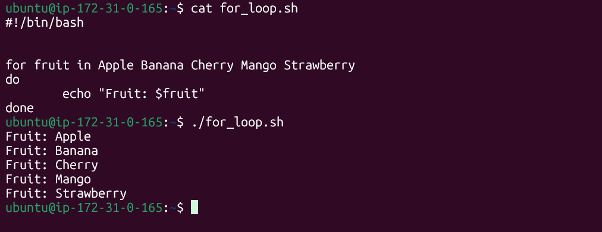
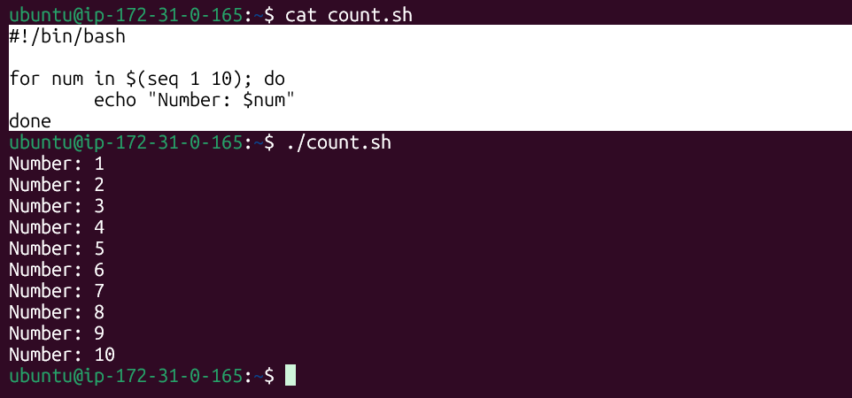
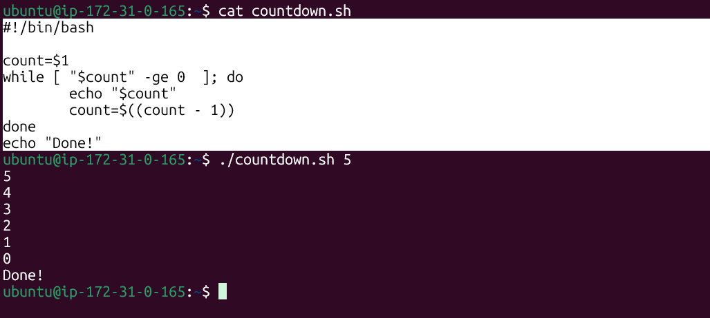
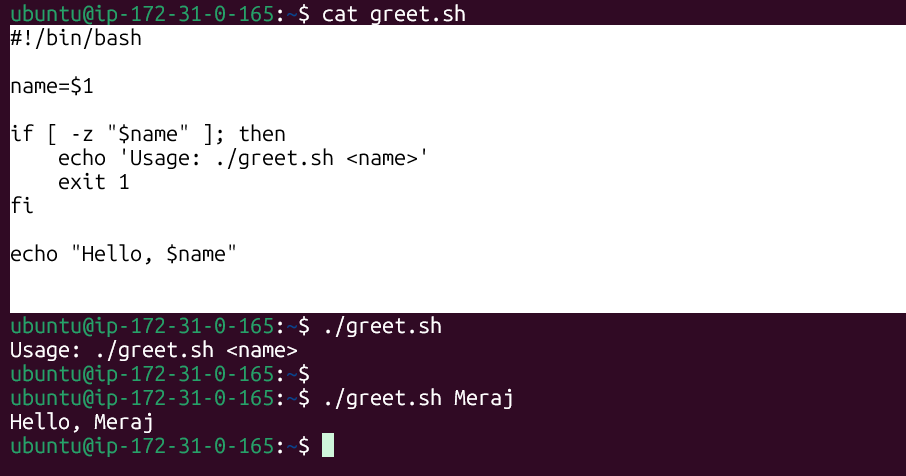
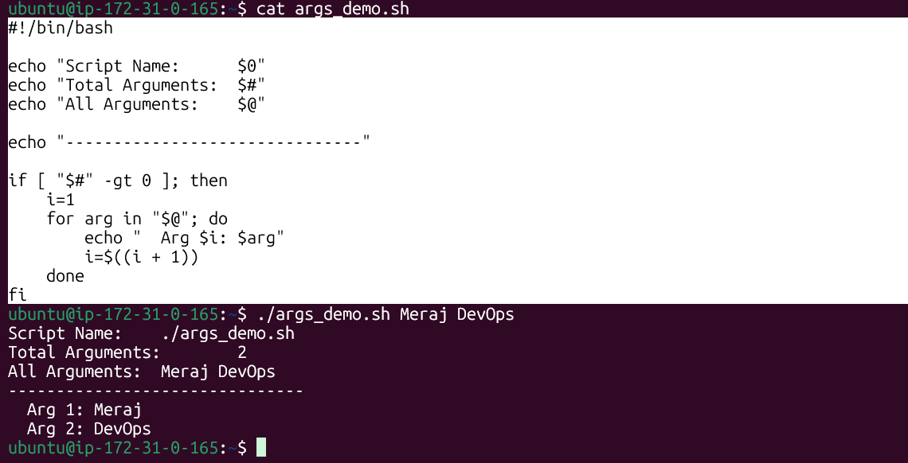
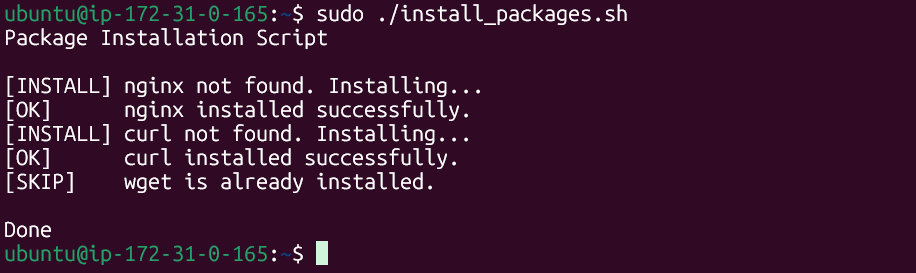
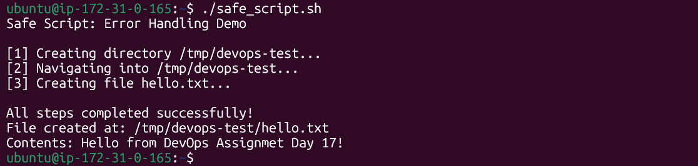
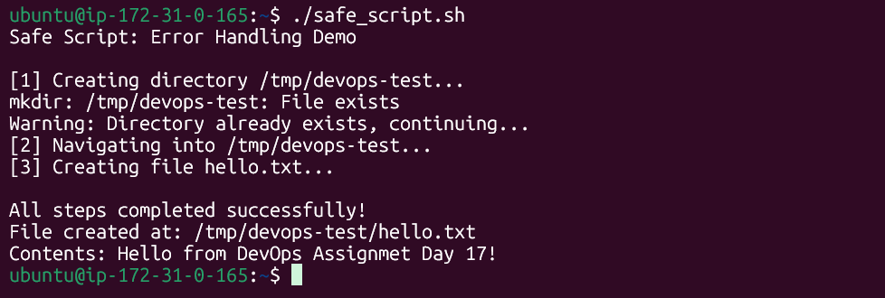

# Day 17 – Shell Scripting: Loops, Arguments & Error Handling

## Overview

This document covers shell scripting fundamentals: `for` and `while` loops, command-line argument handling, package installation automation, and error handling techniques.

---

## Task 1: For Loop

### `for_loop.sh` — Iterate over a fruit list
### Script and Output

---

### `count.sh` — Print numbers 1 to 10
### Script and Output



---

## Task 2: While Loop

### `countdown.sh` — Count down to 0
### Script and Output



---

## Task 3: Command-Line Arguments

### 1. `greet.sh` — Accept a name as argument
### Script and Output


---

### 2. `args_demo.sh` — Demonstrate argument variables
### Script and Output



---

## Task 4: Install Packages via Script

### `install_packages.sh` — Auto-install packages with root check

```bash
#!/bin/bash
# Installs a list of packages if not already present

# Root check
if [ "$EUID" -ne 0 ]; then
    echo "Error: This script must be run as root."
    echo "Usage: sudo ./install_packages.sh"
    exit 1
fi

packages=("nginx" "curl" "wget")

echo "Package Installation Script"
echo ""

for pkg in "${packages[@]}"; do
    if dpkg -s "$pkg" &> /dev/null; then
        echo "[SKIP]    $pkg is already installed."
    else
        echo "[INSTALL] $pkg not found. Installing..."
        if apt-get install -y "$pkg" &> /dev/null; then
            echo "[OK]      $pkg installed successfully."
        else
            echo "[FAIL]    Failed to install $pkg."
        fi
    fi
done

echo ""
echo "Done"
```

### Output



---

## Task 5: Error Handling

### `safe_script.sh` — Error-safe script with `set -e` and `||`

```bash
#!/bin/bash
# Demonstrates error handling with set -e and ||

set -e  # Exit immediately if any command fails

TARGET_DIR="/tmp/devops-test"
TARGET_FILE="hello.txt"

echo "Safe Script: Error Handling Demo"
echo ""

# Step 1: Create directory
echo "[1] Creating directory $TARGET_DIR..."
mkdir "$TARGET_DIR" || echo "Warning: Directory already exists, continuing..."

# Step 2: Navigate into it
echo "[2] Navigating into $TARGET_DIR..."
cd "$TARGET_DIR" || { echo "Error: Could not navigate into $TARGET_DIR"; exit 1; }

# Step 3: Create a file inside
echo "[3] Creating file $TARGET_FILE..."
echo "Hello from DevOps Assignmet Day 17!" > "$TARGET_FILE" || { echo "Error: Could not create file"; exit 1; }

echo ""
echo "All steps completed successfully!"
echo "File created at: $TARGET_DIR/$TARGET_FILE"
echo "Contents: $(cat $TARGET_FILE)"
```
**Output (first run):**



**Output (second run — directory already exists):**



---

## Key Concepts Reference

| Variable | Meaning |
|----------|---------|
| `$1`, `$2` | First, second positional argument |
| `$#` | Total number of arguments |
| `$@` | All arguments as separate words |
| `$0` | Script name/path |
| `$?` | Exit status of last command |
| `$$` | PID of current shell |

| Construct | Purpose |
|-----------|---------|
| `set -e` | Exit script on first error |
| `cmd \|\| fallback` | Run fallback if cmd fails |
| `cmd && next` | Run next only if cmd succeeds |
| `{ cmd; exit 1; }` | Group commands; run as a unit |
| `dpkg -s pkg` | Check if package is installed (Debian/Ubuntu) |
| `$EUID -ne 0` | Check if NOT running as root |

---

## What I Learned

**1. Loop syntax and when to use each type**
`for` loops are best when you know the list ahead of time (files, packages, items). `while` loops shine when you need to loop until a condition changes (countdowns, waiting for a process). The pattern `while [ condition ]; do ... done` and `for item in list; do ... done` are foundational to almost every real-world script.

**2. Command-line arguments make scripts reusable**
Using `$1`, `$#`, and `$@` lets you write a script once and use it in many situations. Always validate inputs: check `[ -z "$1" ]` before using `$1` to avoid silent failures from empty variables.

**3. Error handling is what separates toy scripts from production scripts**
`set -e` combined with `||` gives you two layers of defence: the script stops automatically on unexpected failures, but you can still provide graceful fallbacks for *expected* conditions (like a directory already existing). Checking `$EUID` before performing privileged operations protects against accidental damage when run as the wrong user.