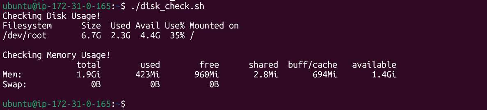
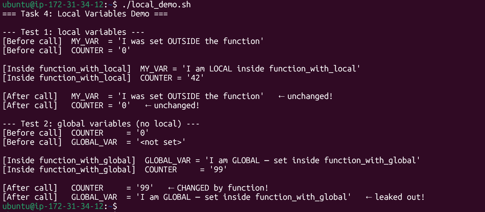

# Day 18 – Shell Scripting: Functions & Intermediate Concepts

---

## Task 1 – Basic Functions

**File:** `functions.sh`

### Script

```bash
#!/bin/bash
greet() {

        name="$1"
        echo "Hello, $name"
}

add() {
        num1="$1"
        num2="$2"
        result=$(( num1 + num2 ))

        echo "Sum of $num1 + $num2 = $result"

}

greet "Meraj"

add 10 10
```

### Output


### Notes

- Function syntax: `function_name() { ... }`
- Arguments inside functions are accessed as `$1`, `$2`, etc.
- Arithmetic is done using `$(( expr ))`.

---

## Task 2 – Functions with Return Values

### Script

```bash
#!/bin/bash

# Disk Checking Function
check_disk() {

        echo "Checking Disk Usage!"
        df -h /
        echo ""
}

# Memory Checking Function
check_memory() {

        echo "Checking Memory Usage!"
        free -h
        echo ""
}

check_disk

check_memory
```

### Output



### Notes

- Functions can print output directly; callers receive it as stdout.
- `df -h /` shows human-readable disk info for the root filesystem.
- `free -h` shows human-readable RAM and swap usage.
- The main section simply calls both functions in sequence.

---

## Task 3 – Strict Mode

**File:** `strict_demo.sh`

### Script

```bash
#!/bin/bash

# Enable strict mode
set -euo pipefail

echo "=== Strict Mode Demo ==="

# -------------------------
# 1. set -u Demo
# -------------------------
echo "Testing set -u..."
echo "$UNDEFINED_VAR"

# -------------------------
# 2. set -e Demo
# -------------------------
echo "Testing set -e..."
false
echo "This line will not execute because 'false' returns a non-zero exit code."

# -------------------------
# 3. set -o pipefail Demo
# -------------------------
echo "Testing set -o pipefail..."
grep "hello" nonexistent_file.txt | wc -l
echo "This line will not execute because grep failed."

```

### Output


---

## Documentation
```bash
# set -e
Exit the script immediately if any command returns a non-zero exit status.
Helps prevent scripts from continuing after an error.

# set -u
Treat undefined variables as errors.
Prevents bugs caused by typos in variable names.

# set -o pipefail
Makes a pipeline fail if any command in the pipeline fails.
Prevents hidden errors in piped commands.
```
---

## Task 4 – Local Variables

**File:** `local_demo.sh`

### Script

```bash
#!/bin/bash
echo "=== Task 4: Local Variables Demo ==="
echo ""

# Function using LOCAL variables — safe, no leakage
function_with_local() {
    local MY_VAR="I am LOCAL inside function_with_local"
    local COUNTER=42
    echo "[Inside function_with_local]  MY_VAR = '${MY_VAR}'"
    echo "[Inside function_with_local]  COUNTER = '${COUNTER}'"
}

# Function using GLOBAL variables — dangerous, leaks out
function_with_global() {
    GLOBAL_VAR="I am GLOBAL — set inside function_with_global"
    COUNTER=99   # This will overwrite any outer COUNTER!
    echo "[Inside function_with_global]  GLOBAL_VAR = '${GLOBAL_VAR}'"
    echo "[Inside function_with_global]  COUNTER     = '${COUNTER}'"
}

echo "--- Test 1: local variables ---"
MY_VAR="I was set OUTSIDE the function"
COUNTER=0

echo "[Before call]  MY_VAR  = '${MY_VAR}'"
echo "[Before call]  COUNTER = '${COUNTER}'"
echo ""

function_with_local

echo ""
echo "[After call]   MY_VAR  = '${MY_VAR}'   ← unchanged!"
echo "[After call]   COUNTER = '${COUNTER}'   ← unchanged!"
echo ""

echo "--- Test 2: global variables (no local) ---"
COUNTER=0
echo "[Before call]  COUNTER     = '${COUNTER}'"
echo "[Before call]  GLOBAL_VAR  = '${GLOBAL_VAR:-<not set>}'"
echo ""

function_with_global

echo ""
echo "[After call]   COUNTER     = '${COUNTER}'   ← CHANGED by function!"
echo "[After call]   GLOBAL_VAR  = '${GLOBAL_VAR}'   ← leaked out!"
```

### Output



### Notes

- Without `local`, any variable set inside a function modifies the global scope.
- With `local`, the variable is scoped only to that function's execution frame.
- Use `${VAR:-default}` to safely reference a variable that may not be set.

---

## Task 5 – System Info Reporter

**File:** `system_info.sh`

### Script

```bash
#!/bin/bash

set -euo pipefail

print_header() {
    local title="$1"
    local width=50
    local line
    line=$(printf '%*s' "$width" '' | tr ' ' '=')
    echo ""; echo "${line}"; echo "  ${title}"; echo "${line}"
}

print_host_info() {
    print_header "HOSTNAME & OS INFO"
    echo "  Hostname    : $(hostname)"
    echo "  OS          : $(uname -o 2>/dev/null || uname -s)"
    echo "  Kernel      : $(uname -r)"
    echo "  Architecture: $(uname -m)"
    if [ -f /etc/os-release ]; then
        local distro
        distro=$(grep '^PRETTY_NAME' /etc/os-release | cut -d= -f2 | tr -d '"')
        echo "  Distro      : ${distro}"
    fi
}

print_uptime() {
    print_header "SYSTEM UPTIME"
    uptime -p 2>/dev/null || uptime
}

print_disk_usage() {
    print_header "DISK USAGE (Top 5 by Usage %)"
    echo ""
    printf "  %-20s %-8s %-8s %-8s %s\n" "Filesystem" "Size" "Used" "Avail" "Use%"
    printf "  %-20s %-8s %-8s %-8s %s\n" "--------------------" "--------" "--------" "--------" "----"
    df -h --output=source,size,used,avail,pcent 2>/dev/null \
        | tail -n +2 | sort -t'%' -k1 -rn | head -5 \
        | while IFS= read -r line; do printf "  %s\n" "$line"; done
}

print_memory_usage() {
    print_header "MEMORY USAGE"
    echo ""
    free -h | while IFS= read -r line; do echo "  ${line}"; done
}

print_top_processes() {
    print_header "TOP 5 CPU-CONSUMING PROCESSES"
    echo ""
    printf "  %-8s %-10s %-6s %-6s %s\n" "PID" "USER" "%CPU" "%MEM" "COMMAND"
    printf "  %-8s %-10s %-6s %-6s %s\n" "--------" "----------" "------" "------" "-------"
    ps aux --sort=-%cpu 2>/dev/null | tail -n +2 | head -5 \
        | awk '{printf "  %-8s %-10s %-6s %-6s %s\n", $2, $1, $3, $4, $11}'
}

main() {
 
    echo "########################################"
    echo "#        SYSTEM INFO REPORT            #"
    echo "#     Generated: ${timestamp}          #"
    echo "########################################"
    print_host_info
    print_uptime
    print_disk_usage
    print_memory_usage
    print_top_processes
    echo "========================================"
    echo "  Report complete."
    echo "========================================"
    echo ""
}

main
```

### Output

```
########################################
#         SYSTEM INFO REPORT           #
#     Generated: 2026-06-15 12:59:38   #
########################################

==================================================
  HOSTNAME & OS INFO
==================================================
  Hostname    : ip-172-31-34-12
  OS          : GNU/Linux
  Kernel      : 7.0.0-1006-aws
  Architecture: x86_64
  Distro      : Ubuntu 26.04 LTS

==================================================
  SYSTEM UPTIME
==================================================
up 31 minutes

==================================================
  DISK USAGE (Top 5 by Usage %)
==================================================

  Filesystem           Size     Used     Avail    Use%
  -------------------- -------- -------- -------- ----
  tmpfs            953M     0  953M   0%
  tmpfs            953M     0  953M   0%
  tmpfs            382M  900K  381M   1%
  tmpfs            191M  8.0K  191M   1%
  none             1.0M     0  1.0M   0%

==================================================
  MEMORY USAGE
==================================================

                 total        used        free      shared  buff/cache   available
  Mem:           1.9Gi       391Mi       1.1Gi       2.7Mi       584Mi       1.5Gi
  Swap:             0B          0B          0B

==================================================
  TOP 5 CPU-CONSUMING PROCESSES
==================================================

  PID      USER       %CPU   %MEM   COMMAND
  -------- ---------- ------ ------ -------
  1        root       0.1    0.8    /sbin/init
  1275     ubuntu     0.1    0.4    sshd-session:
  1086     root       0.0    1.0    /snap/amazon-ssm-agent/13009/amazon-ssm-agent
  668      root       0.0    2.0    /usr/lib/snapd/snapd
  201      root       0.0    0.6    /usr/lib/systemd/systemd-udevd

```

---

## Explanation of `set -euo pipefail`

Place `set -euo pipefail` immediately after the shebang line (`#!/bin/bash`) in every production script.

| Flag | Full Form | What It Does | Without It |
|------|-----------|--------------|------------|
| `-e` | `set -e` | **Exit on error** — script stops immediately when any command returns a non-zero exit code | Script silently continues past failures; bugs hide |
| `-u` | `set -u` | **Unset variable error** — treats any reference to an undefined variable as an error | Undefined vars expand to empty string silently; causes subtle bugs |
| `-o pipefail` | `set -o pipefail` | **Pipeline failure** — the exit status of a pipeline is the exit code of the rightmost command that failed, not always the last one | `false \| true` returns `0` (success) even though `false` failed |

### Example: why each flag matters

```bash
# --- set -e ---
rm /nonexistent/file      # returns exit code 1
echo "This still runs!"   # WITHOUT -e, this executes. WITH -e, script exits.

# --- set -u ---
echo "Hello $NAEM"        # Typo! WITHOUT -u, prints "Hello ". WITH -u, exits with error.

# --- set -o pipefail ---
cat /nonexistent | grep "pattern"
# Without pipefail → exit code 0 (grep succeeded, who cares about cat)
# With    pipefail → exit code 1 (cat failed, pipeline fails)
```

### Combined form

```bash
#!/bin/bash
set -euo pipefail
```

This single line makes scripts significantly safer and easier to debug.

---

## Key Learnings

### 1. Functions make scripts maintainable and reusable
Breaking logic into named functions (`print_host_info`, `check_disk`, etc.) means each piece of logic lives in one place and can be tested independently. A `main()` function that calls all others makes the control flow crystal clear — you can read the script top-to-bottom and understand it in seconds.

### 2. Always use `local` inside functions
Without `local`, variables set inside a function silently overwrite global variables with the same name. This causes hard-to-trace bugs where calling one function corrupts the state for another. `local MY_VAR="value"` keeps the variable scoped to that function's execution, making functions truly self-contained.

### 3. `set -euo pipefail` is the single best habit you can adopt for shell scripting
Bash's default behavior is to silently swallow errors and continue — which means buggy scripts can do real damage before you notice anything went wrong. Adding `set -euo pipefail` at the top converts this to fail-fast behavior: the first error stops the script, undefined variables are flagged, and pipeline failures are visible. It turns debugging from "why did my production deploy silently corrupt data" into "line 47 failed, here's why."