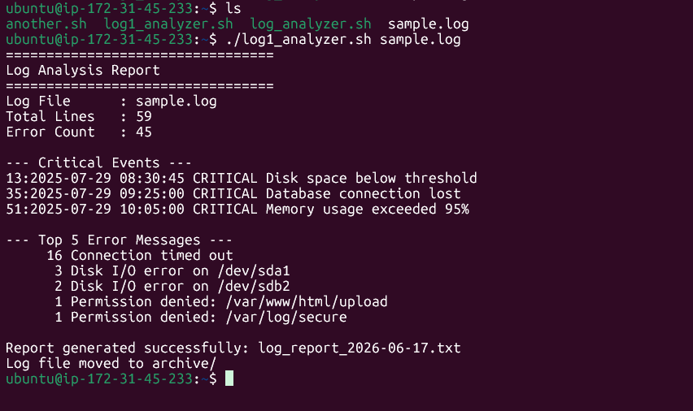

# Day 20 — Bash Scripting Challenge: Log Analyzer and Report Generator

## Overview

A production-grade Bash script that ingests a server log file, extracts key
metrics, and writes a formatted summary report — all in one run.

---

## Script: `log_analyzer.sh`

```bash
#!/bin/bash

set -euo pipefail

# ==========================
# Task 1: Input Validation
# ==========================

if [ $# -ne 1 ]; then
    echo "Usage: $0 <log_file>"
    exit 1
fi

LOG_FILE="$1"

if [ ! -f "$LOG_FILE" ]; then
    echo "Error: File '$LOG_FILE' does not exist."
    exit 1
fi

# ==========================
# Variables
# ==========================

DATE=$(date +%F)
REPORT="log_report_${DATE}.txt"

TOTAL_LINES=$(wc -l < "$LOG_FILE")

# ==========================
# Task 2: Error Count
# ==========================

ERROR_COUNT=$(grep -Ei "ERROR|Failed" "$LOG_FILE" | wc -l)

echo "================================="
echo "Log Analysis Report"
echo "================================="
echo "Log File      : $LOG_FILE"
echo "Total Lines   : $TOTAL_LINES"
echo "Error Count   : $ERROR_COUNT"
echo

# ==========================
# Task 3: Critical Events
# ==========================

echo "--- Critical Events ---"
CRITICAL_EVENTS=$(grep -n "CRITICAL" "$LOG_FILE" || true)

if [ -z "$CRITICAL_EVENTS" ]; then
    echo "No critical events found."
else
    echo "$CRITICAL_EVENTS"
fi

echo

# ==========================
# Task 4: Top Error Messages
# ==========================

echo "--- Top 5 Error Messages ---"

TOP_ERRORS=$(grep "ERROR" "$LOG_FILE" \
    | sed 's/.*ERROR[: ]*//' \
    | sort \
    | uniq -c \
    | sort -rn \
    | head -5)

if [ -z "$TOP_ERRORS" ]; then
    echo "No ERROR messages found."
else
    echo "$TOP_ERRORS"
fi

# ==========================
# Task 5: Summary Report
# ==========================

{
echo "================================="
echo "LOG ANALYSIS SUMMARY REPORT"
echo "================================="
echo "Date of Analysis : $(date)"
echo "Log File         : $LOG_FILE"
echo "Total Lines      : $TOTAL_LINES"
echo "Total Errors     : $ERROR_COUNT"
echo

echo "----- Top 5 Error Messages -----"
if [ -z "$TOP_ERRORS" ]; then
    echo "No ERROR messages found."
else
    echo "$TOP_ERRORS"
fi

echo
echo "----- Critical Events -----"

if [ -z "$CRITICAL_EVENTS" ]; then
    echo "No critical events found."
else
    echo "$CRITICAL_EVENTS"
fi

} > "$REPORT"

echo
echo "Report generated successfully: $REPORT"

# ==========================
# Task 6: Archive Log File
# ==========================

mkdir -p archive

mv "$LOG_FILE" archive/

echo "Log file moved to archive/"
```

---

## Sample Output

### Console output (running against `sample.log`)



### Generated report (`log_report_2026-06-17.txt`)

```
=================================
LOG ANALYSIS SUMMARY REPORT
=================================
Date of Analysis : Wed Jun 17 16:30:56 UTC 2026
Log File         : sample.log
Total Lines      : 59
Total Errors     : 45

----- Top 5 Error Messages -----
     16 Connection timed out
      3 Disk I/O error on /dev/sda1
      2 Disk I/O error on /dev/sdb2
      1 Permission denied: /var/www/html/upload
      1 Permission denied: /var/log/secure

----- Critical Events -----
13:2025-07-29 08:30:45 CRITICAL Disk space below threshold
35:2025-07-29 09:25:00 CRITICAL Database connection lost
51:2025-07-29 10:05:00 CRITICAL Memory usage exceeded 95%

```

### Validation error cases

```bash
# No argument
$ ./log_analyzer.sh
[ERROR] No log file provided.
Usage: ./log_analyzer.sh <path-to-log-file>

# Non-existent file
$ ./log_analyzer.sh /tmp/ghost.log
[ERROR] File not found: '/tmp/ghost.log'
Please supply a valid, readable log file path.
```

---

## Commands & Tools Used

| Tool | Purpose |
|------|---------|
| `grep -cE "ERROR\|Failed"` | Count lines matching either pattern with extended regex |
| `grep -n "CRITICAL"` | Print matching lines prefixed with their line number |
| `awk '{for(i=1;i<=3;i++) $i=""; ...}'` | Strip the first 3 fields (date, time, severity) to isolate the message |
| `sort` | Alphabetically sort messages so identical ones are adjacent |
| `uniq -c` | Collapse duplicate adjacent lines, prepending a count |
| `sort -rn` | Re-sort numerically in descending order (highest count first) |
| `head -5` | Keep only the top 5 results |
| `wc -l` | Count total lines in the file |
| `date +%Y-%m-%d` | Produce a sortable ISO-format date for the report filename |
| `basename` / `realpath` | Extract filename and resolve absolute path |
| `mkdir -p` | Create the archive directory only if it doesn't already exist |
| `mv` | Move the processed log into the archive directory |
| `{ } > file` | Group-redirect a block of `echo` statements to a file in one shot |

---

## Key Learnings

1. **`grep | awk | sort | uniq -c | sort -rn | head` is a classic Unix pipeline.**
   Each tool does exactly one thing: `grep` filters, `awk` strips unwanted
   fields, `sort` arranges identical lines together, `uniq -c` counts them,
   and a second `sort -rn` re-ranks by frequency. Composing small tools this
   way is far more powerful than writing a single complex loop.

2. **`[[ $# -eq 0 ]]` and `[[ ! -f "$file" ]]` are the two essential guards
   for any script that takes file arguments.**
   Exiting early with distinct exit codes (1 for missing arg, 2 for missing
   file) lets callers — cron jobs, CI pipelines, or other scripts — detect
   the exact failure mode programmatically, not just see "something went wrong".

3. **Group-redirecting a block with `{ ... } > file` writes an entire report
   in one operation.**
   The alternative — opening the file once per `echo` — is slower and error-prone.
   Capturing output inside a brace group and redirecting it once keeps the
   report-generation logic clean and atomic.