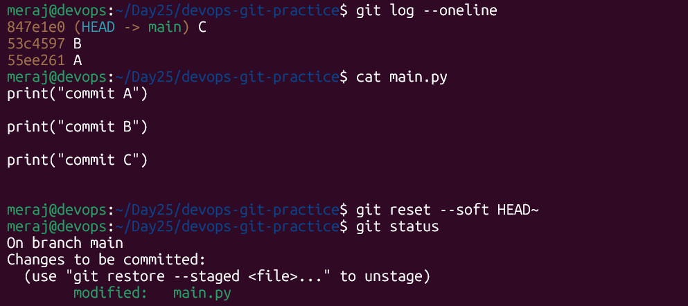
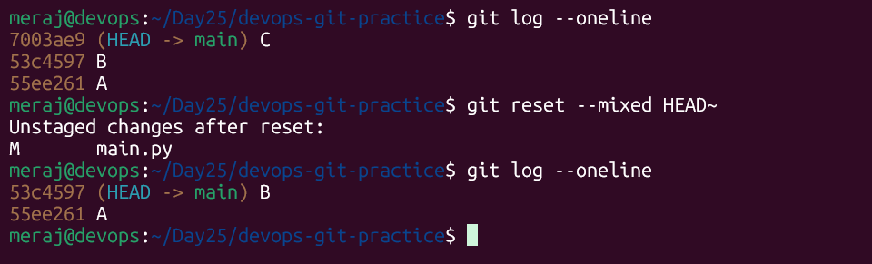
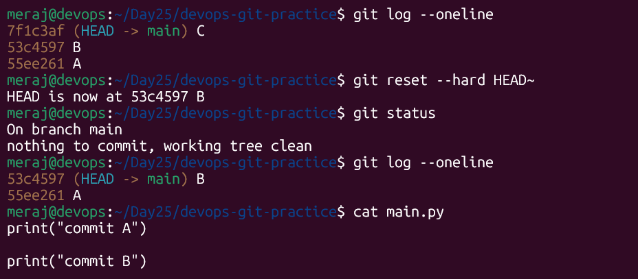
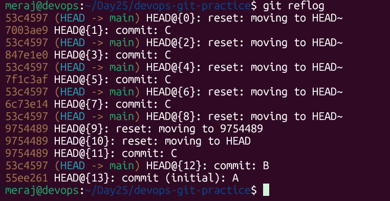
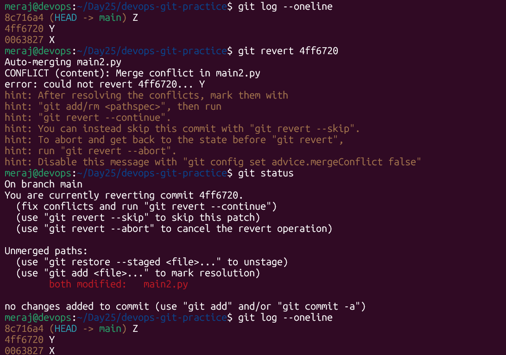
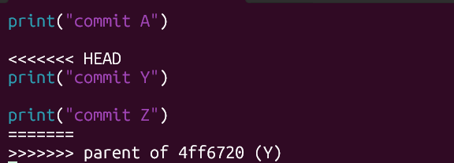
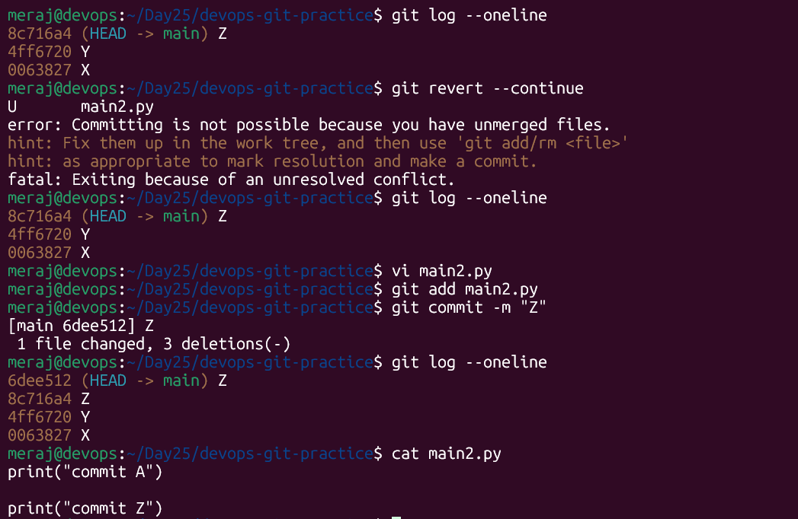

# Day 25 – Git Reset vs Revert & Branching Strategies

## Task 1: Git Reset — Hands-On

Setup: created `devops-git-practice` repo, made three commits on `main.py`:

```
 Commit C
 Commit B
 Commit A
 
```

### `git reset --soft HEAD~1`




**What happens:** HEAD and the branch pointer move back to Commit B, but the
*index (staging area)* and *working directory* are untouched. Commit C's
change (`Line C`) is still there — fully staged, ready to be committed again
immediately (`git commit -m "..."` would recreate an equivalent commit).

### `git reset --mixed HEAD~1` (default mode)

Re-committed C, then:



**What happens:** HEAD/branch pointer moves back, the *staging area is also
reset* to match the new HEAD — so the change is no longer staged — but the
*working directory* keeps the edit. You'd need `git add` before committing
again. This is the default behavior of `git reset` (no flag = `--mixed`).

### `git reset --hard HEAD~1`

Re-committed C again, then:



**What happens:** HEAD, the index, *and* the working directory are all reset
to Commit B. `Line C` is completely gone from the file. This is the
destructive one — if you hadn't committed it elsewhere, the work is lost
from your working tree.

**Safety net — `git reflog`:**



Even after `--hard`, the old commit object (`----`) still exists in
Git's object database and is recoverable via `git reflog` +
`git reset --hard <hash>` (or `git cherry-pick <hash>`), until garbage
collection eventually cleans it up.

### Answers

**Difference between `--soft`, `--mixed`, `--hard`:**

| Mode | Moves HEAD/branch | Resets staging area (index) | Resets working directory |
|---|---|---|---|
| `--soft` | Yes | No (keeps staged) | No (keeps files) |
| `--mixed` (default) | Yes | Yes (unstages) | No (keeps files) |
| `--hard` | Yes | Yes | Yes (discards file changes) |

**Which is destructive and why?**
`--hard` is destructive because it overwrites the working directory — any
uncommitted/unstaged changes and the diff from the reset-away commits are
wiped from your files, not just from history. (Recoverable only via
reflog as long as the commit isn't garbage-collected.)

**When to use each:**
- `--soft`: You want to squash/redo recent commits but keep all the changes
  staged, ready to re-commit differently (e.g., combining 3 commits into 1).
- `--mixed`: You want to undo commits but review/re-stage changes piece by
  piece before recommitting (e.g., you committed too early and want to
  reorganize what goes into which commit).
- `--hard`: You want to completely throw away commits and file changes —
  e.g., you experimented locally and decided to scrap it entirely, and
  you're certain nothing of value is uncommitted elsewhere.

**Should you ever `git reset` on commits already pushed?**
No, not on a shared/public branch. Resetting rewrites history locally; if
you then force-push, anyone else who already pulled those commits will have
a diverged history, causing conflicts and potentially losing work. Only use
`reset` on commits that are purely local/unpushed, or on a branch you are
100% certain nobody else has based work on. For shared history, use
`git revert` instead.

---

## Task 2: Git Revert — Hands-On

Made three commits X, Y, Z on `main2.py`:

```
Commit Z
Commit Y
Commit X
```

Reverted the middle commit:


Because Commit Z's line was added right after Commit Y's line, Git couldn't
automatically figure out how to "subtract" Y without touching the area Z
also changed a real, common scenario when reverting a non-latest commit.
Resolved manually (kept Line X and Line Z, removed Line Y), then:

`Here is Merging conflict due to revert from middle of log`



`after solve the conflict`



**Is Commit Y still in history?** Yes — `------- Commit Y` is still right
there in the log. `git revert` doesn't remove anything; it adds a *new*
commit (`--------`) whose diff is the inverse of Y's diff.

### Answers

**How is `revert` different from `reset`?**
`reset` moves the branch pointer backward and can rewrite/erase history.
`revert` moves history *forward* — it creates a brand-new commit that
undoes the changes of a target commit, leaving the original commit (and
everything after it) intact in the log.

**Why is revert safer for shared branches?**
Because it never rewrites existing commits or requires force-pushing. The
commit history that teammates have already pulled stays valid and
consistent — `revert` only ever adds, never removes/rewrites, so there's
no risk of diverging histories or stomping on someone else's work.

**When to use revert vs reset?**
- Use **revert** on any commit that has already been pushed / shared with
  others (e.g., undoing a bad commit on `main` in production).
- Use **reset** only on local, unpushed commits where you want to clean up
  your own history before sharing it.

---

## Task 3: Reset vs Revert — Summary

| | `git reset` | `git revert` |
|---|---|---|
| **What it does** | Moves the current branch pointer (and optionally index/working dir) backward to a previous commit | Creates a new commit that applies the inverse of a target commit's changes |
| **Removes commit from history?** | Yes (commits after the reset point become unreachable / can be lost) | No — original commit stays in the log; a new "undo" commit is added |
| **Safe for shared/pushed branches?** | No (rewrites history, needs force-push, breaks collaborators) | Yes (history-preserving, normal push) |
| **When to use** | Local cleanup of unpushed commits, undoing staged changes, squashing | Undoing changes on shared/public branches, production hotfix rollbacks |

---

## Task 4: Branching Strategies

### GitFlow

**How it works:** Long-lived `develop` branch (integration) sits alongside
`main` (production). New work happens in `feature/*` branches off
`develop`. When ready for a release, a `release/*` branch is cut from
`develop` for stabilization, then merged into both `main` and `develop`.
Urgent production fixes use `hotfix/*` branches off `main`, merged back
into both `main` and `develop`.

**Flow diagram:**
```
main      ---------------------------o----------------o---->
                                       \release/1.0    /hotfix/1.0.1
develop   --o---o-------o------o-------o---------------o---->
             \   \      /      /
        feature/a feature/b---/
```

**When/where used:** Projects with scheduled, versioned releases (desktop
software, enterprise products, libraries with strict release cadences).

**Pros:** Clear structure for parallel release/maintenance work; good
isolation between in-progress and stable code; supports hotfixes cleanly.

**Cons:** Heavyweight — many long-lived branches, more merge overhead,
slows down continuous delivery; overkill for fast-moving web apps.

### GitHub Flow

**How it works:** One long-lived branch, `main`, which is always
deployable. All work happens on short-lived `feature/*` (or any
descriptively-named) branches branched off `main`. Open a PR early, get
review + CI, merge back into `main`, and deploy immediately (or
continuously) from `main`.

**Flow diagram:**
```
main     ---o------------------o------------------o---->
              \  feature/login /   \ feature/fix  /
               o---o---o------o     o------o-----o
                   (PR + review + merge)
```

**When/where used:** Web apps and SaaS products doing continuous
deployment — GitHub itself, most modern startups.

**Pros:** Simple, fast, minimal branch overhead, plays well with CI/CD and
frequent deploys.

**Cons:** No built-in concept of "release" or "stabilization" branch — not
ideal if you need to support multiple versions in production
simultaneously or do scheduled (not continuous) releases.

### Trunk-Based Development

**How it works:** Everyone commits directly to `main` ("trunk") very
frequently, or uses extremely short-lived feature branches (hours, not
days/weeks) that merge back quickly. Incomplete features are hidden behind
feature flags rather than long-lived branches. Relies heavily on strong CI
and automated testing.

**Flow diagram:**
```
main  --o--o--o--o--o--o--o--o--o--o--o--o-->
            \fb/   \fb/         \fb/
            (few-hour branches, merged fast)
```

**When/where used:** Large-scale, high-velocity engineering orgs (Google,
Meta) and most cloud-native CI/CD shops; pairs well with feature flags.

**Pros:** Minimizes merge conflicts (small, frequent integrations);
enables true continuous integration; very fast feedback loops.

**Cons:** Requires mature CI/testing/feature-flag discipline; risky without
strong automated test coverage; less suitable for teams not ready to
invest in that tooling/culture.

### Answers

**Startup shipping fast:** **GitHub Flow** — simple enough for a small
team, pairs naturally with continuous deployment, low process overhead.

**Large team with scheduled releases:** **GitFlow** — its release/hotfix
branches map directly onto a versioned, scheduled release process and give
clear isolation between in-progress and stable code.

**Favorite open-source project's strategy (example: Kubernetes):**
Kubernetes uses a trunk-based-ish model: contributors work on short-lived
feature branches off `master`/`main` via PRs, but the project also
maintains long-lived `release-1.xx` branches for each minor version to
backport fixes — effectively a hybrid of trunk-based development for
day-to-day work and GitFlow-style release branches for shipping/maintaining
versions. (Worth checking the actual repo's `branches` page for any repo
you pick — the exact mix varies by project.)

---

## Reflog reminder

`git reflog` was the safety net used above — even after `git reset --hard`
discarded `Commit C` from the branch, the commit object remained recoverable
by hash until eventually garbage collected. Good habit: run `git reflog`
before panicking about "lost" commits.