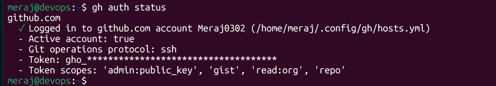

# Day 26 – GitHub CLI: Manage GitHub from Your Terminal

---

## Task 1: Install and Authenticate

### 1. Install the GitHub CLI

**Linux (Debian/Ubuntu):**
```bash
(type -p wget >/dev/null || (sudo apt update && sudo apt install wget -y)) \
  && sudo mkdir -p -m 755 /etc/apt/keyrings \
  && wget -qO- https://cli.github.com/packages/githubcli-archive-keyring.gpg | sudo tee /etc/apt/keyrings/githubcli-archive-keyring.gpg > /dev/null \
  && sudo chmod go+r /etc/apt/keyrings/githubcli-archive-keyring.gpg \
  && echo "deb [arch=$(dpkg --print-architecture) signed-by=/etc/apt/keyrings/githubcli-archive-keyring.gpg] https://cli.github.com/packages stable main" | sudo tee /etc/apt/sources.list.d/github-cli.list > /dev/null \
  && sudo apt update \
  && sudo apt install gh -y
```

Verify installation:
```bash
gh --version
```


### 2. Authenticate with your GitHub account
```bash
gh auth login
```
- Authenticate via web browser (recommended) or paste a personal access token?


Easiest path: **GitHub.com → HTTPS → Login with a web browser**, then follow the one-time code it gives you.

### 3. Verify login and active account
```bash
gh auth status
```
Sample output:




### 4: What authentication methods does `gh` support?

`gh auth login` supports several ways to authenticate:

1. **Browser-based OAuth login** – `gh` opens your browser, you approve access, and it generates a token automatically. This is the recommended, most common method.
2. **Personal Access Token (PAT)** – you can paste an existing token generated from GitHub Settings → Developer Settings → Personal Access Tokens (`gh auth login --with-token < mytoken.txt`).
3. **SSH key-based auth** – during setup you can choose SSH as the git protocol; `gh` can generate a new SSH key and upload it to your account for you.
4. **GitHub Enterprise Server support** – you can authenticate against a self-hosted GitHub Enterprise instance instead of github.com by specifying the hostname.
5. **Environment variable / CI auth** – setting `GH_TOKEN` or `GITHUB_TOKEN` lets `gh` authenticate non-interactively, which is what you'd use in CI/CD pipelines or scripts.

---

## Task 2: Working with Repositories

### 1. Create a new public repo with a README
```bash
gh repo create gh-test-repo --public --add-readme
```

### 2. Clone a repo using `gh`
```bash
gh repo clone gh-test-repo
```
`gh repo clone` is basically a wrapper around `git clone` but understands GitHub shorthand (`owner/repo`) instead of requiring the full URL.

### 3. View details of one of your repos
```bash
gh repo view gh-test-repo
```
Add `--web` to open it in the browser instead:
```bash
gh repo view gh-test-repo --web
```

### 4. List all your repositories
```bash
gh repo list
gh repo list meraj0302 --limit 30
```

### 5. Open a repo in your browser from the terminal
```bash
gh repo view gh-test-repo --web
```


### 6. Delete the test repo
```bash
gh repo delete gh-test-repo
```


---

## Task 3: Issues

### 1. Create an issue with title, body, and label
```bash
gh issue create \
  --repo <owner>/<repo> \
  --title "Bug: login button unresponsive" \
  --body "Clicking the login button on mobile does nothing. Steps to reproduce: ..." \
  --label "bug"
```
Note: the label must already exist on the repo, or you'll get an error — create it first with `gh label create bug --color FF0000` if needed, or omit `--label`.

### 2. List all open issues
```bash
gh issue list --repo <owner>/<repo>
gh issue list --repo <owner>/<repo> --state open
```

### 3. View a specific issue by number
```bash
gh issue view 1 --repo <owner>/<repo>
```

### 4. Close an issue
```bash
gh issue close 1 --repo <owner>/<repo>
```
You can also close with a comment:
```bash
gh issue close 1 --repo <owner>/<repo> --comment "Fixed in latest release."
```

**Observations:**
```
[PASTE OUTPUT HERE]
```

### Answer: How could you use `gh issue` in a script or automation?

`gh issue` commands support `--json` output, which makes them scriptable rather than just interactive. Some real automation use-cases:

- **Auto-triage bots**: a cron job or GitHub Action script runs `gh issue list --json number,title,labels` and auto-applies labels, assigns owners, or pings Slack based on keywords in the title/body.
- **Stale issue cleanup**: a nightly script queries `gh issue list --search "updated:<30 days ago" --json number` and auto-closes or comments on inactive issues.
- **Release-note generation**: `gh issue list --state closed --label "bug" --json title,number` can be piped into a changelog generator.
- **Ticket sync**: a script could create a GitHub issue automatically (`gh issue create`) whenever a new bug is filed in an external tracker (e.g., triggered by a webhook), keeping systems in sync.
- **CI failure reporting**: if a pipeline step fails, a script calls `gh issue create` to automatically file an issue with the failing logs attached, instead of requiring a human to notice and file it manually.

The `--json` flag combined with tools like `jq` turns `gh issue` into a proper API client from bash, so it fits naturally into shell scripts or CI jobs without needing a separate GitHub API library.

---

## Task 4: Pull Requests

### 1. Create a branch, make a change, push, and open a PR
```bash
git checkout -b feature/update-readme
echo "## New Section" >> README.md
git add README.md
git commit -m "docs: add new section to README"
git push -u origin feature/update-readme

gh pr create --title "docs: update README" --body "Adds a new section explaining X." --base main
```
Or let `gh` auto-fill the title/body from your commit message:
```bash
gh pr create --fill
```

### 2. List all open PRs
```bash
gh pr list --repo <owner>/<repo>
```

### 3. View PR details — status, reviewers, checks
```bash
gh pr view 3 --repo <owner>/<repo>
gh pr checks 3 --repo <owner>/<repo>
```
`gh pr view` shows the PR description, review status, and linked checks; `gh pr checks` specifically shows CI check pass/fail status.

### 4. Merge your PR
```bash
gh pr merge 3 --squash --delete-branch
```

**Observations:**
```
[PASTE OUTPUT HERE — PR URL, checks output, merge confirmation]
```

### Answer: What merge methods does `gh pr merge` support?

Three merge strategies, matching what's available in the GitHub UI:

1. **`--merge`** – creates a standard merge commit that preserves full commit history from the branch.
2. **`--squash`** – combines all commits in the PR into a single commit on the base branch (keeps history clean, commonly used for feature branches with messy commit history).
3. **`--rebase`** – replays the PR's commits individually on top of the base branch without a merge commit, keeping a linear history.

Useful flags: `--delete-branch` removes the source branch after merging, `--auto` enables auto-merge (merges automatically once required checks pass), and `--admin` bypasses branch protection rules if you have admin rights.

### Answer: How would you review someone else's PR using `gh`?

```bash
# Check out the PR locally to test it
gh pr checkout 5

# View the diff without checking out
gh pr diff 5

# View overall PR info, comments, and status
gh pr view 5 --comments

# Approve
gh pr review 5 --approve --body "LGTM, nice work!"

# Request changes
gh pr review 5 --request-changes --body "Please add tests for the new function."

# Leave a general comment without approving/rejecting
gh pr review 5 --comment --body "Left some thoughts inline."
```
This lets you do a full code review — pull the branch, inspect the diff, run the code locally, and submit a formal review — all without opening a browser.

---

## Task 5: GitHub Actions & Workflows (Preview)

### 1. List workflow runs on a public repo
```bash
gh run list --repo cli/cli
```

### 2. View the status of a specific workflow run
```bash
gh run view <run-id> --repo cli/cli
gh run view <run-id> --repo cli/cli --log
```
`--log` streams the full job log for that run, useful for debugging a failing pipeline without opening the Actions tab in the browser.

You can also inspect workflow definitions themselves:
```bash
gh workflow list --repo cli/cli
gh workflow view <workflow-name> --repo cli/cli
```

**Observations:**
```
[PASTE OUTPUT HERE]
```

### Answer: How could `gh run` and `gh workflow` be useful in a CI/CD pipeline?

- **Triggering workflows manually**: `gh workflow run <name>` can kick off a `workflow_dispatch` job from a script — useful for manual deploys or re-running a pipeline without clicking through the UI.
- **Polling for completion**: a deployment script can call `gh run watch <run-id>` to block until a triggered workflow finishes, then branch logic based on success/failure — handy for chaining pipelines (e.g., "wait for build workflow to succeed before triggering deploy workflow").
- **Debugging failures fast**: `gh run view --log-failed` pulls only the logs from failed steps, so on-call engineers can diagnose a broken pipeline directly from the terminal instead of digging through the Actions UI.
- **Auditing/reporting**: `gh run list --json conclusion,name,createdAt` can feed a dashboard or Slack notification summarizing recent build health across repos.
- **Local automation hooks**: a pre-deploy script can check `gh run list --workflow=ci.yml --branch main --limit 1 --json conclusion` to confirm the latest CI run on `main` passed before allowing a deploy to proceed.

Essentially, `gh run`/`gh workflow` turn Actions into something scriptable from any shell, which matters once you're chaining pipelines together or building your own deployment tooling on top of GitHub Actions.

---

## Task 6: Useful `gh` Tricks

### `gh api` — raw GitHub API calls
```bash
gh api /user
gh api repos/<owner>/<repo>/stargazers
gh api graphql -f query='{ viewer { login } }'
```
Lets you hit any GitHub REST or GraphQL endpoint using your authenticated `gh` session — no need to manually manage tokens/headers with `curl`.

### `gh gist` — create and manage Gists
```bash
gh gist create myscript.sh --public
gh gist list
gh gist view <gist-id>
```

### `gh release` — create and manage releases
```bash
gh release create v1.0.0 --title "v1.0.0" --notes "First stable release"
gh release list
gh release view v1.0.0
```

### `gh alias` — shortcuts for frequent commands
```bash
gh alias set prc 'pr create --fill'
gh alias set il 'issue list --state open'
gh alias list
```
Now `gh prc` runs the full `pr create --fill` command.

### `gh search repos` — search GitHub from the terminal
```bash
gh search repos "devops cli tool" --language go --stars ">100"
```

**Observations:**
```
[PASTE OUTPUT HERE — which of these did you find most useful and why]
```

---

## Summary / Key Takeaways

- `gh` removes the browser round-trip for almost every day-to-day GitHub task: repos, issues, PRs, releases, and even raw API calls.
- The `--json` flag (paired with `jq`) is what makes `gh` genuinely useful for **automation** rather than just a convenience CLI — it turns every command into a scriptable data source.
- `gh auth login` supporting token/env-var auth is what makes `gh` usable inside CI pipelines, not just interactively on a local machine.
- `gh pr create --fill`, `gh pr checkout`, and `gh pr review` together make full PR workflows (create → review → merge) possible without ever leaving the terminal.
- `gh run` / `gh workflow` extend this same terminal-first philosophy to CI/CD, which will matter a lot once GitHub Actions is covered in more depth.