# Day 29 – Introduction to Docker

## Task 1: What is Docker?

### What is a container and why do we need them?

A **container** is a lightweight, standalone, executable package that bundles an application together with everything it needs to run — code, runtime, system libraries, and configuration. Containers isolate an application from the underlying host system while sharing the host's operating system kernel.

**Why we need them:**
- **"Works on my machine" problem** — Containers package the app with its exact dependencies, so it behaves the same on a developer's laptop, a test server, or production.
- **Speed** — Containers start in seconds because they don't boot a full OS.
- **Efficiency** — Since containers share the host kernel, they use far less CPU/RAM/disk than a VM running the same workload.
- **Portability** — A container image built once can run on any machine that has a container runtime (Docker, containerd, etc.), regardless of the underlying OS distribution.
- **Isolation** — Each container gets its own filesystem, process space, and network interface, so apps don't interfere with each other even if they run on the same host.
- **Scalability** — Because containers are small and fast, they are ideal building blocks for microservices and for orchestration tools like Kubernetes.

### Containers vs Virtual Machines — what's the real difference?

| Aspect | Virtual Machines | Containers |
|---|---|---|
| What's virtualized | Entire hardware (via a hypervisor) | Only the OS-level processes (via the host kernel) |
| OS | Each VM runs its own full guest OS | All containers share the host's OS kernel |
| Size | Gigabytes (full OS + app) | Megabytes (just app + dependencies) |
| Boot time | Minutes (booting a full OS) | Seconds (starting a process) |
| Isolation level | Very strong (separate kernel per VM) | Process-level isolation (namespaces + cgroups) |
| Resource usage | Heavy — each VM reserves its own RAM/CPU | Light — containers share resources dynamically |
| Density | Fewer VMs per host | Many more containers per host |
| Use case | Running different OSes, strong security boundaries | Fast, portable, scalable app deployment |

**In short:** A VM virtualizes an entire computer, including its own kernel. A container virtualizes only the application layer and shares the host machine's kernel. This is why containers are dramatically lighter and faster to start than VMs, at the cost of slightly weaker isolation (since a kernel vulnerability could theoretically affect all containers on that host).

### Docker Architecture

Docker uses a **client-server architecture** with these key components:

- **Docker Client** — The command-line tool (`docker`) you interact with. When you type `docker run`, the client sends this command to the Docker daemon via a REST API (over a UNIX socket or network interface).
- **Docker Daemon (`dockerd`)** — Runs in the background on the host machine. It listens for API requests and manages Docker objects: building images, running containers, managing networks and volumes.
- **Docker Images** — Read-only templates used to create containers. An image includes the application code, runtime, libraries, and dependencies, built up in layers (each `Dockerfile` instruction adds a layer).
- **Docker Containers** — A running (or stopped) instance of an image. It's the image plus a writable layer on top, plus runtime configuration (ports, environment variables, volumes).
- **Docker Registry** — A place to store and distribute images. **Docker Hub** is the default public registry, but private registries (AWS ECR, GitHub Container Registry, self-hosted) are common too. `docker pull` fetches an image from a registry; `docker push` uploads one.

**My own description of the flow:**

```
                 ┌────────────────────┐
   docker run    │   Docker Client    │
  ─────────────► │   (CLI / API)      │
                 └─────────┬──────────┘
                           │ REST API call
                           ▼
                 ┌────────────────────┐
                 │   Docker Daemon    │
                 │     (dockerd)      │
                 └───┬───────────┬────┘
                     │           │
        pulls image  │           │ creates & runs
        if missing   ▼           ▼
             ┌───────────┐  ┌───────────────┐
             │  Registry │  │   Container   │
             │(Docker Hub│  │ (running from │
             │ or other) │  │  an image)    │
             └───────────┘  └───────────────┘
                     ▲
                     │ built from
             ┌───────────────┐
             │     Image     │
             │ (layers: base │
             │ OS + deps +   │
             │ app code)     │
             └───────────────┘
```

In simple words: I type a command into the **client**. The client talks to the **daemon**, which is the actual engine doing the work. If the daemon doesn't already have the image locally, it pulls it from a **registry** (like Docker Hub). Once it has the image, it creates a **container** — a live, running instance of that image — with its own isolated filesystem, network, and process space.

---

## Task 2: Install Docker

### 1. Install Docker

### Using docker documents
Installed Docker Desktop (Windows/Mac) or Docker Engine (Linux) following the official instructions at https://docs.docker.com/get-docker/

Linux (Ubuntu) quick install:
```bash
sudo apt-get update
sudo apt-get install ca-certificates curl gnupg
sudo install -m 0755 -d /etc/apt/keyrings
curl -fsSL https://download.docker.com/linux/ubuntu/gpg | sudo gpg --dearmor -o /etc/apt/keyrings/docker.gpg
sudo chmod a+r /etc/apt/keyrings/docker.gpg

echo \
  "deb [arch=$(dpkg --print-architecture) signed-by=/etc/apt/keyrings/docker.gpg] https://download.docker.com/linux/ubuntu \
  $(. /etc/os-release && echo "$VERSION_CODENAME") stable" | \
  sudo tee /etc/apt/sources.list.d/docker.list > /dev/null

sudo apt-get update
sudo apt-get install docker-ce docker-ce-cli containerd.io docker-buildx-plugin docker-compose-plugin
```

### another one is `docker.io`, below snap has attached for reprence.

> 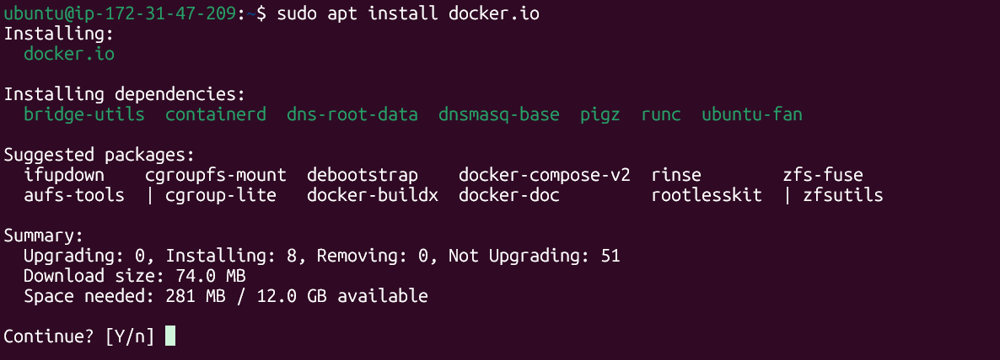
> 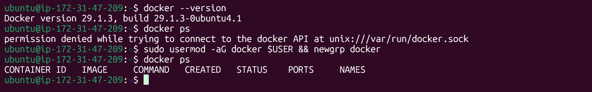


### 2. Verify installation
```bash
docker --version
docker info
```
> 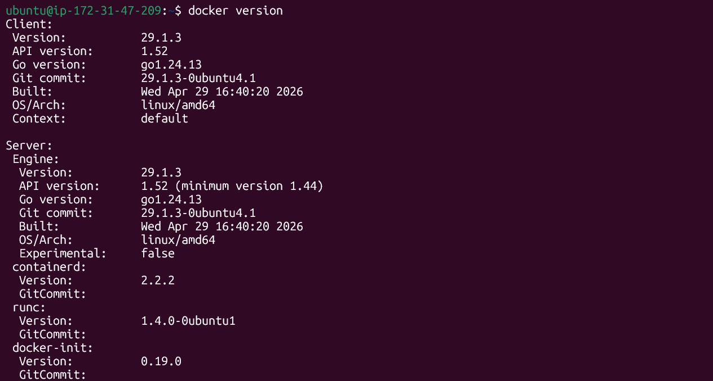

### 3. Run the hello-world container
```bash
docker run hello-world
```
> _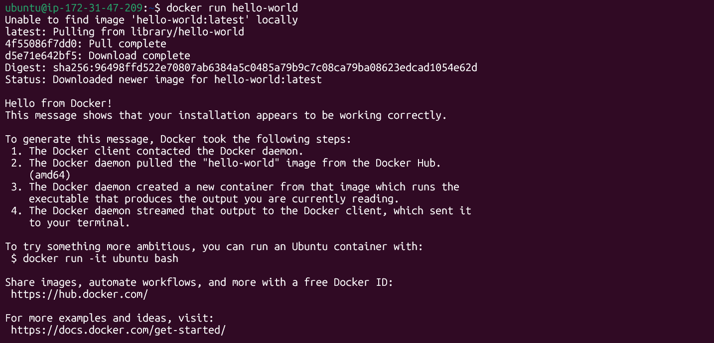_

### 4. What the output explains
The `hello-world` output walks through exactly what Docker did:
1. The Docker **client** contacted the Docker **daemon**.
2. The daemon checked locally for the `hello-world` image and didn't find it (first run).
3. The daemon **pulled** the image from Docker Hub (the default registry).
4. The daemon created a **new container** from that image and ran it.
5. The container printed the message to stdout, and the daemon streamed that output back to the client — this is the message you saw.
6. The container then exited, since its only job was to print the message.

This confirms the full loop: **client → daemon → registry → image → container** all worked correctly.

---

## Task 3: Run Real Containers

### 1. Run an Nginx container and access it in the browser
```bash
docker run -d -p 80:80 --name my-nginx nginx
```
Then open `http://0.0.0.0:80` in the browser — "Welcome to nginx!" page.
> _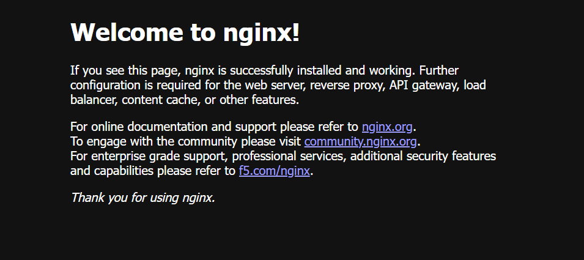_

### 2. Run an Ubuntu container in interactive mode
```bash
docker run -it ubuntu bash
```
Inside the container, explore it like a mini Linux box:
```bash
ls /
cat /etc/os-release
whoami
apt update && apt install -y curl
exit
```
> _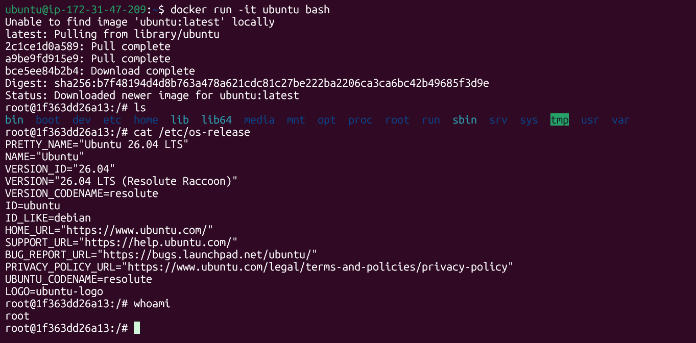_

### 3. List all running containers
```bash
docker ps
```
> _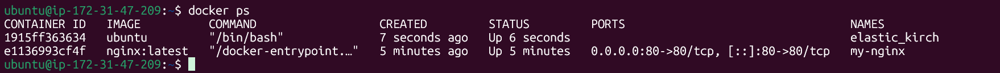_

### 4. List all containers (including stopped ones)
```bash
docker ps -a
```
> _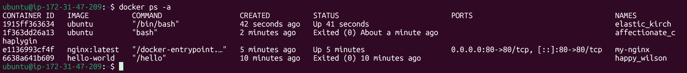_

### 5. Stop and remove a container
```bash
docker stop my-nginx
docker rm my-nginx
```
> _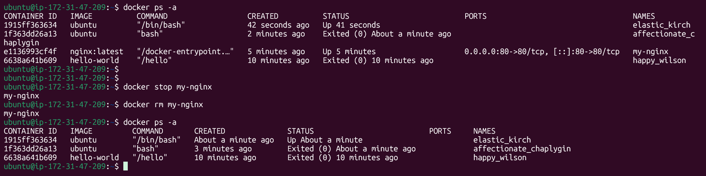_

---

## Task 4: Explore

### 1. Run a container in detached mode
```bash
docker run -d nginx
```
> 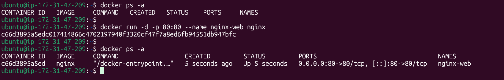

**What's different:** With `-d` (detached), the container runs in the background and immediately returns control of the terminal to you, instead of attaching your terminal to the container's stdout/stdin (as with `-it`). You have to use `docker logs` or `docker attach` to see its output afterward.

### 2. Give a container a custom name
```bash
docker run -d --name webserver nginx
```
> 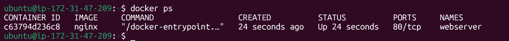

Without `--name`, Docker auto-generates a random name (e.g. `laughing_curie`). Naming makes it much easier to reference the container in later commands (`docker logs webserver`, `docker stop webserver`, etc).

### 3. Map a port from the container to the host
```bash
docker run -d --name webserver -p 8080:80 nginx
```
> 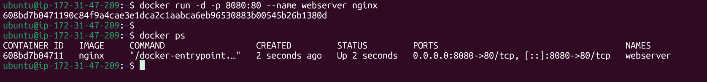

`-p 8080:80` means: host port `8080` → container port `80`. Now `http://localhost:8080` reaches Nginx running inside the container.

### 4. Check logs of a running container
```bash
docker logs webserver
docker logs -f webserver   # follow logs live, like tail -f
```
> _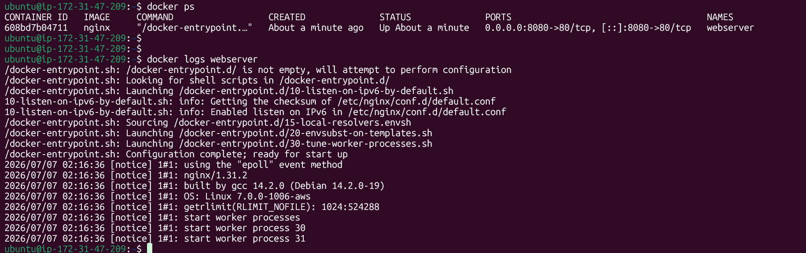_

### 5. Run a command inside a running container
```bash
docker exec -it webserver bash
# now inside the container:
ls /usr/share/nginx/html
exit
```
> 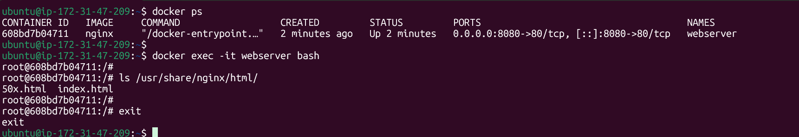

Or run a one-off command without a full shell:
```bash
docker exec webserver cat /etc/nginx/nginx.conf
```
> 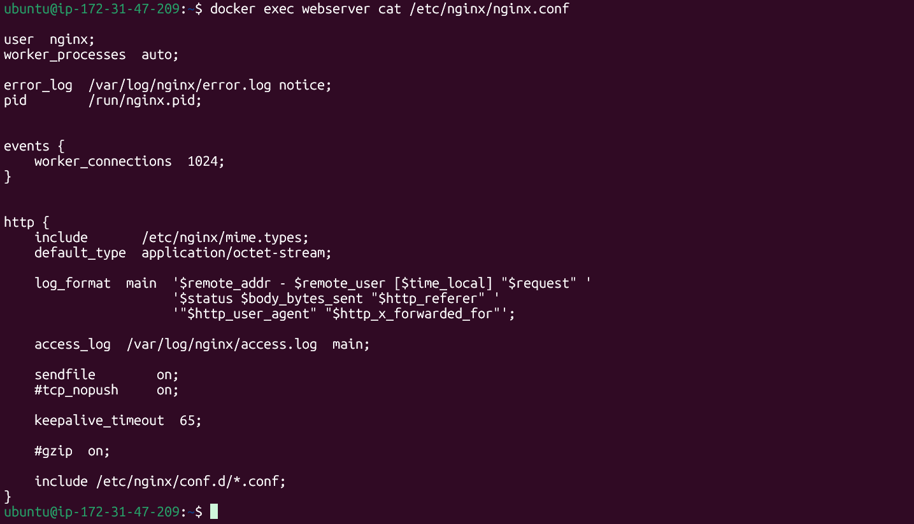

---

## Cleanup
```bash
docker stop webserver my-nginx
docker rm webserver my-nginx
docker ps -a
```

---

## Why This Matters for DevOps

Docker is the foundation of modern deployment. Every CI/CD pipeline, Kubernetes cluster, and microservice architecture starts with containers. Containers give teams:
- **Consistency** across dev, staging, and production environments
- **Fast, reproducible builds** that can be versioned like code
- **A common unit of deployment** that orchestrators (Kubernetes, ECS, Nomad) can schedule and scale
- **Isolation** that lets many services run safely on the same infrastructure

Today's first `docker run hello-world` is the same fundamental building block behind large-scale, production container platforms — just at the smallest possible scale.