# Day 30 – Docker Images & Container Lifecycle

## Task 1: Docker Images

### 1. Pull the images
```bash
docker pull nginx
docker pull ubuntu
docker pull alpine
```
> 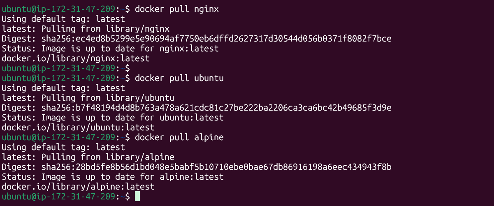

### 2. List all images
```bash
docker images
```
> 

Example sizes see below:

| Image | Approx. Size |
|---|---|
| `ubuntu` | ~160 MB |
| `nginx` | ~241 MB (includes Debian base + Nginx) |
| `alpine` | ~13 MB |

### 3. Ubuntu vs Alpine — why the size difference?

- **Alpine Linux** is built around **musl libc** (a minimal C library) and **BusyBox** (a single small binary providing stripped-down versions of common Unix tools), instead of the full GNU toolchain. It ships only the bare essentials needed to boot a functioning Linux userspace.
- **Ubuntu**'s base image uses **glibc** and a much larger set of standard Debian/Ubuntu packages, utilities, and metadata (documentation, man pages, package manager caches, etc.) baked in for broader compatibility.
- Alpine deliberately excludes anything not essential — no man pages, minimal locale support, no extra utilities — trading some convenience and compatibility (some software expects glibc) for a drastically smaller footprint.
- **Result:** Alpine is roughly **10x smaller** than Ubuntu, which is why it's the go-to base image for production containers where image size, pull speed, and attack surface matter (fewer packages = fewer vulnerabilities).

### 4. Inspect an image
```bash
docker inspect nginx
```
> 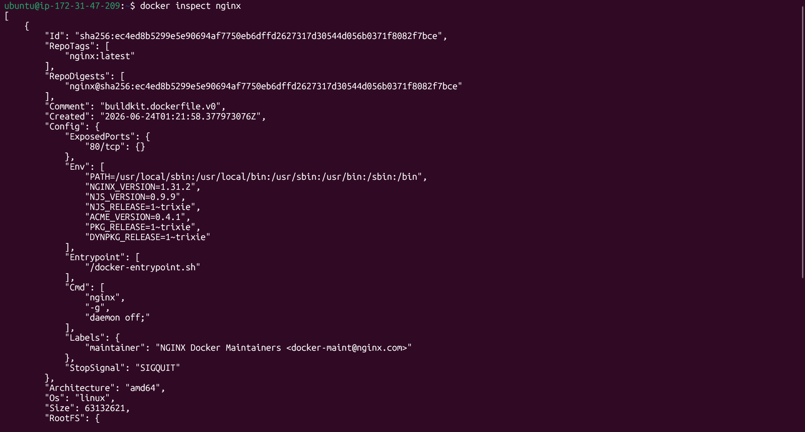

Key information visible in `docker inspect`:
- **Id / RepoTags / RepoDigests** — unique image ID and tags/digests
- **Created** — when the image was built
- **Architecture / Os** — target platform (e.g. `amd64`, `linux`)
- **Config** — default `Cmd`, `Entrypoint`, exposed `Ports`, environment variables (`Env`), working directory
- **RootFS / Layers** — the list of layer hashes that make up the image's filesystem
- **Size / VirtualSize** — total size of the image

### 5. Remove an image
```bash
docker rmi alpine
```
> 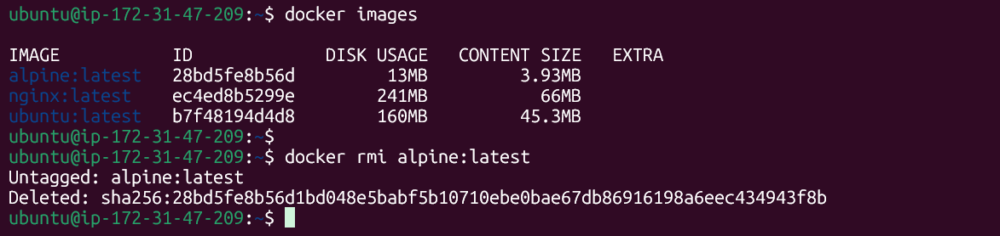
> Note: if a container (even a stopped one) is using the image, then will need to remove the container first, or use `docker rmi -f`.

---

## Task 2: Image Layers

### 1. Inspect image history
```bash
docker image history nginx
```
> 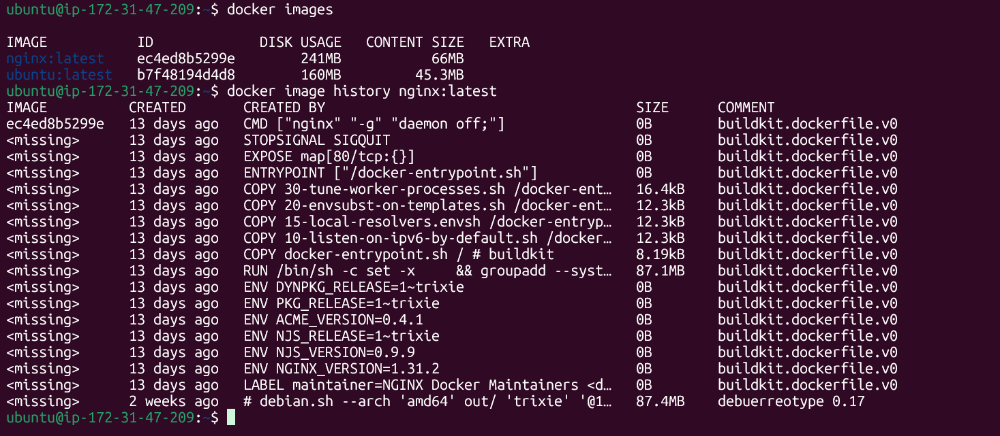

### 2. What you see
Each row in the output is one **layer** of the image, corresponding to one instruction in the Dockerfile that built it (`FROM`, `RUN`, `COPY`, `EXPOSE`, `CMD`, etc.), listed from **newest (top) to oldest/base (bottom)**.
- Layers that actually add files (like a `RUN apt-get install` or `COPY` command) show a **non-zero size**.
- Layers that only change metadata — like `CMD`, `EXPOSE`, `ENV`, `WORKDIR`, `LABEL` — show **0B**, because they don't add any files to the filesystem, they just record configuration that gets applied when the container runs.

### 3. What are layers and why does Docker use them?

An image is built as a **stack of read-only layers**, where each layer represents the filesystem changes (added/modified/deleted files) introduced by one build instruction. When a container runs, Docker adds one thin **writable layer** on top of all the read-only image layers (this is the "container layer").

**Why Docker uses layers:**
- **Caching** — If you rebuild an image and only the last few instructions changed, Docker reuses the cached layers from earlier, unchanged instructions instead of rebuilding them. This makes builds dramatically faster.
- **Storage efficiency / sharing** — If multiple images share the same base layers (e.g. many images built `FROM ubuntu`), those layers are stored **once** on disk and shared across all of them, instead of being duplicated.
- **Faster pulls/pushes** — Only the layers that changed need to be transferred over the network; unchanged layers are reused from what's already local.
- **Immutability & reproducibility** — Because layers are read-only, the same image always produces the same starting filesystem, which is a big part of why containers behave consistently across machines.

---

## Task 3: Container Lifecycle

Practicing the full lifecycle using one Nginx container named `lifecycle-demo`.

### 1. Create a container without starting it
```bash
docker create --name lifecycle-demo nginx
docker ps -a
```
> State: `Created` — the container exists but has never run.
> 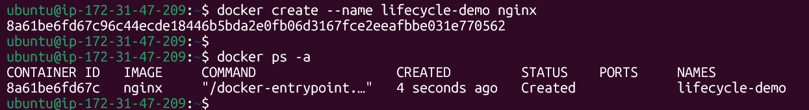

### 2. Start the container
```bash
docker start lifecycle-demo
docker ps -a
```
> State: `Up X seconds` (running).
> 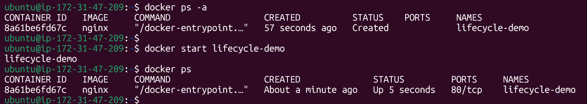

### 3. Pause it and check status
```bash
docker pause lifecycle-demo
docker ps -a
```
> State: `Up X seconds (Paused)` — all processes inside are frozen (via cgroups freezer), but the container is not stopped.
> 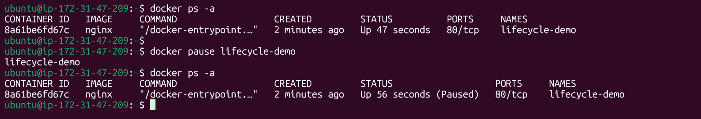

### 4. Unpause it
```bash
docker unpause lifecycle-demo
docker ps -a
```
> State: back to `Up X seconds`, processes resume exactly where they were.
>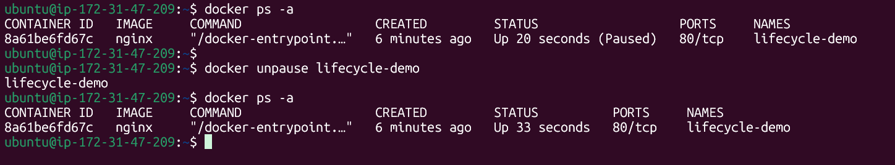

### 5. Stop it
```bash
docker stop lifecycle-demo
docker ps -a
```
> State: `Exited (0)` — Docker sends `SIGTERM`, waits a grace period (default 10s), then `SIGKILL` if it hasn't exited.
> 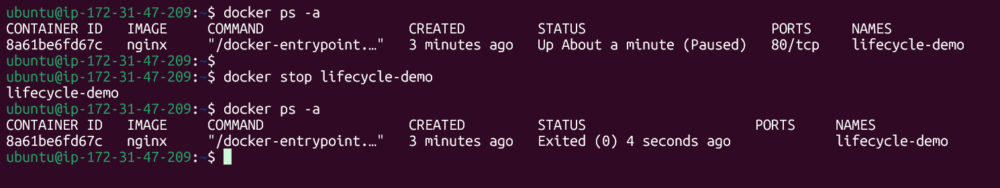

### 6. Restart it
```bash
docker restart lifecycle-demo
docker ps -a
```
> State: `Up X seconds` again — equivalent to stop + start in one command.
> 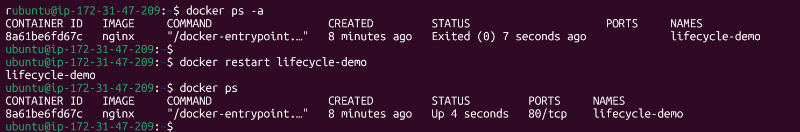

### 7. Kill it
```bash
docker kill lifecycle-demo
docker ps -a
```
> State: `Exited (137)` — `SIGKILL` sent immediately, no graceful shutdown period (137 = 128 + 9, signal 9 = SIGKILL).
> 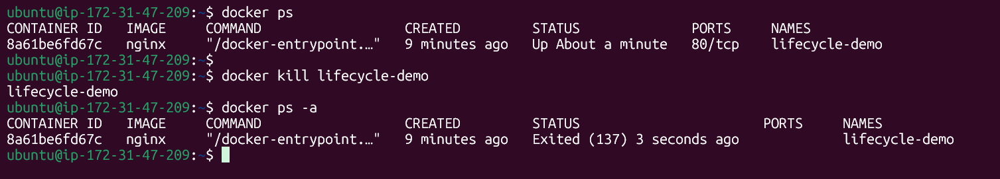

### 8. Remove it
```bash
docker rm lifecycle-demo
docker ps -a
```
> Container no longer appears at all.
> 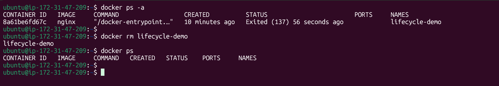

### Lifecycle summary

```
create → Created
   │ start
   ▼
Running ──pause──► Paused ──unpause──► Running
   │
   │ stop (graceful, SIGTERM→SIGKILL)      kill (immediate SIGKILL)
   ▼                                          │
Exited ◄──────────────────────────────────────┘
   │ start / restart
   ▼
Running
   │ rm
   ▼
(removed / gone)
```

---

## Task 4: Working with Running Containers

### 1. Run Nginx in detached mode
```bash
docker run -d --name web -p 80:80 nginx
```
> 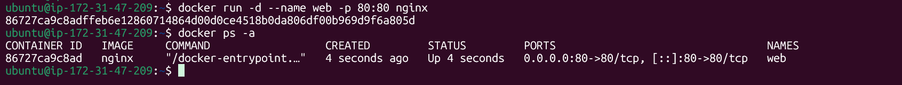

### 2. View its logs
```bash
docker logs web
```
> 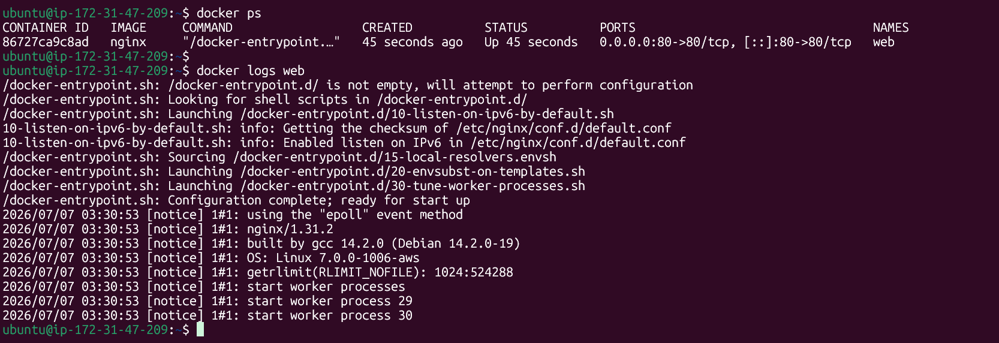

### 3. View real-time logs (follow mode)
```bash
docker logs -f web
```
Leave this running and refresh `http://localhost:80` in the browser a few times in another terminal — you'll see new access log lines stream in live. `Ctrl+C` to stop following (this does not stop the container).
> 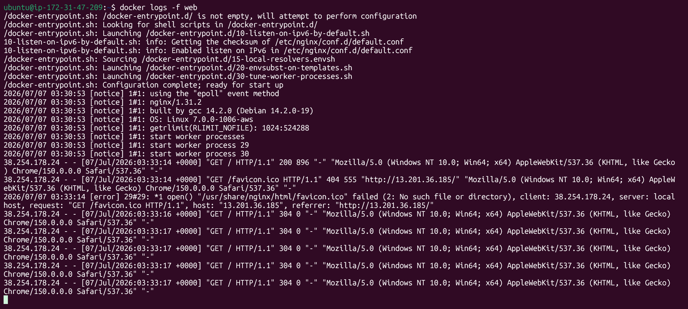

### 4. Exec into the container and look around
```bash
docker exec -it web bash
ls /etc/nginx
cat /etc/nginx/nginx.conf
ls /usr/share/nginx/html
exit
```
> 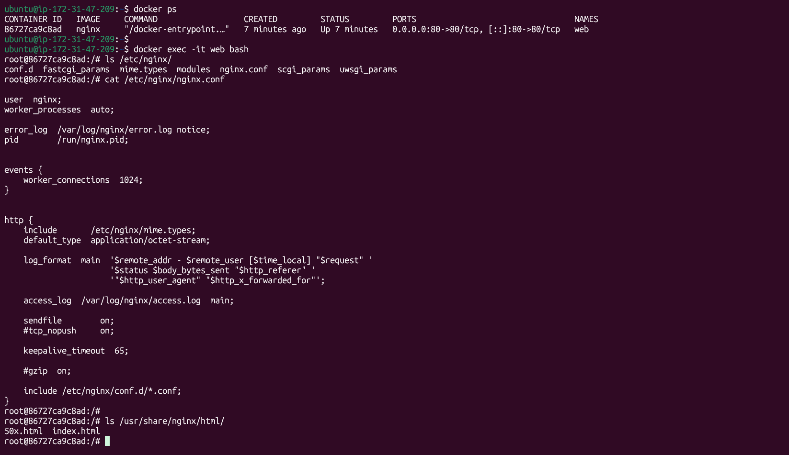

### 5. Run a single command without entering it
```bash
docker exec web nginx -v
docker exec web ls /usr/share/nginx/html
```
> 

### 6. Inspect the container
```bash
docker inspect web
```
Specific fields worth pulling out directly:
```bash
docker inspect -f '{{.NetworkSettings.IPAddress}}' web
docker inspect -f '{{.NetworkSettings.Ports}}' web
docker inspect -f '{{.Mounts}}' web
```
> 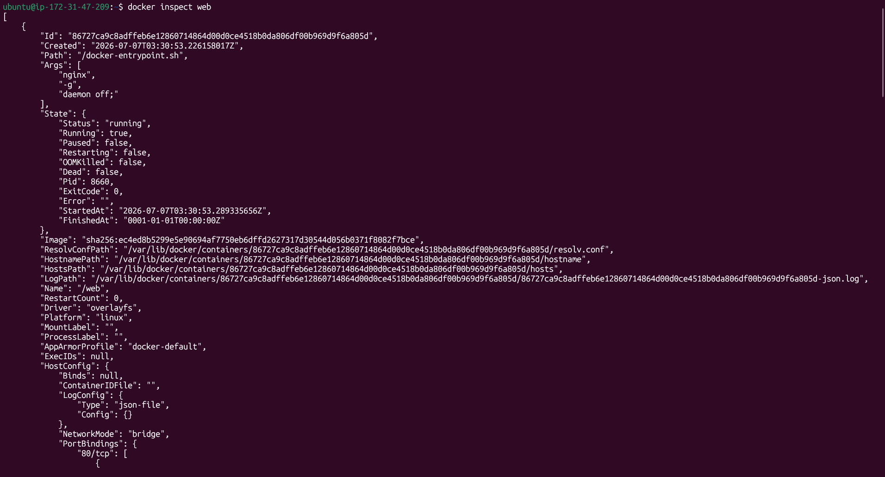

What this reveals:
- **IP address** — the container's internal IP on Docker's bridge network (e.g. `172.17.0.2`), used for container-to-container communication.
- **Port mappings** — the host↔container port bindings (e.g. `8080/tcp -> 0.0.0.0:8080`).
- **Mounts** — any volumes or bind mounts attached to the container, along with their source/destination paths and read/write mode.

---

## Task 5: Cleanup

### 1. Stop all running containers in one command
```bash
docker stop $(docker ps -q)
```
> 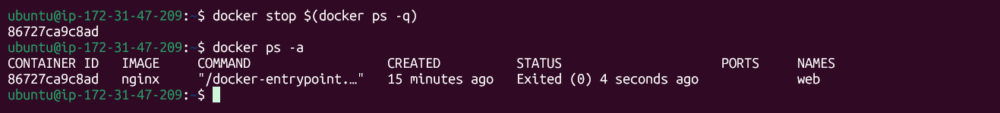

### 2. Remove all stopped containers in one command
```bash
docker container prune -f
```
> 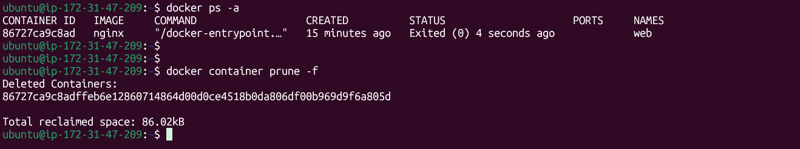

### 3. Remove unused images
```bash
docker image prune -a -f
```
> `-a` removes all images not used by any container (not just dangling ones); `-f` skips the confirmation prompt.
> 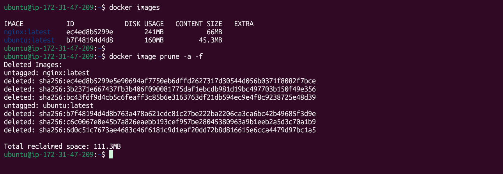

### 4. Check Docker's disk usage
```bash
docker system df
```
No Image and container
> Shows a breakdown by TYPE (Images, Containers, Local Volumes, Build Cache) with TOTAL, ACTIVE, SIZE, and RECLAIMABLE space.
> 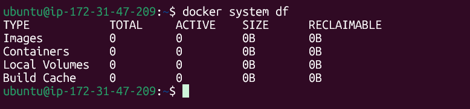

For a full one-shot cleanup of everything unused (containers, networks, dangling images, build cache):
```bash
docker system prune -a -f
```

---

## Key Takeaways

- An **image** is a static, read-only template made of layers; a **container** is a running instance of an image plus a writable layer on top.
- **Layers** enable caching, storage sharing, and faster builds/pulls — Docker only rebuilds/transfers what actually changed.
- Containers move through a clear **lifecycle**: created → running → paused/stopped → removed, and each state transition uses a specific command and signal (`SIGTERM` for `stop`, `SIGKILL` for `kill`).
- `docker logs`, `docker exec`, and `docker inspect` are the three main tools for observing and interacting with a container while it's alive.
- Regular cleanup (`prune`, `system df`) matters because unused images, stopped containers, and build cache silently eat disk space over time.