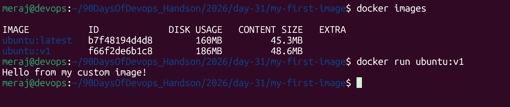
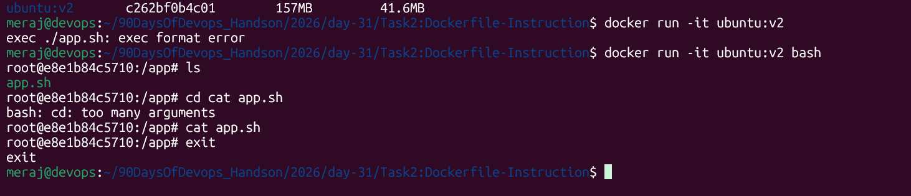
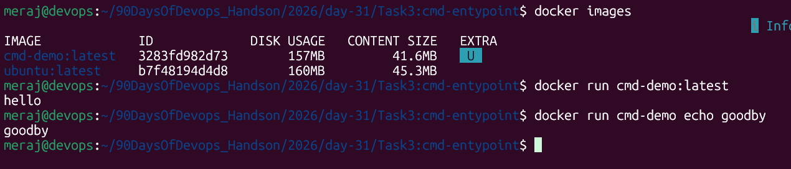
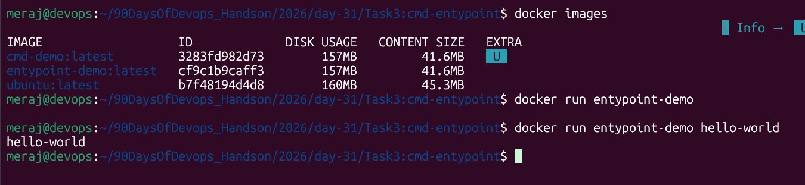
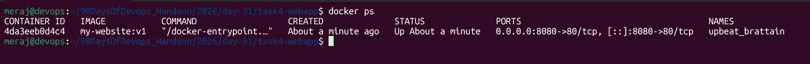
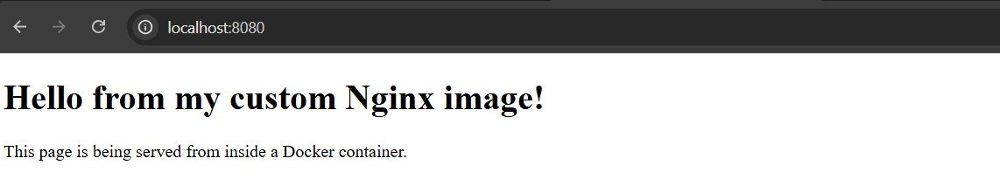
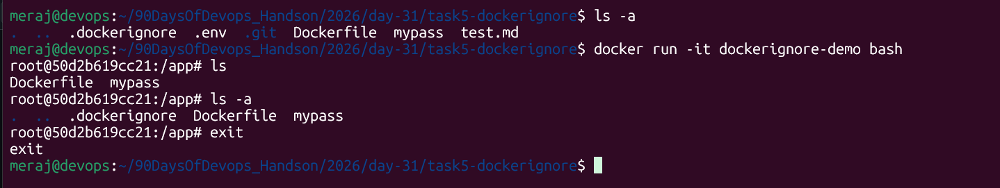

# Day 31 – Dockerfile: Build Your Own Images

Today's goal: move from *using* Docker images to *building* them.

---

## Task 1: Your First Dockerfile

**`my-first-image/Dockerfile`**
```dockerfile
FROM ubuntu:latest

RUN apt-get update && apt-get install -y curl && rm -rf /var/lib/apt/lists/*

CMD ["echo", "Hello from my custom image!"]
```

Build and run:
```bash
docker build -t ubuntu:v1 .
docker run ubuntu:v1
```
**Expected output:**
> 

**What's happening:**
- `FROM ubuntu` — start from the official Ubuntu base image.
- `RUN apt-get install -y curl` — installs curl *during the build*, baking it into the image layer. It doesn't run when you `docker run` — it already happened when you `docker build`.
- `rm -rf /var/lib/apt/lists/*` — cleans up apt cache in the same `RUN` layer to keep image size down.
- `CMD` — the default process the container executes when started. Since we didn't override it, it just echoes the message and exits.

---

## Task 2: Dockerfile Instructions

**`task2-instructions/Dockerfile`**
```dockerfile
#Base Image
FROM ubuntu:latest

#Run command and install deps
RUN apt-get update && apt-get install -y bash && rm -rf /var/lib/apt/lists/*

#Creating default dir in container
WORKDIR /app

#Copy from source Code to Destination
COPY app.sh .

#using shell giving execute permission to app.sh
RUN chmod +x app.sh

#Container inside port Expose
EXPOSE 8080

#Executee code from container
CMD ["./app.sh"]
```

Build and run:
```bash
docker build -t ubuntu:v2 .
docker run -it ubuntu:v2 bash
```
**Expected output:**
> 

**What each instruction does:**
| Instruction | Purpose |
|---|---|
| `FROM` | Chooses the base image everything else is built on top of |
| `RUN` | Executes a command **at build time**, creating a new image layer (e.g. installing packages) |
| `COPY` | Copies files from the build context (your host folder) into the image filesystem |
| `WORKDIR` | Sets the current working directory for all following instructions (and for the container at runtime); creates the directory if it doesn't exist |
| `EXPOSE` | Purely documentation — tells humans/tools "this container listens on port 8080." It does **not** publish the port; you still need `-p` on `docker run` |
| `CMD` | The default command executed **at container runtime** if none is given on the command line |

---

## Task 3: CMD vs ENTRYPOINT

**`task3-cmd/Dockerfile`**
```dockerfile
FROM ubuntu:latest
CMD ["echo", "hello"]
```

```bash
cd task3-cmd
docker build -t cmd-demo .
docker run cmd-demo
# -> hello

docker run cmd-demo echo goodbye
# -> goodbye   (CMD was completely replaced)
```
**Expected output:**
> 

**`task3-entrypoint/Dockerfile`**
```dockerfile
FROM ubuntu:latest
ENTRYPOINT ["echo"]
```

```bash
cd task3-entrypoint
docker build -t entrypoint-demo .
docker run entrypoint-demo
# -> (empty line, echo with no args)

docker run entrypoint-demo hello world
# -> hello world   (args are APPENDED to the entrypoint, not replacing it)
```
**Expected output:**


**Observations:**
- With `CMD`, anything you type after the image name on `docker run` **replaces** the entire CMD.
- With `ENTRYPOINT`, anything you type after the image name is **appended as arguments** to the entrypoint command — it can't be replaced without the `--entrypoint` flag.

**When to use CMD vs ENTRYPOINT:**
- Use **CMD** when you want to provide a sensible default command that the user can freely override (e.g. a base image like `ubuntu` where people might run different one-off commands).
- Use **ENTRYPOINT** when the image is built to always run as a specific tool/executable, and you only want the user to supply arguments/options — e.g. a CLI tool image, or something like `docker run my-cli --help`.
- A very common combo: `ENTRYPOINT ["python", "app.py"]` with `CMD ["--default-flag"]` — ENTRYPOINT fixes the program, CMD supplies default args that can still be overridden.

---

## Task 4: Build a Simple Web App Image

**`task4-webapp/index.html`**
```html
<!DOCTYPE html>
<html lang="en">
<head>
  <meta charset="UTF-8">
  <title>My Dockerized Website</title>
</head>
<body>
  <h1>Hello from my custom Nginx image!</h1>
  <p>This page is being served from inside a Docker container.</p>
</body>
</html>
```

**`task4-webapp/Dockerfile`**
```dockerfile
FROM nginx:alpine

COPY index.html /usr/share/nginx/html/index.html
```

Build and run:
```bash
docker build -t my-website:v1 .
docker run -d -p 8080:80 my-website:v1
```



Visit **http://localhost:8080** in your browser — you should see the page.

**Notes:**
- `nginx:alpine` is a lightweight Nginx image based on Alpine Linux.
- Nginx's default web root is `/usr/share/nginx/html/` — any file placed there (like `index.html`) is served automatically.
- `nginx:alpine` already has its own `EXPOSE 80` and `CMD` baked in, so we don't need to declare them ourselves — we're just layering our content on top of a pre-configured image.
- `-p 8080:80` maps host port 8080 → container port 80.

---

## Task 5: .dockerignore

**`task5-dockerignore/project/.dockerignore`**
```
node_modules
.git
*.md
.env
```

**`task5-dockerignore/project/Dockerfile`**
```dockerfile
FROM ubuntu:latest
WORKDIR /app
COPY . .
RUN ls -la /app
CMD ["ls", "-la", "/app"]
```

Build and check:
```bash
docker build -t dockerignore-demo .
```
> 

Look at the build log output from `RUN ls -la /app` (or run the container) — you should see `app.js` and `Dockerfile`/`.dockerignore` present, but **not** `node_modules/`, `.git/`, `NOTES.md`, or `.env`.

**Why this matters:**
- `.dockerignore` works like `.gitignore` — it excludes files/folders from the **build context** sent to the Docker daemon.
- Without it, `COPY . .` would ship your entire `node_modules` (huge, and should be reinstalled fresh anyway), your `.git` history (irrelevant and potentially sensitive), and secrets like `.env` straight into the image — a real security risk if that image is ever pushed to a registry.
- It also makes builds faster because Docker has less data to send to the build context.

---

## Task 6: Build Optimization

**Before (`task6-optimization/before/Dockerfile`) — naive order:**
```dockerfile
FROM python:3.12-slim
WORKDIR /app

COPY . .
RUN pip install --no-cache-dir -r requirements.txt

CMD ["python", "app.py"]
```

**After (`task6-optimization/after/Dockerfile`) — optimized order:**
```dockerfile
FROM python:3.12-slim
WORKDIR /app

COPY requirements.txt .
RUN pip install --no-cache-dir -r requirements.txt

COPY . .

CMD ["python", "app.py"]
```

Try it:
```bash
cd task6-optimization/before
docker build -t opt-demo:before .
# edit app.py (e.g. change the print statement), then:
docker build -t opt-demo:before .
# -> notice: "pip install" layer is re-run and shows no "CACHED" tag
```

```bash
cd ../after
docker build -t opt-demo:after .
# edit app.py, then:
docker build -t opt-demo:after .
# -> notice: "pip install" layer shows "CACHED" — it was skipped!
```

**Why layer order matters for build speed:**
- Docker builds images in **layers**, one per instruction, and caches each layer.
- On a rebuild, Docker walks through the Dockerfile top to bottom. As soon as **one** instruction's inputs have changed (a copied file, a command, etc.), that layer is rebuilt — **and every layer after it** is invalidated and rebuilt too, even if nothing else actually changed.
- In the "before" version, `COPY . .` (which includes app code that changes often) comes *before* `pip install`. Any tiny code edit invalidates the cache for `COPY . .`, which cascades and forces `pip install` to re-run from scratch every time — even though `requirements.txt` never changed. This is slow, especially with many dependencies.
- In the "after" version, we `COPY requirements.txt .` and run `pip install` **first**, while it depends on nothing but that one file. Only when `requirements.txt` itself changes does that expensive layer get invalidated. The full `COPY . .` (which changes constantly) is pushed to the **end**, so editing your code only invalidates that cheap final layer.
- **General rule:** order Dockerfile instructions from *least frequently changing* (base image, system deps, dependency manifests) to *most frequently changing* (your actual application source code). This maximizes cache hits and minimizes rebuild time.

---

## Key Takeaways

- A Dockerfile is a recipe: each instruction creates a cached, reusable layer.
- `RUN` = build-time; `CMD`/`ENTRYPOINT` = run-time default behavior.
- `EXPOSE` documents ports; `-p` on `docker run` actually publishes them.
- `.dockerignore` keeps images small, fast to build, and free of secrets/junk.
- Layer ordering (stable stuff first, volatile stuff last) is the single biggest lever for fast rebuilds.