# Day 32 – Docker Volumes & Networking

## Task 1: The Problem — Containers Are Ephemeral

### Step 1 — Run a Postgres container

```bash
docker run -d \
  --name pg-test \
  -e POSTGRES_PASSWORD=mysecret \
  -p 5432:5432 \
  postgres:16
```
Check it's running:

```bash
docker ps
```
> 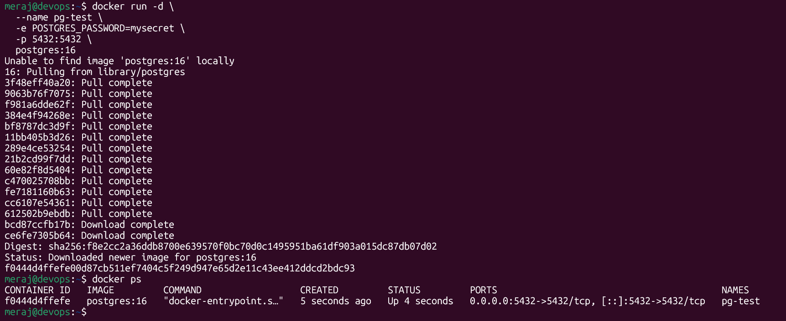

### Step 2 — Go inside of Postgres and Create database

```bash
docker exec -it pg-test psql -U postgres
postgres=# CREATE DATABASE devops;
CREATE DATABASE

postgres=# \l

                                                      List of databases
   Name    |  Owner   | Encoding | Locale Provider |  Collate   |   Ctype    | ICU Locale | ICU Rules |   Access privileges
-----------+----------+----------+-----------------+------------+------------+------------+-----------+-----------------------
 devops    | postgres | UTF8     | libc            | en_US.utf8 | en_US.utf8 |            |           |
```

> 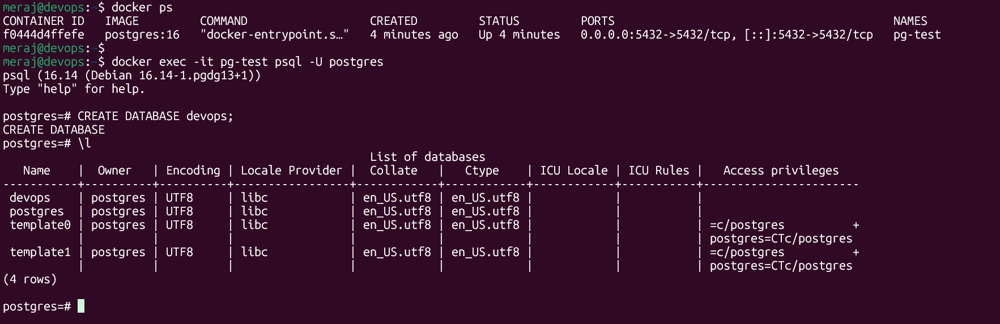

### Step 3 — Stop and remove the container

```bash
docker stop pg-test
docker rm pg-test
```
> 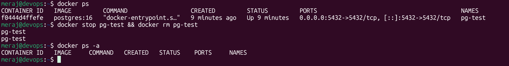

### Step 4 — Run a brand new container

```bash
docker run -d \
  --name pg-test \
  -e POSTGRES_PASSWORD=mysecret \
  -p 5432:5432 \
  postgres:16

docker exec -it pg-test psql -U postgres -c "SELECT * FROM users;"
```

**Result:** Here We can see our DB has gone!:

> 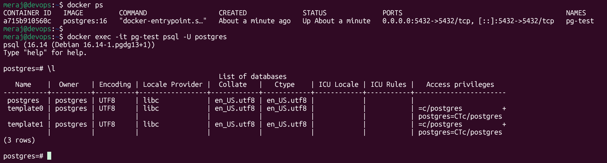

### What happened and why

By default, Postgres stores its data files inside the container's own writable layer (its filesystem). When you run `docker rm`, Docker deletes that writable layer entirely — including `/var/lib/postgresql/data`. A new container from the same image starts from a clean image layer with no memory of anything that happened in the old container. **Containers are meant to be disposable; without an external volume, any data written inside them is disposable too.**

---

## Task 2: Named Volumes — Fixing Persistence

### Step 1 — Create a named volume

```bash
docker volume create pg-data
```
> 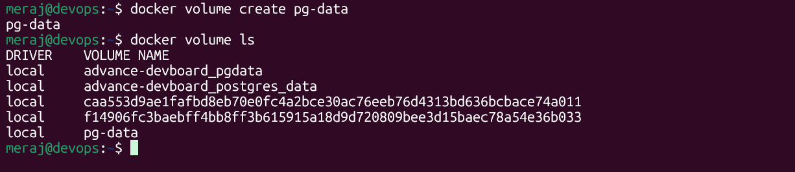

### Step 2 — Run the database attached to the volume

```bash
docker run -d \
  --name pg-vol \
  -e POSTGRES_PASSWORD=mysecret \
  -v pg-data:/var/lib/postgresql/data \
  -p 5432:5432 \
  postgres:16
```
> 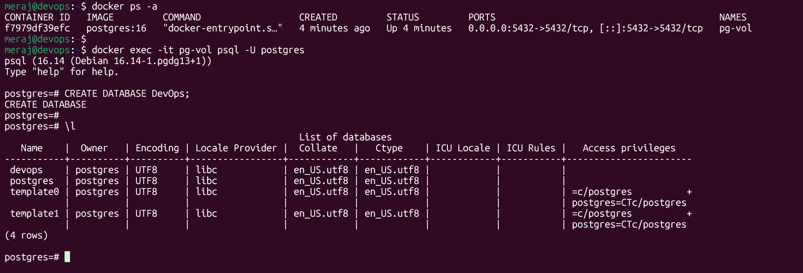

### Step 3 — Add data, then stop and remove the container

```bash
docker stop pg-vol && docker rm pg-vol
```

### Step 4 — Run a brand new container with the same volume

```bash
docker run -d \
  --name pg-vol2 \
  -e POSTGRES_PASSWORD=mysecret \
  -v pg-data:/var/lib/postgresql/data \
  -p 5432:5432 \
  postgres:16
```
**Result:** `DevOps` is still there. ✅

> 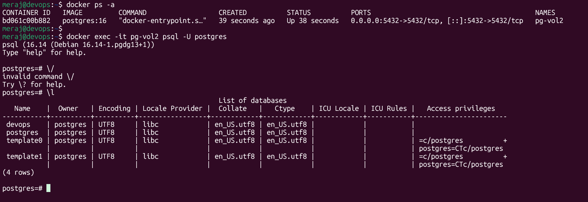

### Verify the volume
```bash
docker volume ls
docker volume inspect pg-data
```
> 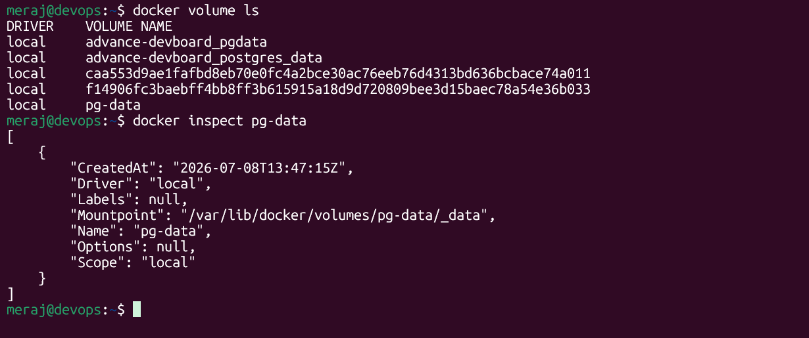

`docker volume inspect` will show something like a `Mountpoint` on the host (e.g. `/var/lib/docker/volumes/pg-data/_data`) — that's the actual location on the host machine where Docker stores the data, managed entirely by Docker itself.

### Why this works

The named volume `pg-data` lives outside any single container's writable layer, managed by the Docker daemon. When a container is removed, the volume is untouched. Attaching the same volume name to a new container re-mounts the same underlying data directory, so Postgres finds its files exactly as it left them.

---

## Task 3: Bind Mounts

### Step 1 — Create a folder with index.html on the host

```bash
mkdir -p ~/nginx-site
cat > ~/nginx-site/index.html << 'EOF'
<!DOCTYPE html>
<html>
<head><title>Day 32 Test</title></head>
<body>
  <h1>Hello from my host machine!</h1>
</body>
</html>
EOF
```

### Step 2 — Run Nginx with a bind mount

```bash
docker run -d \
  --name nginx-test \
  -p 8080:80 \
  -v ~/nginx-site:/usr/share/nginx/html \
  nginx:latest
```
> 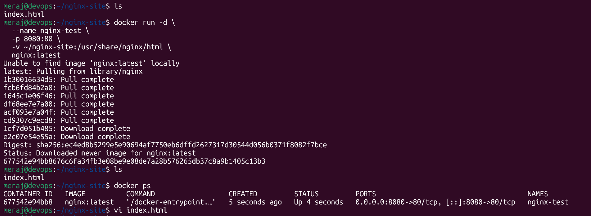

### Step 3 — Access it in the browser

Open `http://localhost:8080`

> 

### Step 4 — Edit on host, refresh browser

```bash
echo "<h1>Updated content — no rebuild needed!</h1>" > ~/nginx-site/index.html
```

Refresh the browser tab.

> 

### Named Volume vs Bind Mount

| | Named Volume | Bind Mount |
|---|---|---|
| **Managed by** | Docker (in `/var/lib/docker/volumes/...`) | ~/nginx-sites |
| **Location** | Abstracted; you don't need to know/care where | Explicit host path, fully visible/editable by you |
| **Portability** | Works the same across machines/OSes | Tied to a specific host path structure |
| **Best for** | Databases, persistent app state | Local development (live code editing), config files |
| **Editing from host** | Awkward — meant to be touched only by containers | Easy — it's just a normal folder |
| **Created by** | `docker volume create` (or auto-created) | Just a folder that already exists on disk |

**In short:** a named volume is Docker-managed storage meant for data containers own and persist; a bind mount is a direct window into a specific folder on your host, ideal when you want to actively edit files and see changes reflected instantly in the container.

---

## Task 4: Docker Networking Basics

### Step 1 — List networks

```bash
docker network ls
```
> 

### Step 2 — Inspect the default bridge network

```bash
docker network inspect bridge
```
> 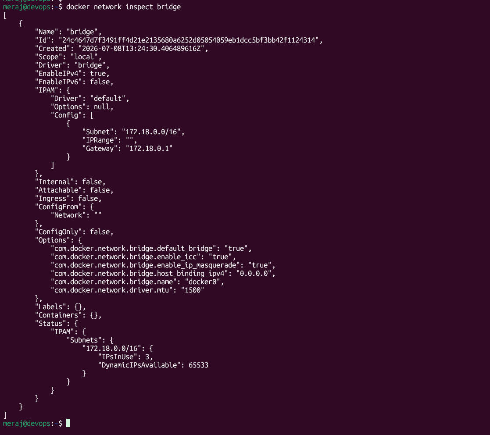

### Step 3 — Two containers on default bridge, ping by name

```bash
docker run -dit --name c1 busybox sh
docker run -dit --name c2 busybox sh

docker exec c1 ping -c 3 c2
```

**Result:** ❌ Fails — `ping: bad address 'c2'`

> 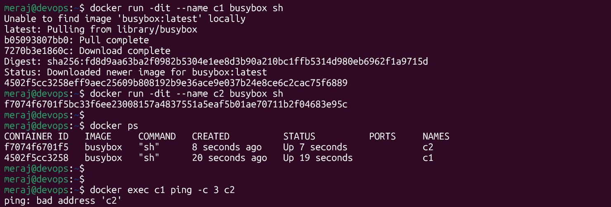

### Step 4 — Ping by IP instead

```bash
docker exec c1 ping -c 3 172.18.0.3
```

**Result:** ✅ Works — ping by IP succeeds.

> 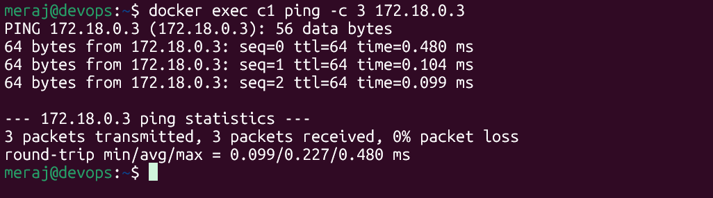

**Why:** The default `bridge` network does not provide automatic DNS resolution between containers. Containers get IP addresses on this network, but Docker only registers container names in DNS for **user-defined** networks — not the default one (this is a legacy behavior kept for backward compatibility).

---

## Task 5: Custom Networks

### Step 1 — Create a custom bridge network

```bash
docker network create myapp-net
```
> 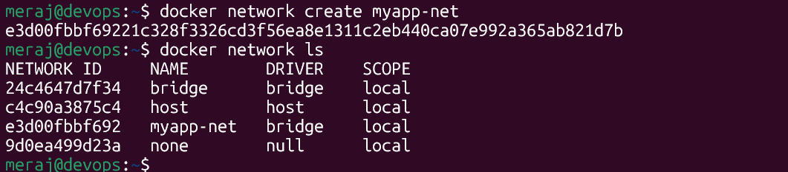

### Step 2 — Run two containers on it

```bash
docker run -dit --name c3 --network my-app-net busybox sh
docker run -dit --name c4 --network my-app-net busybox sh
```

### Step 3 — Ping by name

```bash
docker exec c1 ping -c 3 c2
```

**Result:** ✅ Works now!

> 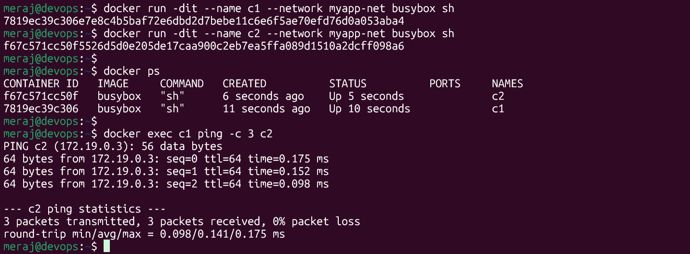

### Why custom networks allow name-based communication but the default bridge doesn't

Every user-defined bridge network in Docker runs an embedded DNS server (at `127.0.0.11` inside each container on that network). When you attach a container to a custom network, Docker automatically registers its container name in that embedded DNS server, so any other container on the same network can resolve it by name.

The default `bridge` network predates this feature and was never upgraded to use it — it exists mainly for backward compatibility with old Docker setups, and Docker's own docs recommend against using it for multi-container communication. **This is exactly why best practice is: always create a custom network for any multi-container setup.**

---

## Task 6: Put It Together

### Step 1 — Create a custom network

```bash
docker network create app-net
```

### Step 2 — Database container with volume, on the network

```bash
docker volume create mysql-data

docker run -d \
  --name my-db \
  --network app-net \
  -e MYSQL_ROOT_PASSWORD=mysecret \
  -e MYSQL_DATABASE=appdb \
  -v mysql-data:/var/lib/mysql \
  mysql:8
```

Give it a few seconds to initialize:

```bash
docker logs -f my-db
```
> 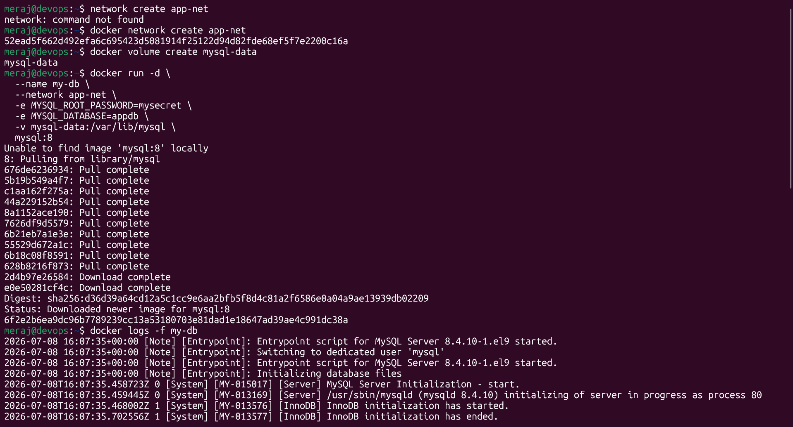

### Step 3 — App container on the same network

Using a lightweight container as a stand-in "app" that just needs to reach the DB:

```bash
docker run -dit --name my-app --network app-net busybox sh
```
> 

### Step 4 — Verify the app can reach the DB by name

```bash
docker exec my-app ping -c 3 my-db
```
> 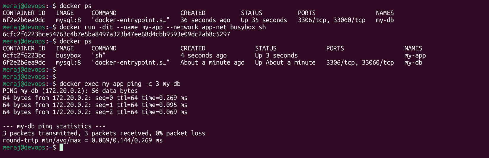

For a more realistic check (actually testing the MySQL port, not just ICMP), use a container with a MySQL client, e.g.:

```bash
docker run -it --rm --network app-net mysql:8 \
  mysql -h my-db -u root -pmysecret -e "SHOW DATABASES;"
```

**Result:** `appdb` shows up in the list — confirming the app container reached the database container purely by its container name, over the custom network, with the data itself sitting safely in the `mysql-data` volume.

> 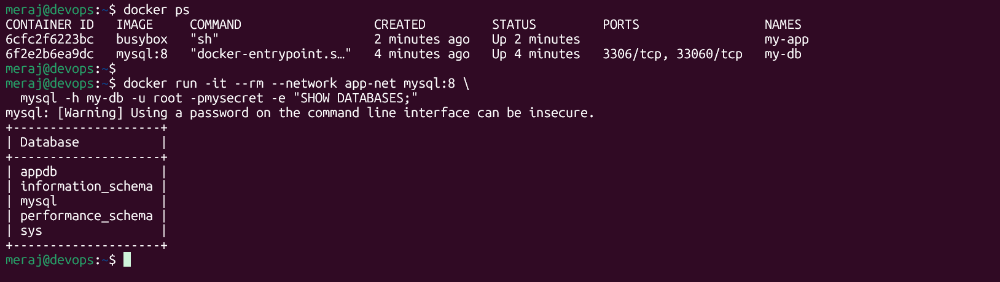
---

## Summary — Key Takeaways

| Concept | Problem it Solves | Command |
|---|---|---|
| **Named Volume** | Data lost when container is removed | `docker volume create`, `-v name:/path` |
| **Bind Mount** | Need to edit files from the host live | `-v /host/path:/container/path` |
| **Custom Network** | Containers can't find each other by name on default bridge | `docker network create`, `--network` |

**Big picture:** Volumes decouple *data* from the *container lifecycle*. Custom networks decouple *service discovery* from IP addresses. Together, they let you build multi-container apps (app + database + cache, etc.) that can be torn down and rebuilt at will without losing data or breaking connectivity — which is the whole point of containers being disposable in the first place.

---

## Cleanup (optional)

```bash
docker rm -f pg-test pg-vol pg-vol2 nginx-test c1 c2 c3 c4 my-db my-app
docker volume rm pg-data mysql-data
docker network rm my-app-net app-net
```