# Day 33 – Docker Compose: Multi-Container Basics

---

## Task 1: Install & Verify

**Check Docker Compose is available:**

```bash
docker compose version
```

> 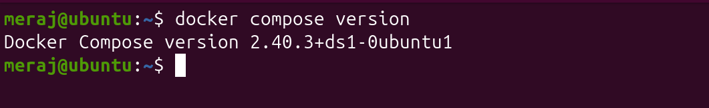


## Task 2: Your First Compose File

**Folder:** `compose-basics/`

**`compose-basics/docker-compose.yml`:**

```yaml

services:
  web:
    image: nginx:latest
    container_name: nginx-basic
    ports:
      - "8080:80"
    restart: unless-stopped

```

**Run it:**

```bash
cd compose-basics
docker compose up
```

Compose will:
1. Create a default network named `compose-basics_default`
2. Pull the `nginx:latest` image if not already present
3. Start a container named `nginx-basic`
4. Map host port `8080` → container port `80`

**Access in browser:** `http://localhost:8080` → shows the default "Welcome to nginx!" page.

**Stop it:**

```bash
docker compose down
```

This removes the container and the auto-created network (but not the image or any
volumes, unless you add `-v`).

> 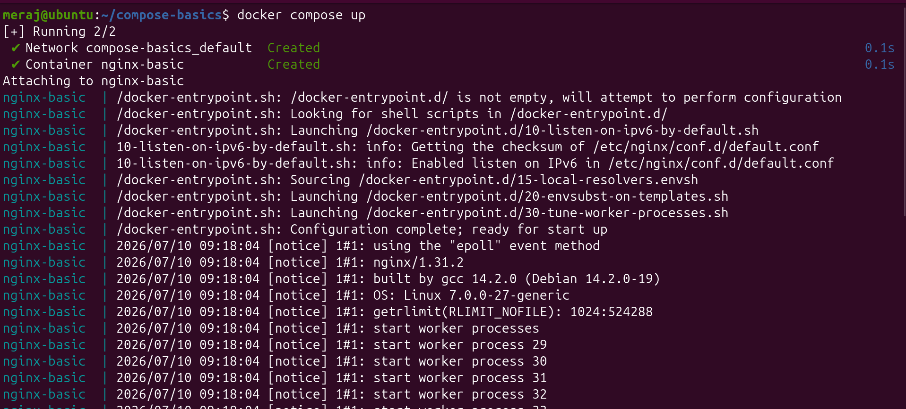

---

## Task 3: Two-Container Setup (WordPress + MySQL)

**Folder:** `wordpress-mysql/`

**`wordpress-mysql/docker-compose.yml`:**

```yaml
services:
  mysql:
    image: mysql:8.0
    container_name: mysql
    restart: unless-stopped
    environment:
      MYSQL_ROOT_PASSWORD: root
      MYSQL_DATABASE: wordpress
      MYSQL_USER: devops
      MYSQL_PASSWORD: devops
    volumes:
      - db_data:/var/lib/mysql

  wordpress:
    image: wordpress:latest
    container_name: wordpress-app
    restart: unless-stopped
    depends_on:
      - mysql
    ports:
      - "8000:80"
    environment:
      WORDPRESS_DB_HOST: mysql:3306
      WORDPRESS_DB_USER: devops
      WORDPRESS_DB_PASSWORD: devops
      WORDPRESS_DB_NAME: wordpress

volumes:
  db_data:
```


**How the requirements are met:**
- **Same network:** Compose automatically creates one network (`wordpress-mysql_default`)
  and attaches both services to it — no manual `docker network create` needed.
- **Named volume for persistence:** `db_data` is a named volume mounted at
  `/var/lib/mysql` inside the `db` container, so MySQL's data files survive container
  removal.
- **Service-name DNS:** WordPress connects to the database using `db:3306` —
  `db` is the *service name* from the YAML, and Compose's built-in DNS resolves it to
  the MySQL container's IP automatically. No hardcoded IPs.

**Run it:**

```bash
cd wordpress-mysql
docker compose up -d
```
> 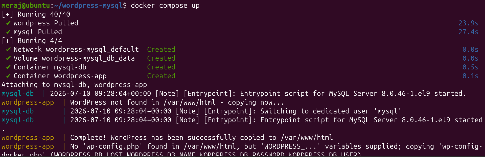

**Access WordPress:** `http://localhost:8000` → run through the WordPress install
wizard (site title, admin username/password, email).

> 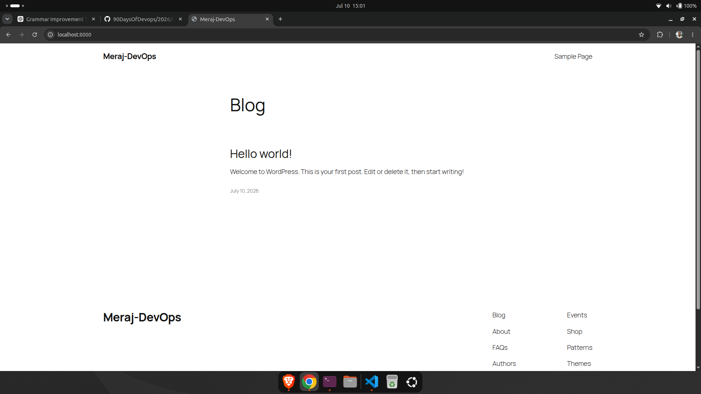

**Persistence test:**

```bash
docker compose down
docker compose up -d
```
> 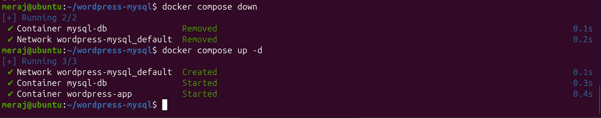

Then reload `http://localhost:8000` — your site title, admin user, and any posts you
created are still there, because `db_data` (the named volume) was **not** deleted by
`docker compose down` (only containers/networks are removed by default; volumes
persist unless you run `docker compose down -v`).

> 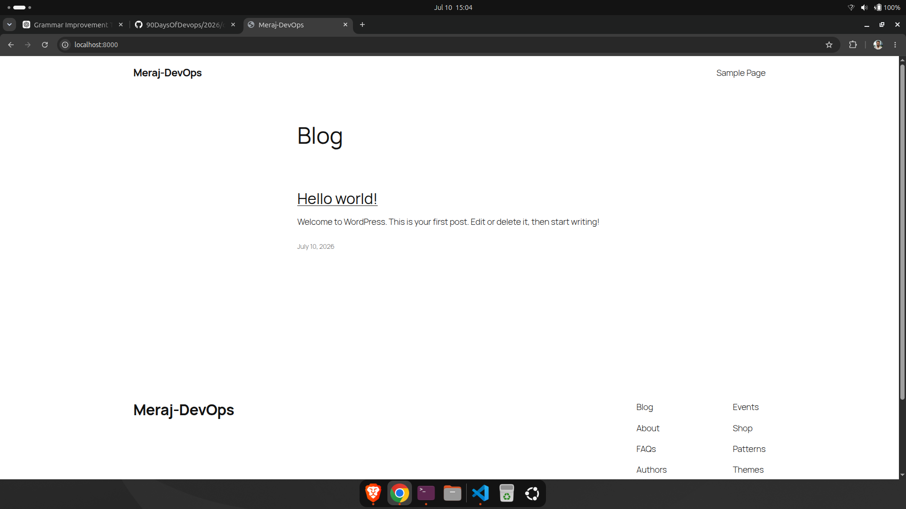

---

## Task 4: Compose Commands

Run these from inside `wordpress-mysql/` (or `compose-basics/`) and record the output.

**1. Start services in detached mode**
```bash
docker compose up -d
```
> 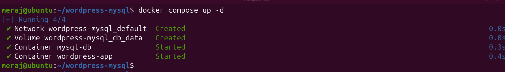

**2. View running services**
```bash
docker compose ps
```
> 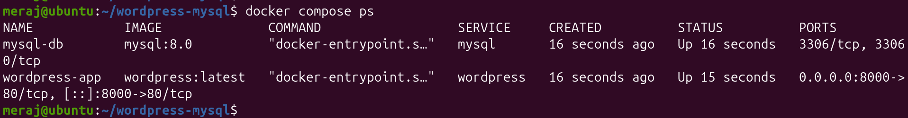
Shows each service's container name, image, command, status, and ports.

**3. View logs of all services**
```bash
docker compose logs
```
> 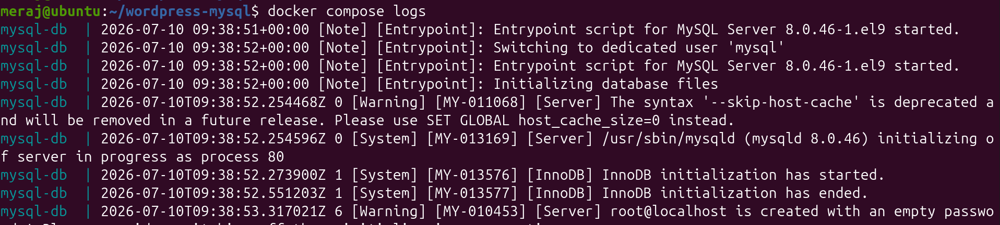

**4. View logs of a specific service**
```bash
docker compose logs wordpress
docker compose logs mysql
```
> 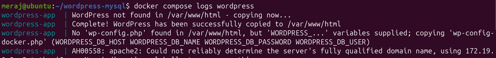
> 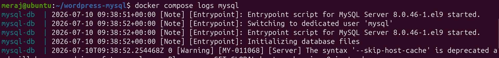

**5. Stop services without removing (containers stay, just stopped)**
```bash
docker compose stop
```
> 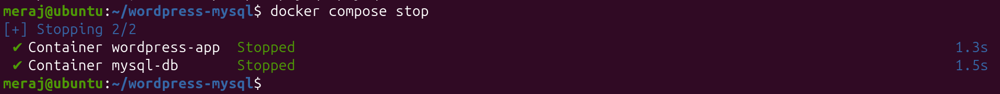

**6. Remove everything (containers, networks — not volumes/images by default)**
```bash
docker compose down
```
> 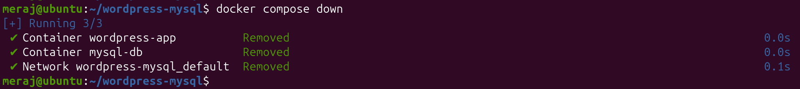

Add `-v` to also remove named volumes, and `--rmi all` to also remove images.

**7. Rebuild images after a change**
```bash
docker compose up -d --build
```
> 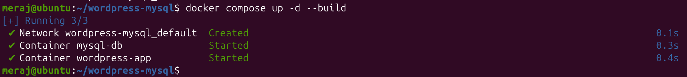

Use this when you've edited a `Dockerfile` referenced via `build:` in the compose
file, or want to force-pull updated base images. For pre-built images (like plain
`nginx`/`wordpress`/`mysql` with no custom `build:`), use:

```bash
docker compose pull
docker compose up -d
```
> 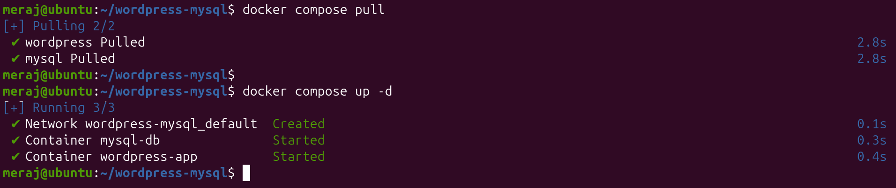

---

## Task 5: Environment Variables

**1. Environment variables directly in `docker-compose.yml`**

Shown in Task 3's `db` and `wordpress` services under `environment:` — e.g.
`WORDPRESS_DB_HOST: db:3306`.

**2. `.env` file referenced from compose**

**`wordpress-mysql/.env`:**

> 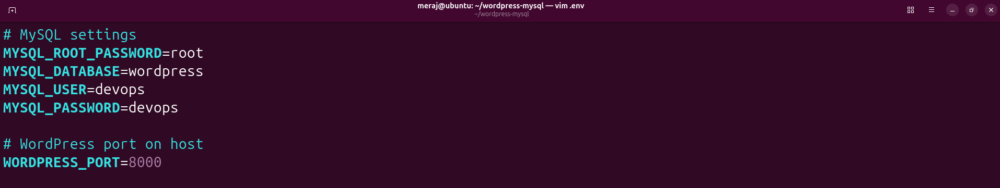

Compose automatically loads a `.env` file in the same directory as
`docker-compose.yml` and substitutes `${VAR_NAME}` placeholders in the YAML with these
values — no extra flag needed.

**3. Verify variables are picked up**
```bash
docker compose config
```

This prints the fully resolved compose file with all `${...}` placeholders
substituted with real values — a quick way to confirm `.env` is being read correctly
before you even start containers.

You can also check inside a running container:
```bash
docker compose exec mysql env | grep MYSQL
```

> 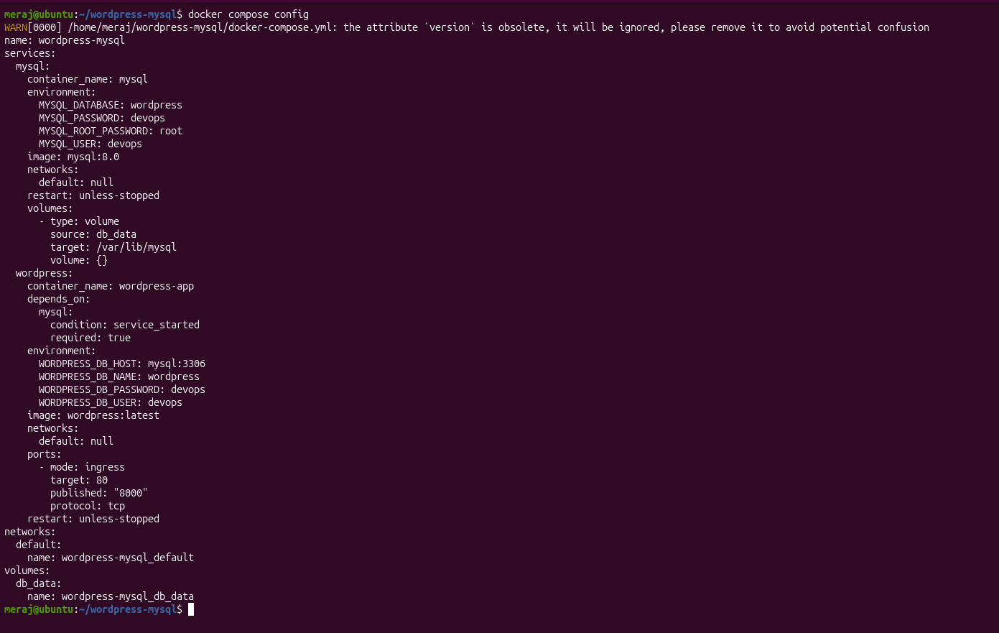

---

## Key Takeaways

- Compose turns multi-step manual `docker run`/`docker network create`/`docker volume
  create` workflows into one declarative YAML file.
- Services on the same Compose file share a network automatically, and can reach each
  other by **service name** (Compose's built-in DNS).
- Named volumes decouple data lifetime from container lifetime — `docker compose down`
  removes containers/networks but leaves volumes (and your data) intact.
- `.env` files keep secrets/config out of the YAML itself and make the same compose
  file reusable across environments.