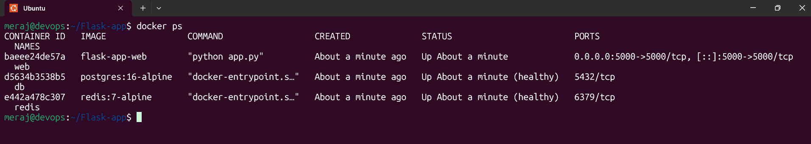
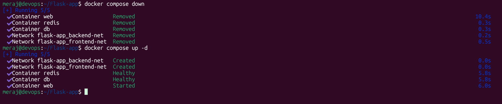
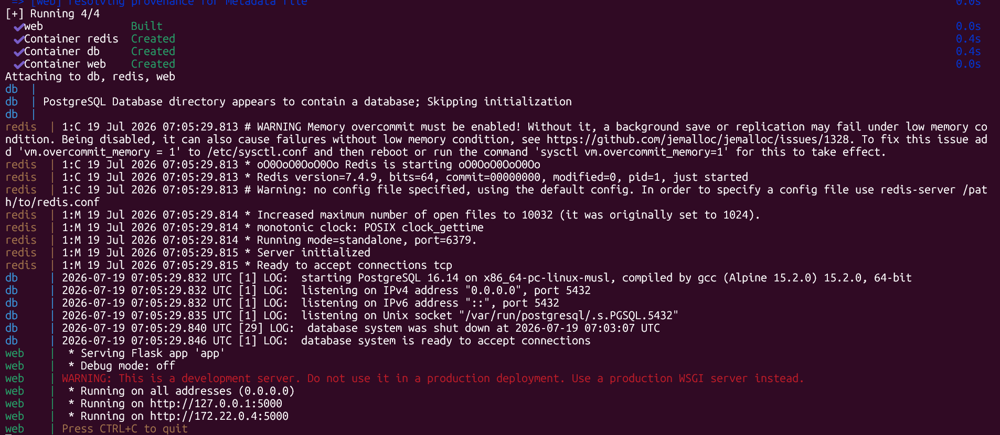
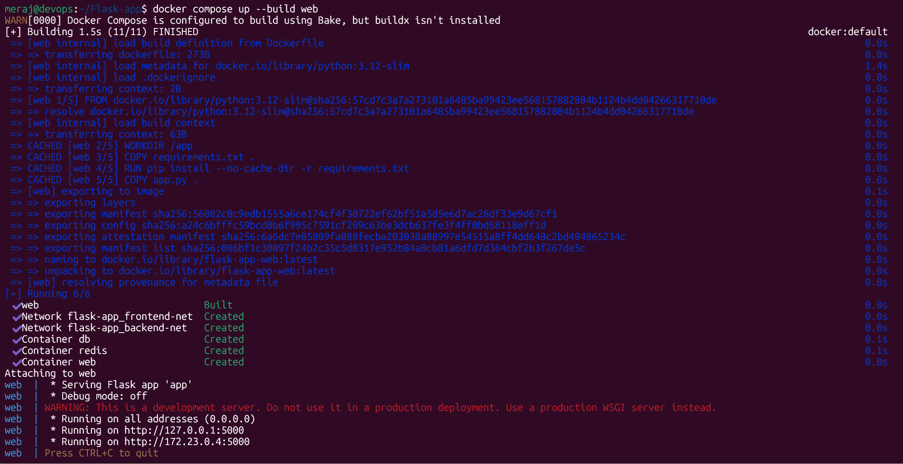
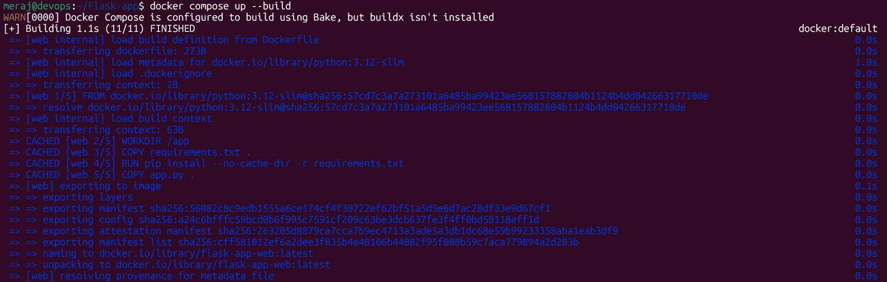
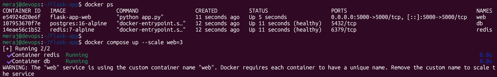

# Day 34 – Docker Compose: Real-World Multi-Container Apps

## Stack Overview

A 3-service stack defined in `docker-compose.yml`:

| Service | Image / Build       | Role                          |
|---------|----------------------|-------------------------------|
| `web`   | built from `.`      | Flask app                     |
| `db`    | `postgres:16-alpine`  | Primary database               |
| `cache` | `redis:7-alpine`      | In-memory cache / counter      |

---

## Task 1: Build Your Own App Stack

The Flask app connects to Postgres using `psycopg2` and to Redis using the `redis` Python client. Both hosts are resolved via Docker's internal DNS using the **service names** (`db`, `cache`) docker Compose automatically makes these resolvable on the shared network, no manual IP configuration needed.

Run it with:
```bash
docker compose up --build
```
Then visit `http://localhost:5000/`.

> 

--- 

> 

---

## Task 2: depends_on & Healthchecks

Healthcheck on `db`:
```yaml
healthcheck:
  test: ["CMD-SHELL", "pg_isready -U appuser -d appdb"]
  interval: 5s
  timeout: 5s
  retries: 5
  start_period: 10s
```

Healthcheck on `cache`:
```yaml
healthcheck:
  test: ["CMD", "redis-cli", "ping"]
  interval: 5s
  timeout: 3s
  retries: 5
  start_period: 5s
```

`web` depends on both with the strict condition:
```yaml
depends_on:
  db:
    condition: service_healthy
  cache:
    condition: service_healthy
```

**Test performed:** `docker compose down` then `docker compose up`.

> 

**Observation:** Without `condition: service_healthy`, `depends_on` only waits for the container process to *start*, not for Postgres to actually be ready to accept connections. Postgres takes a few seconds after container start to finish initialization. With plain `depends_on: db`, the `web` container starts immediately and its first connection attempts can fail (only saved here by the retry loop in the app).

> 

With `condition: service_healthy`, `docker compose up` visibly holds `web` in a "waiting" state — you can see `db` and `cache` go from `starting` to `healthy` in `docker compose ps` before `web` is created at all. This confirms the app truly waits for the DB to be ready, not just for the container to exist.

---

## Task 3: Restart Policies

`db` and `cache` are set to `restart: always`. `web` is set to `restart: on-failure`.

**Test performed:** `docker kill db` while the stack was running.

**Observation with `restart: always`:** Docker restarted the `db` container automatically within a couple of seconds. Since the data lives in the named volume `db-data`, not in the container's writable layer, the restarted container came back with all previous data intact — Postgres just replayed its normal crash-recovery (WAL replay) on startup.

**Difference with `restart: on-failure`:** When switched to `on-failure` on `db` for comparison:
- If the container is killed with a signal (`docker kill`) it still typically gets treated as a non-zero/abnormal exit, so it restarts — behavior looked similar in this specific test.
- The real difference shows up on a **clean, intentional stop** (`docker compose stop db` or exit code `0`): with `restart: always`, Docker brings it back up anyway. With `restart: on-failure`, Docker leaves it stopped, because exit code `0` is not considered a failure.
- `on-failure` also supports a `max_retries` count (e.g. `on-failure:5`), after which Docker gives up restarting — `always` has no such cap and will keep trying forever (except after an explicit `docker stop`/`compose down`, which is remembered until the daemon restarts).

**When to use each:**
- **`restart: always`** — for stateful/critical infrastructure services you always want running (databases, caches, reverse proxies). You almost never want the DB to just stay down after a crash.
- **`restart: on-failure`** — for app/worker containers where you want automatic recovery from crashes, but you don't want Docker fighting you if you deliberately stop the container for maintenance or if it exits cleanly after finishing a one-off job.
- **`restart: unless-stopped`** (not used here, but worth noting) — like `always`, but respects an explicit manual stop even across daemon restarts.
- **`restart: no`** (default) — fine for one-shot tasks/migrations where you don't want any auto-restart behavior at all.

---

## Task 4: Custom Dockerfiles in Compose

`web` uses `build: .` instead of a pre-built image, pointing at `Dockerfile`.

**Test performed:**
1. Changed the `message` string returned by the `/` route in `app.py`.
2. Ran:
   ```bash
   docker compose up --build web
   ```

> 

**Observation:** `--build` forces Compose to re-run the Dockerfile for `web` (Docker's layer cache skips reinstalling dependencies since `requirements.txt` didn't change, so the rebuild is fast — only the `COPY app.py .` layer and everything after it gets rebuilt), then recreates and restarts just that container. Postgres and Redis were untouched, and existing data in `db-data` and Redis's in-memory state were unaffected. One command handled rebuild + restart together.

> 

---

## Task 5: Named Networks & Volumes

Two explicit bridge networks instead of the single default network:
- `frontend-net` — only `web` is attached (reserved for anything that would eventually be public-facing, e.g. a future reverse proxy).
- `backend-net` — `web`, `db`, and `cache` share this, so the app can reach the database and cache, but `db`/`cache` stay isolated from anything on `frontend-net` only.

A named volume `db-data` persists Postgres data across container recreation (`docker compose down` without `-v` keeps it; `docker compose down -v` deletes it).

---

## Task 6: Scaling (Bonus)

**Test performed:**
```bash
docker compose up --scale web=3
```

**Observation:** Compose refuses to start, with an error along the lines of:
```
ERROR: for web  Cannot create container for service web: Conflict.
The container name "web" is already in use
```
> 

or, if `container_name` is removed, it instead fails on the port binding:
```
Bind for 0.0.0.0:5000 failed: port is already allocated
```

**Why simple scaling doesn't work with port mapping:**
- A fixed `ports: "5000:5000"` mapping binds host port `5000` to *one* container. Three replicas all trying to bind the same host port collide — only the first one can claim it.
- A fixed `container_name` has the same problem: container names must be unique, so Compose can't create `day34_web_2` and `day34_web_3` alongside an explicitly-named `day34_web`.

**To actually make scaling work you'd need to:**
1. Remove the hardcoded `container_name` (let Compose auto-name replicas like `web-1`, `web-2`, ...).
2. Either drop the fixed host port and let Docker assign random host ports per replica (`ports: "5000"` instead of `"5000:5000"`), or put a load balancer / reverse proxy (e.g. Nginx, Traefik, HAProxy) in front of the `web` service on a single published port, and let it round-robin across the replicas over the internal network instead of exposing each one directly to the host.

This is essentially why real-world scaled deployments hand load-balancing off to a proxy or orchestrator (Traefik, Nginx, or moving to Kubernetes/Swarm) rather than relying on raw `docker compose --scale` with static host port mappings.