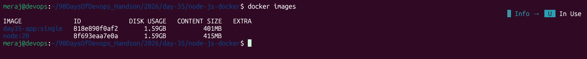
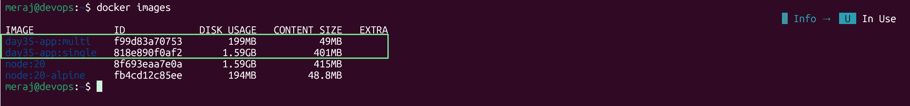
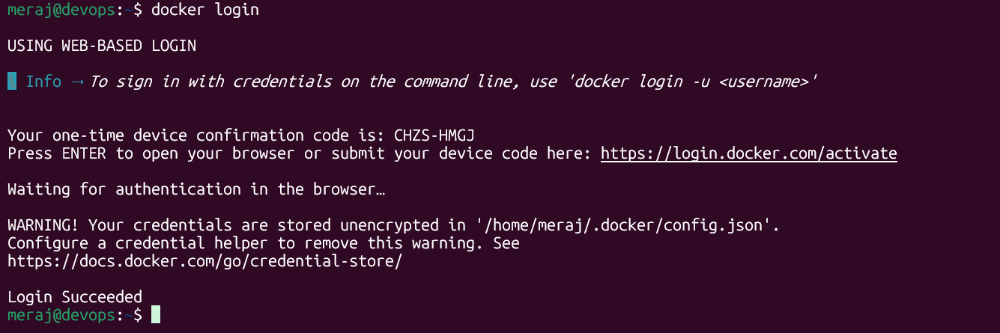
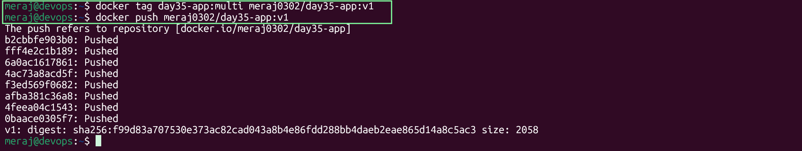
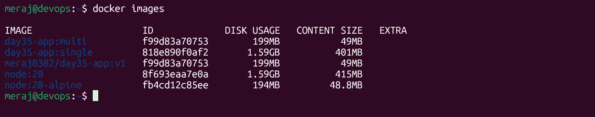
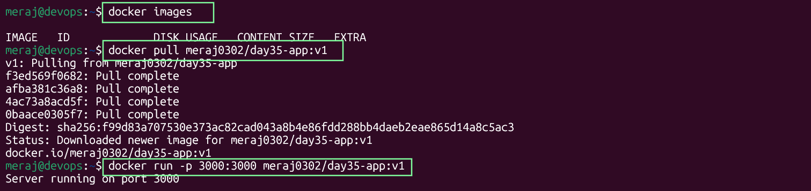
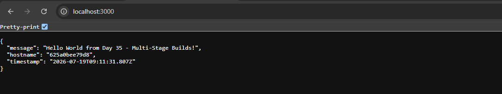
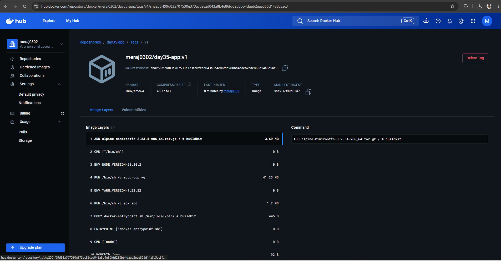
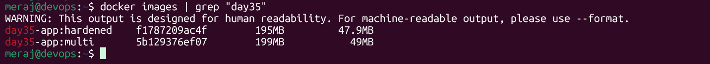
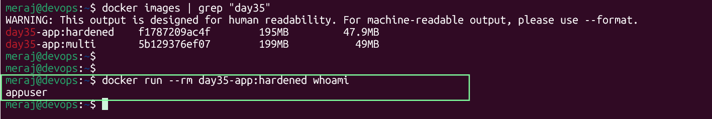

# Day 35 – Multi-Stage Builds & Docker Hub

A Node.js "Hello World" API used to demonstrate the difference between a
single-stage Docker image and an optimized multi-stage image, then push the
result to Docker Hub.

---

## Task 1 — The Problem with Large Images

**App:** minimal Express server (`app/index.js`) returning JSON on `GET /`.

**Dockerfile.singlestage:**

```dockerfile
FROM node:20

WORKDIR /app

COPY package.json .
RUN npm install

COPY index.js .

EXPOSE 3000

CMD ["node", "index.js"]
```

Build and measure:

```bash
docker build -f Dockerfile.singlestage -t day35-app:single .
docker images day35-app:single
```

**Recorded size:** `node:20` is a full Debian-based image with build tools,
npm cache, and a lot of OS packages baked in.

> 

---

## Task 2 — Multi-Stage Build

**Dockerfile.multistage:**

```dockerfile
# ---- Stage 1: builder ----
FROM node:20 AS builder

WORKDIR /app

COPY package.json .
RUN npm install --omit=dev

COPY index.js .

# ---- Stage 2: minimal runtime image ----
FROM node:20-alpine

WORKDIR /app

COPY --from=builder /app/node_modules ./node_modules
COPY --from=builder /app/index.js .
COPY --from=builder /app/package.json .

EXPOSE 3000

CMD ["node", "index.js"]
```

Build and measure:

```bash
docker build -f Dockerfile.multistage -t day35-app:multi .
docker images day35-app:multi
```

**Recorded size:** Expect roughly **~150–180 MB** — a large drop from the
single-stage build.

> 

### Why is the multi-stage image so much smaller?

- **The build stage's junk never ships.** `npm install`, apt/apk caches,
  compilers, and any dev-only tooling exist only in the `builder` stage.
  Only the files explicitly copied out with `COPY --from=builder` make it
  into the final image — everything else in stage 1 is discarded when the
  build finishes.
- **Different, smaller base image for the runtime stage.** `node:20` is
  built on Debian and includes a full OS with build-essential-style tooling.
  `node:20-alpine` is built on Alpine Linux (using `musl` instead of `glibc`)
  and is designed to be minimal — often under 50 MB before dependencies are
  even added.
- **No source control history, cache layers, or intermediate artifacts.**
  A single-stage build accumulates every layer created during `RUN npm
  install` (including npm's internal cache) into the final image. In a
  multi-stage build those layers belong to the `builder` stage, which is
  never tagged or shipped — Docker just throws it away once `COPY --from=`
  has pulled what it needs.
- **Smaller image = smaller attack surface.** Fewer packages means fewer
  CVEs to patch and less for an attacker to work with if they get a shell
  inside the container.

---

## Task 3 — Push to Docker Hub

1. create account,if you don't already have one.

2. Log in from your terminal:

```bash
docker login
```
> 

3. Tag the multi-stage image with your Docker Hub username:

```bash
docker tag day35-app:multi meraj0302/day35-app:v1
```

4. Push both tags:

```bash
docker push meraj0302/day35-app:v1
```
> 

5. Verify by removing the local image and pulling it back down (or do this
   on a second machine):

```bash
docker rmi day35-app:multi meraj0302/day35-app:v1
docker pull meraj0302/day35-app:v1
docker run -p 3000:3000 meraj0302/day35-app:v1
```
> 
---
> 
---
> 
---

## Task 4 — Docker Hub Repository

1. Go to `https://hub.docker.com/r/yourusername/day35-app` and confirm the
   push landed.

> 

---

## Task 5 — Image Best Practices

**Dockerfile.bestpractices** applies four practices at once:

```dockerfile
# ---- Stage 1: builder ----
FROM node:20.15.1-alpine AS builder   
WORKDIR /app

COPY package.json .
RUN npm install --omit=dev

COPY index.js .

# ---- Stage 2: minimal, non-root runtime ----
FROM node:20.15.1-alpine

WORKDIR /app

# Combine steps into one RUN layer: create a dedicated non-root user/group
RUN addgroup -S appgroup && adduser -S appuser -G appgroup

COPY --from=builder /app/node_modules ./node_modules
COPY --from=builder /app/index.js .
COPY --from=builder /app/package.json .

USER appuser

EXPOSE 3000

CMD ["node", "index.js"]
```

Checklist against the four practices:

1. **Minimal base image** — `alpine` instead of the full `node:20`
   (Debian) or `ubuntu` image. A quick comparison:

   ```bash
   docker pull node:20.15.1
   docker pull node:20.15.1-alpine
   docker images node --format "table {{.Repository}}\t{{.Tag}}\t{{.Size}}"
   ```

   `node:20.15.1` is roughly **~1 GB**; `node:20.15.1-alpine` is typically
   **~130–170 MB** — a rough **6–8x** reduction from the base image choice
   alone, before your own app code is even added.

2. **Non-root user** — `RUN addgroup -S appgroup && adduser -S appuser -G
   appgroup` creates an unprivileged user, and `USER appuser` switches to
   it before `CMD` runs. If the app is ever compromised, the attacker lands
   in a low-privilege context instead of root.

3. **Combined `RUN` commands** — the group and user creation is done in a
   single `RUN` line with `&&` instead of two separate `RUN` instructions,
   which keeps it to one layer instead of two.

4. **Pinned base image tags** — `node:20.15.1-alpine` instead of `node:latest`
   or even `node:20-alpine`. Pinning to an exact version means builds are
   reproducible: the image you build today is the same image you (or a
   teammate, or CI) build six months from now, instead of silently picking
   up whatever `latest` happens to resolve to at build time.

Build and compare sizes before/after:

```bash
docker build -f Dockerfile.multistage -t day35-app:multi .
docker build -f Dockerfile.bestpractices -t day35-app:hardened .
docker images | grep day35-app
```
> 

Verify the non-root user actually took effect:
```bash
docker run --rm day35-app:hardened whoami
```
> 
---

## Summary

| Task | Key takeaway |
|---|---|
| 1 | A naive single-stage Node image ships the entire build toolchain — ~1 GB+ |
| 2 | Multi-stage builds discard the build stage; only final artifacts + a slim base ship — often **5–7x smaller** |
| 3 | `docker login` → `docker tag user/repo:tag` → `docker push` gets image onto Docker Hub |
| 4 | Tags are mutable labels; `latest` is a convention, not a promise — pin versions in production |
| 5 | Small base image + non-root `USER` + fewer layers + pinned tags = a smaller, safer, more reproducible image |