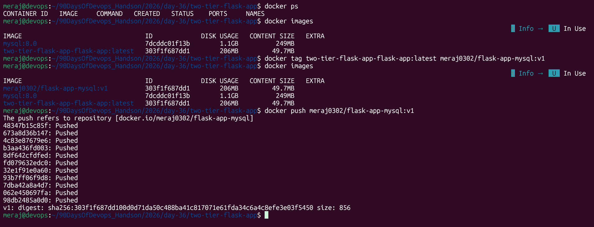
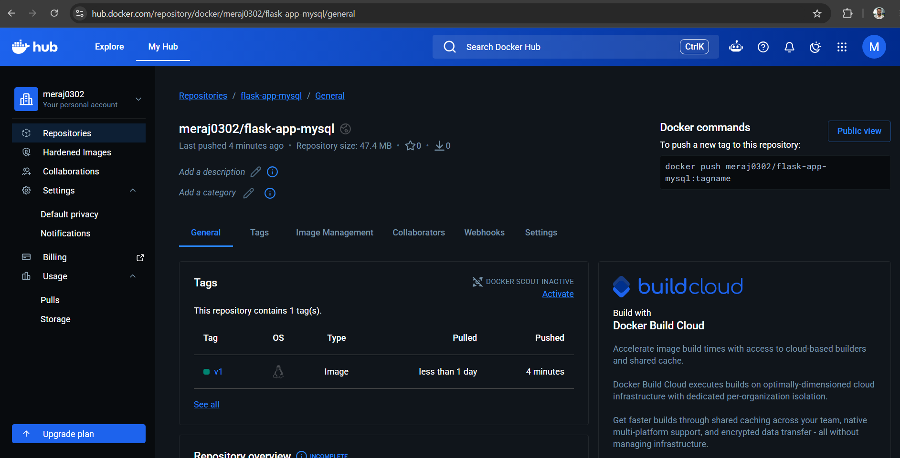
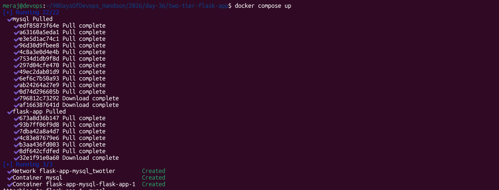
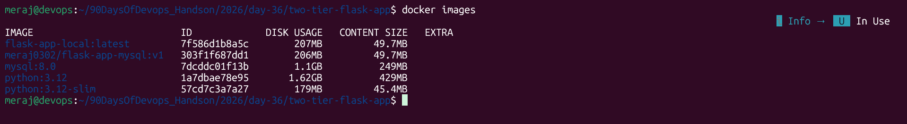

# Day 36 – Docker Project: Dockerize a Full Application

## 1. App Chosen

**Two-Tier Flask + MySQL App**
Source: [`Meraj0302/two-tier-flask-app`](https://github.com/Meraj0302/two-tier-flask-app)
(a fork/variant of the popular LondheShubham153 two-tier-flask-app used in
a lot of DevOps courses).

**Why this app:**
- It's a genuine two-tier setup (stateless app + stateful DB), so it
  exercises everything the assignment asks for: multi-service Compose,
  volumes, healthchecks, env-based config.

## 2. The Dockerfile

```dockerfile
# ------------------- Stage 1: Build Stage ------------------------------
FROM python:3.12 AS builder

WORKDIR /app

# Install build dependencies
RUN apt-get update && \
    apt-get install -y --no-install-recommends \
        gcc \
        default-libmysqlclient-dev \
        pkg-config && \
    rm -rf /var/lib/apt/lists/*

# Copy requirements and install dependencies
COPY requirements.txt .

RUN pip install --no-cache-dir -r requirements.txt

# ------------------- Stage 2: Final Stage ------------------------------
FROM python:3.12-slim

WORKDIR /app

# Install runtime dependency only
RUN apt-get update && \
    apt-get install -y --no-install-recommends \
        libmariadb3 && \
    rm -rf /var/lib/apt/lists/*

# Create a non-root user
RUN groupadd -r appgroup && \
    useradd -r -g appgroup -d /app -s /usr/sbin/nologin appuser

# Copy installed Python packages
COPY --from=builder /usr/local/lib/python3.12/site-packages/ \
                     /usr/local/lib/python3.12/site-packages/

# Copy application source
COPY . .

# Set ownership
RUN chown -R appuser:appgroup /app

# Switch to non-root user
USER appuser

# Run the application
CMD ["python", "app.py"]
```

**Design choices:**
- **Multi-stage build**: `mysqlclient` needs `gcc` + MySQL dev headers to
  compile at install time. Those tools (~150MB+) have no reason to exist
  in the runtime image, so stage 1 builds a virtualenv and stage 2 only
  copies the finished `site-packages`, plus the much smaller MySQL
  *runtime* library.
- **`python:3.12-slim`** instead of the default `python:3.12` — cuts the
  base image from ~1GB down to ~150MB before dependencies are even added.
- **Non-root user** (`appuser`): the process never runs as root inside
  the container, and app files are `chown`'d to that user explicitly.
- **Gunicorn, not `flask run`**: the original app called `app.run(debug=True)`,
  which is a Werkzeug dev server with the interactive debugger enabled —
  never something you want reachable in a container. Swapped to Gunicorn
  with 3 workers.
- **`.dockerignore`** excludes `.env`, `.git`, docs, k8s manifests, and
  caches, so secrets never end up in the build context or an image layer.

## 3. Docker Compose

`docker-compose.yml` wires up two services on a custom bridge network:


```docker-compse.yml
services:
  mysql: 
    image: mysql:8.0
    container_name: mysql
    environment:
      MYSQL_ROOT_PASSWORD: ${MYSQL_ROOT_PASSWORD}
      MYSQL_DATABASE: ${MYSQL_DB}
      MYSQL_USER: ${MYSQL_USER}
      MYSQL_PASSWORD: ${MYSQL_PASSWORD}
    volumes:
      - ./mysql-data:/var/lib/mysql
      - ./message.sql:/docker-entrypoint-initdb.d/message.sql  
    networks:
      - twotier
    healthcheck:
      test: ["CMD", "mysqladmin", "ping", "-h", "localhost", "-u${ROOT_USER}", "-p${MYSQL_ROOT_PASSWORD}"]
      interval: 10s
      timeout: 5s
      retries: 5
      start_period: 60s

  flask-app:
    build: .
    ports:
      - "5000:5000"
    environment:
      MYSQL_HOST: mysql
      MYSQL_USER: ${MYSQL_USER}
      MYSQL_PASSWORD: ${MYSQL_PASSWORD}
      MYSQL_DB: ${MYSQL_DB}
    depends_on:
      - mysql
    networks:
      - twotier
    restart: always
    healthcheck:
      test: ["CMD-SHELL", "curl -f http://localhost:5000/health || exit 1"]
      interval: 10s
      timeout: 5s
      retries: 5
      start_period: 30s

networks:
  twotier:

```

- **`mysql`** (`mysql:8.0`) — data persisted via a named volume
  (`mysql-data`), seeded once from `message.sql` on first boot, with a
  `mysqladmin ping` healthcheck.
- **`flask-app`** — built from the Dockerfile above, waits for MySQL to
  report **healthy** (`depends_on: condition: service_healthy`) before
  starting, not just "container started."
- Both services read connection details from `.env` (see `.env.example`)
  — nothing is hardcoded.

## 4. Challenges Faced & How They Were Solved

1. Tag app image

> 

2. Docker Hub link "https://hub.docker.com/repository/docker/meraj0302/flask-app-mysql/general"

> 

3. Run docker compose with docker hub image instead of build

```docker compose.yml
services:
  mysql: 
    image: mysql:8.0
    container_name: mysql
    environment:
      MYSQL_ROOT_PASSWORD: ${MYSQL_ROOT_PASSWORD}
      MYSQL_DATABASE: ${MYSQL_DB}
      MYSQL_USER: ${MYSQL_USER}
      MYSQL_PASSWORD: ${MYSQL_PASSWORD}
    volumes:
      - ./mysql-data:/var/lib/mysql
      - ./message.sql:/docker-entrypoint-initdb.d/message.sql  
    networks:
      - twotier
    healthcheck:
      test: ["CMD", "mysqladmin", "ping", "-h", "localhost", "-u${ROOT_USER}", "-p${MYSQL_ROOT_PASSWORD}"]
      interval: 10s
      timeout: 5s
      retries: 5
      start_period: 60s

  flask-app:
    image: meraj0302/flask-app-mysql:v1
    ports:
      - "5000:5000"
    environment:
      MYSQL_HOST: mysql
      MYSQL_USER: ${MYSQL_USER}
      MYSQL_PASSWORD: ${MYSQL_PASSWORD}
      MYSQL_DB: ${MYSQL_DB}
    depends_on:
      - mysql
    networks:
      - twotier
    restart: always
    healthcheck:
      test: ["CMD-SHELL", "curl -f http://localhost:5000/health || exit 1"]
      interval: 10s
      timeout: 5s
      retries: 5
      start_period: 30s

networks:
  twotier:

```
--- 

## 5. Final Image Size

> 

---

> 

--- 
