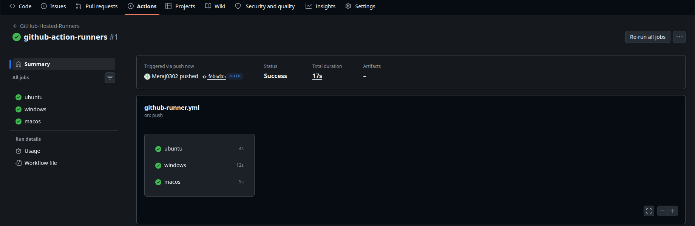
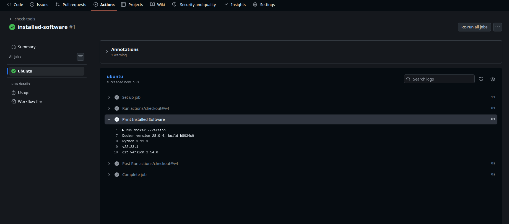
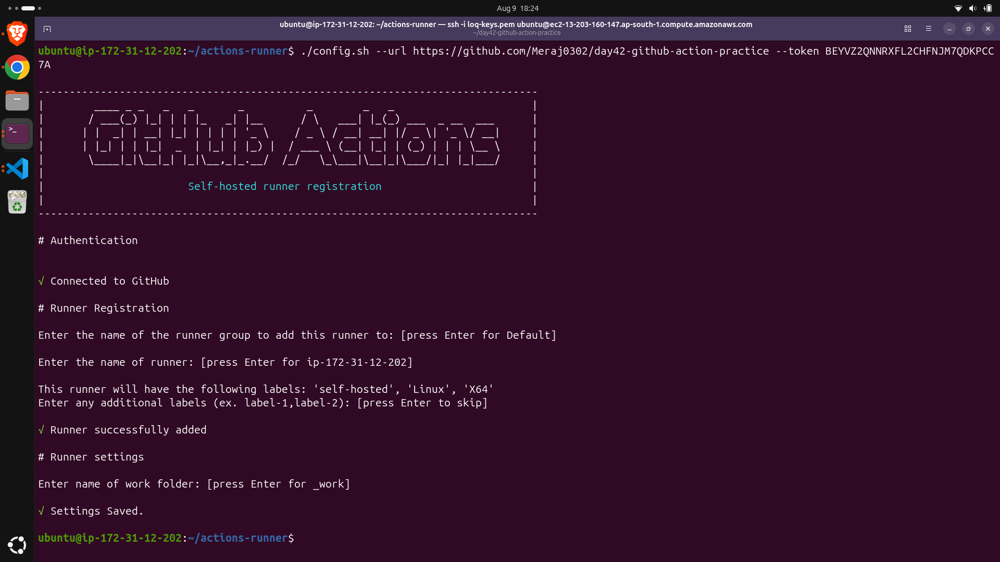
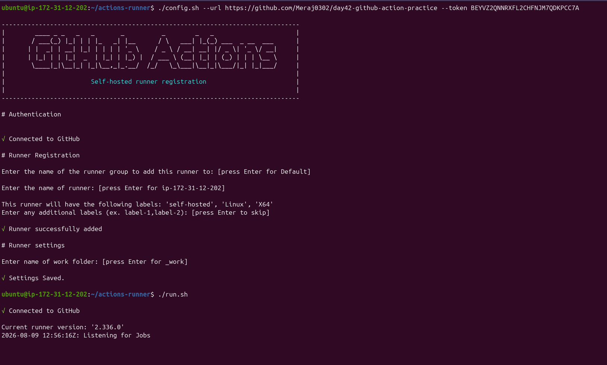
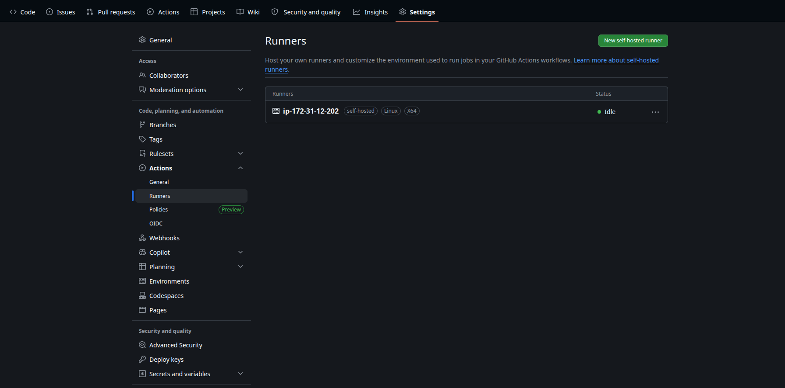
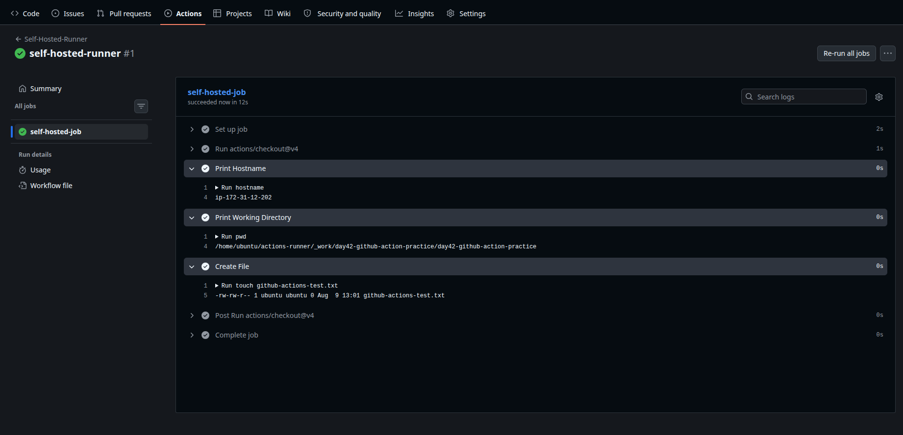
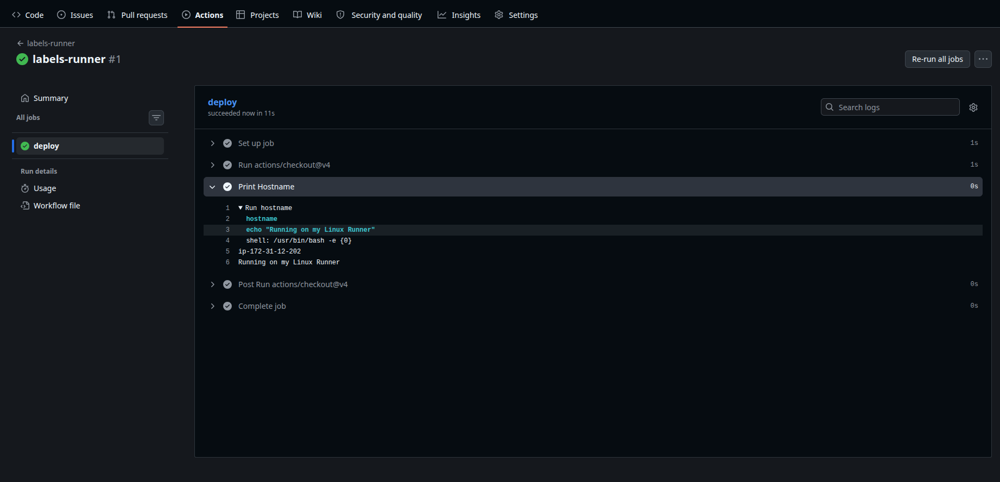

# Day 42 – GitHub-Hosted & Self-Hosted Runners

---

# Objective

Every GitHub Actions workflow runs on a machine called a **Runner**.

A runner is responsible for:

- Downloading your repository
- Executing workflow steps
- Running scripts and commands
- Uploading artifacts
- Reporting job status back to GitHub

Without a runner, GitHub Actions workflows cannot execute.

---

# What is a Runner?

A **Runner** is a machine (physical or virtual) that executes GitHub Actions jobs.

There are two types of runners:

1. GitHub-hosted Runner
2. Self-hosted Runner

---

# Challenge Task 1 - GitHub-Hosted Runners

## Objective

Run the same workflow on three different operating systems.

## Workflow

```yaml
name: GitHub-Hosted-Runners

on:
  push:

jobs:
  ubuntu:
    runs-on: ubuntu-latest
    steps:
      - uses: actions/checkout@v4
      - name: System Information
        run: |
          echo "Operating System: $RUNNER_OS"
          echo "Hostname: $(hostname)"
          echo "Current User: $(whoami)"

  windows:
    runs-on: windows-latest
    steps:
      - uses: actions/checkout@v4
      - name: System Information
        shell: powershell
        run: |
          Write-Host "Operating System: $env:RUNNER_OS"
          hostname
          whoami

  macos:
    runs-on: macos-latest
    steps:
      - uses: actions/checkout@v4
      - name: System Information
        run: |
          echo "Operating System: $RUNNER_OS"
          echo "Hostname: $(hostname)"
          echo "Current User: $(whoami)"
```

---

## Output

Three jobs execute simultaneously.

> 

---

## What is a GitHub-Hosted Runner?

A GitHub-hosted runner is a temporary virtual machine provided and managed by GitHub. GitHub automatically creates the runner when a workflow starts and deletes it after the job completes.

### Who manages it?

**GitHub** manages:

- Infrastructure
- Operating system updates
- Security patches
- Installed software
- Runner lifecycle

Users only need to write workflows.

---

# Challenge Task 2 - Explore Pre-installed Software

GitHub-hosted runners come with many development tools already installed.

Update the Ubuntu job:

```yaml
name: check-tools

on:
  push:

jobs:
  ubuntu:
    runs-on: ubuntu-latest
    steps:
      - uses: actions/checkout@v4
      - name: Print Installed Software
        run: |
          docker --version
          python --version
          node --version
          git --version
```

---

## Output

> 
---

## Common Pre-installed Software

- Docker
- Python
- Node.js
- Java
- Go
- .NET
- Ruby
- Git
- Azure CLI
- AWS CLI
- Terraform (varies by image)
- kubectl

---

## Why are pre-installed tools useful?

Because you don't need to install common software every time your workflow runs.

Benefits:

- Faster workflows
- Less setup code
- Consistent environments
- Reduced build time
- Improved reliability

---

# Challenge Task 3 – Set Up a Self-Hosted Runner

## Step 1

Open your repository.

```
Repository
↓
Settings
↓
Actions
↓
Runners
↓
New Self-hosted Runner
```
---

## Step 2

Choose:
```
Operating System --> Linux --> Architecture: x64 --> GitHub generates setup commands.
```

---

## Step 3

Run the commands on your Linux machine (or EC2/VPS).

Example:

```bash
mkdir actions-runner

cd actions-runner

curl -o actions-runner-linux-x64.tar.gz -L https://github.com/actions/runner/releases/latest/download/actions-runner-linux-x64.tar.gz

tar xzf actions-runner-linux-x64.tar.gz
```

---

## Step 4

Configure the runner.

> 

---

## Step 5

Start the runner.

```bash
./run.sh
```

> 

---

## Optional: Run as a Service

To keep the runner active after reboot:

```bash
sudo ./svc.sh install

sudo ./svc.sh start
```

---

## Verify

> 

---

# Challenge Task 4 – Use Your Self-Hosted Runner

## Workflow

```yaml
name: Self Hosted Runner

on:
  workflow_dispatch:

jobs:
  self-hosted-job:
    runs-on: self-hosted
    steps:
      - uses: actions/checkout@v4
      - name: Print Hostname
        run: hostname

      - name: Print Working Directory
        run: pwd

      - name: Create File
        run: |
          touch github-actions-test.txt
          ls -l github-actions-test.txt
```

---

## Output

> 

---

# Challenge Task 5 – Runner Labels

## Why Labels?

Imagine your company has:

```
Ubuntu Runner

Windows Runner

GPU Runner

Production Runner

Staging Runner
```

GitHub needs a way to know **which runner should execute a job**.

Labels solve this.

---

## Add Label

```
Repository → Settings → Actions → Runners

```
Select your runner.
Add label:

```
linix-aws
```

---

## Update Workflow

```yaml
runs-on:

  - self-hosted
  - linux-aws
```

Complete example:

```yaml
name: labels-runner

on:
  push:

jobs:
  deploy:
    runs-on:
      - self-hosted
      - linux-aws

    steps:
      - uses: actions/checkout@v4

      - name: Print Hostname
        run: |
            hostname
            echo "Running on my Linux Runner"
```

---

## Output

> 

---

## Why are labels useful?

Labels allow GitHub to target specific self-hosted runners based on their capabilities or purpose.

Examples:

- `linux`
- `windows`
- `gpu`
- `production`
- `staging`
- `high-memory`
- `my-linux-runner`

This helps route jobs to the correct machine.

---

# Challenge Task 6 – GitHub-Hosted vs Self-Hosted

| Feature | GitHub-Hosted Runner | Self-Hosted Runner |
|----------|----------------------|--------------------|
| **Who manages it?** | GitHub | User or Organization |
| **Cost** | Included with GitHub plan (usage limits apply) | User pays for hardware or cloud VM |
| **Pre-installed Tools** | Many tools already installed | User installs and maintains tools |
| **Good For** | CI testing, builds, open-source projects | Custom environments, private infrastructure, long-running jobs |
| **Security Concern** | Managed by GitHub with isolated temporary VMs | User is responsible for OS, patches, secrets, and network security |

---

# Pipeline Flow Diagram

```
             Git Push

                 │

                 ▼

        GitHub Actions Workflow

          ┌──────────────┐

          │              │

          ▼              ▼

GitHub Hosted      Self Hosted

 Runner              Runner

(Ubuntu VM)      (Your Linux VM)

          │              │

          ▼              ▼

 Execute Job       Execute Job

          │              │

          └──────┬───────┘

                 ▼

          Job Completed
```

---

# GitHub-Hosted Runner Lifecycle

```
Workflow Starts

       │

       ▼

GitHub Creates VM

       │

       ▼

Downloads Repository

       │

       ▼

Runs Workflow

       │

       ▼

Uploads Logs

       │

       ▼

Deletes VM
```

Every workflow gets a **fresh, temporary environment**.

---

# Self-Hosted Runner Lifecycle

```
Install Runner

      │

      ▼

Configure Runner

      │

      ▼

Runner Registers with GitHub

      │

      ▼

Idle

      │

      ▼

Receives Job

      │

      ▼

Executes Workflow

      │

      ▼

Returns to Idle
```

Unlike GitHub-hosted runners, a self-hosted runner **remains online** until you stop or remove it.

---

# Key Takeaways

- A runner executes GitHub Actions workflows.
- GitHub-hosted runners are temporary virtual machines managed by GitHub.
- Self-hosted runners run on your own hardware or cloud VM.
- GitHub-hosted runners include many pre-installed development tools.
- Self-hosted runners allow custom software, network access, and persistent environments.
- Labels help GitHub choose the correct self-hosted runner when multiple runners are available.

---

# Quick Revision

| Term | Description |
|------|-------------|
| Runner | Machine that executes workflow jobs |
| GitHub-hosted | Managed by GitHub, temporary VM |
| Self-hosted | Managed by the user on their own machine |
| `runs-on` | Specifies which runner executes the job |
| Label | Used to target specific self-hosted runners |

---

# Interview Questions

### What is a GitHub Actions runner?

A runner is a machine that executes GitHub Actions workflow jobs.

---

### What is the difference between GitHub-hosted and self-hosted runners?

GitHub-hosted runners are temporary virtual machines managed by GitHub, while self-hosted runners are machines managed by the user or organization.

---

### Why would you use a self-hosted runner?

To access private networks, use custom software or hardware, reduce costs for heavy workloads, or maintain persistent environments.

---

### What does `runs-on` do?

It specifies which runner (GitHub-hosted or self-hosted) should execute the workflow job.

---

### Why are labels important for self-hosted runners?

Labels allow workflows to target specific runners with required capabilities, such as operating system, hardware, or environment.

---

# Submission Checklist

- ✅ Created workflow for GitHub-hosted runners
- ✅ Ran jobs on Ubuntu, Windows, and macOS
- ✅ Explored pre-installed software
- ✅ Configured a self-hosted runner
- ✅ Verified runner status as Idle
- ✅ Created `self-hosted.yml`
- ✅ Ran workflow on self-hosted runner
- ✅ Added a custom runner label
- ✅ Used label in `runs-on`
- ✅ Compared GitHub-hosted and self-hosted runners
- ✅ Added required screenshots

---

# Folder Structure

```
github-actions-practice/
│
├── .github/
│   └── workflows/
│       ├── hosted-runners.yml
│       ├── self-hosted.yml
│       ├── hello.yml
│       ├── manual.yml
│       ├── matrix.yml
│       └── pr-check.yml
│
└── README.md
```

---

**Day 42 Complete ✅**