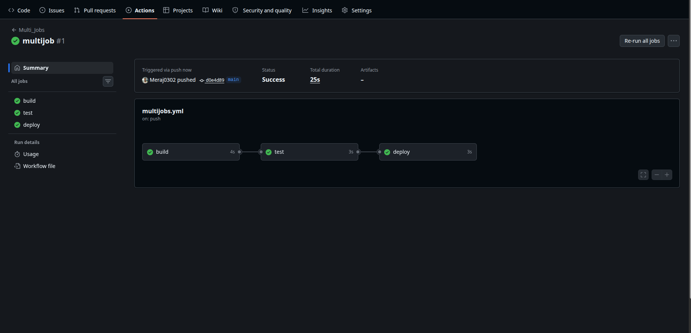
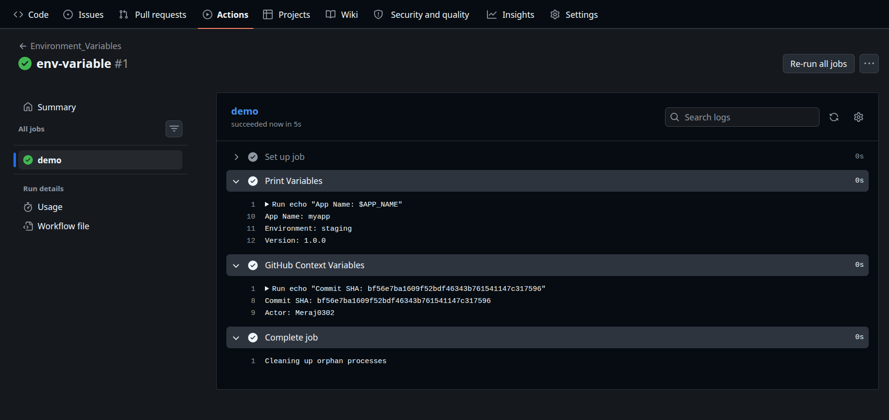
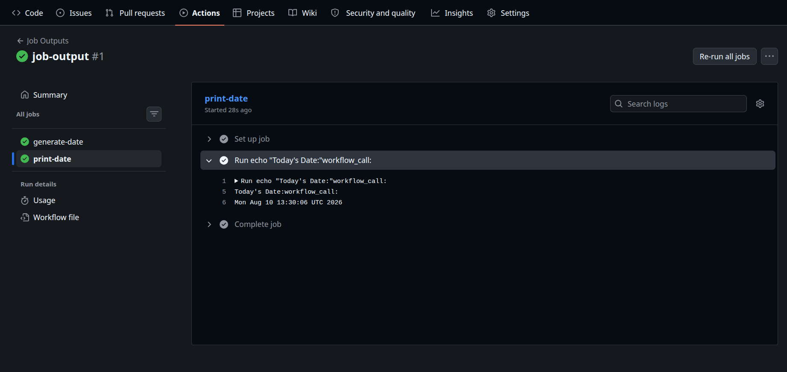
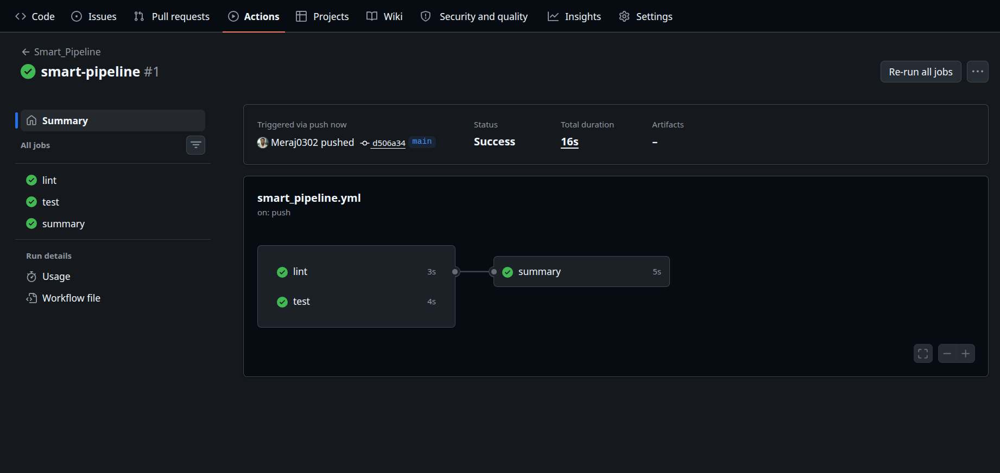
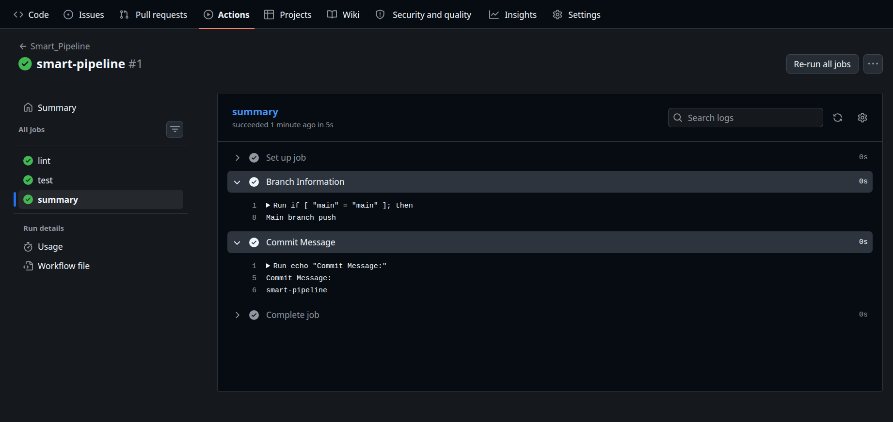

# Day 43 – Jobs, Steps, Environment Variables & Conditionals

---

# Objective

Until now, our workflows contained only one job. Real-world CI/CD pipelines are more advanced—they contain multiple jobs that depend on each other, share information, and execute only under certain conditions.

Today:

- Multi-job workflows
- Job dependencies
- Environment variables
- GitHub context variables
- Passing outputs between jobs
- Conditional execution
- Smart pipelines

---

# Workflow Execution Flow

```
             Git Push
                 │
                 ▼
        GitHub Actions Workflow
                 │
        ┌────────┴────────┐
        ▼                 ▼
      Build            Environment
        │
        ▼
      Test
        │
        ▼
     Deploy
```

---

# Challenge Task 1 – Multi-Job Workflow

## Objective

Create three jobs that execute one after another.

```yaml
name: Multi_Jobs

on:
  push:

jobs:
  build:
    runs-on: ubuntu-latest

    steps:
      - run: echo "Building the application..."

  test: #Job -1
    needs: build
    runs-on: ubuntu-latest

    steps:
      - run: echo "Running tests..."

  deploy: # Job -2
    needs: test
    runs-on: ubuntu-latest

    steps:
      - run: echo "Deploying application..."
```

---

### Output

> 

---

## What is `needs`?

`needs` creates a dependency between jobs.

Example:

```yaml
needs: build
```

means:

> Don't start this job until **build** completes successfully.

Without `needs`, all jobs run in parallel.

---

# Challenge Task 2 – Environment Variables

GitHub Actions supports environment variables at three levels:

- Workflow
- Job
- Step

---

## Workflow
 
```yaml
name: Environment_Variables

on:
  push:

env:
  APP_NAME: myapp

jobs:
  demo:
    runs-on: ubuntu-latest

    env:
      ENVIRONMENT: staging

    steps:
      - name: Print Variables
        env:
          VERSION: 1.0.0
        run: |
          echo "App Name: $APP_NAME"
          echo "Environment: $ENVIRONMENT"
          echo "Version: $VERSION"

      - name: GitHub Context Variables
        run: |
          echo "Commit SHA: ${{ github.sha }}"
          echo "Actor: ${{ github.actor }}"
```

---
### Output

> 

---

## Environment Variable Hierarchy

```
Workflow Level

        │
        ▼

Job Level

        │
        ▼

Step Level
```

Step-level variables override job-level variables.

Job-level variables override workflow-level variables.

---

# GitHub Context Variables

GitHub automatically provides useful information.

| Variable | Description |
|-----------|-------------|
| `${{ github.actor }}` | User who triggered workflow |
| `${{ github.sha }}` | Commit SHA |
| `${{ github.ref_name }}` | Branch name |
| `${{ github.repository }}` | Repository name |
| `${{ github.workflow }}` | Workflow name |
| `${{ github.event_name }}` | Event type |

Example:

```yaml
echo "${{ github.actor }}"
```
---

# Challenge Task 3 – Job Outputs

Sometimes one job generates data another job needs.

Example:
Build Job →
creates version number →
Deploy Job uses it.

---

## Workflow

```yaml
name: Job_Outputs

on:
  push:

jobs:
  generate-date:
    runs-on: ubuntu-latest

    outputs:
      today: ${{ steps.current.outputs.today }}

    steps:
      - id: current
        run: echo "today=$(date)" >> "$GITHUB_OUTPUT"

  print-date:
    needs: generate-date
    runs-on: ubuntu-latest
    steps:
      - run: |
          echo "Today's Date:"
          echo "${{ needs.generate-date.outputs.today }}"
```

---

### Output
> 

---

## Flow

```
Generate Date

      │
      ▼

Store Output

      │
      ▼

Second Job Reads Output
```
---

## Why use Job Outputs?

Outputs allow jobs to share information without duplicating work.

Common use cases:

- Docker image tag
- Application version
- Build number
- Release version
- Artifact location
- Deployment URL

---

# Challenge Task 4 – Conditionals

GitHub Actions can decide whether to execute a job or step.

---

## Run Only on Main Branch

```yaml
- name: Main Branch Only
  if: github.ref == 'refs/heads/main'
  run: echo "Running on main branch"
```

---

## Run Only If Previous Step Failed

```yaml
- name: Failure Handler
  if: failure()
  run: echo "Previous step failed!"
```

---

## Job Only for Push Events

```yaml
jobs:
  deploy:
    if: github.event_name == 'push'
    runs-on: ubuntu-latest
    steps:
      - run: echo "Push event detected"
```

---

## Continue Even If Step Fails

```yaml
- name: Fail Intentionally
  continue-on-error: true
  run: exit 1
```

---

## What does `continue-on-error` do?

Normally:

```
Step Fails
↓
Workflow Stops
```

With:

```yaml
continue-on-error: true
```

```
Step Fails
↓
Workflow Continues
```

Useful when failures are acceptable (for example, optional checks or experimental steps).

---

# Challenge Task 5 – Smart Pipeline

```yaml
name: Smart_Pipeline

on:
  push:

jobs:
  lint:
    runs-on: ubuntu-latest
    steps:
      - run: echo "Running lint checks..."

  test:
    runs-on: ubuntu-latest
    steps:
      - run: echo "Running tests..."

  summary:
    needs:
      - lint
      - test
      
    runs-on: ubuntu-latest
    steps:
      - name: Branch Information
        run: |
          if [ "${{ github.ref_name }}" = "main" ]; then
            echo "Main branch push"
          else
            echo "Feature branch push"
          fi

      - name: Commit Message
        run: |
          echo "Commit Message:"
          echo "${{ github.event.head_commit.message }}"
```
---
### Output

> 

> 

---

# Smart Pipeline Flow

```
               Git Push
                   │
         ┌─────────┴─────────┐
         ▼                   ▼
      Lint Job          Test Job
         │                   │
         └─────────┬─────────┘
                   ▼
             Summary Job
```

`lint` and `test` run **in parallel**, while `summary` waits for both to finish.

---

# Common Conditional Functions

| Function | Purpose |
|-----------|----------|
| `success()` | Run if previous steps succeeded |
| `failure()` | Run if previous step failed |
| `always()` | Always run |
| `cancelled()` | Run if workflow was cancelled |

Example:

```yaml
if: success()
```
---

# Key Takeaways

- Jobs run in parallel unless `needs` is used.
- `needs` creates dependencies between jobs.
- Environment variables can be defined at workflow, job, or step level.
- GitHub context variables provide repository and workflow information.
- Job outputs allow one job to pass data to another.
- `if` controls when jobs or steps execute.
- `continue-on-error` lets workflows continue even if a step fails.

---

# Quick Revision

| Feature | Purpose |
|----------|---------|
| `needs` | Creates job dependency |
| `outputs` | Passes values between jobs |
| `env` | Defines environment variables |
| `if` | Conditional execution |
| `continue-on-error` | Continue after failure |
| `${{ github.actor }}` | Workflow trigger user |
| `${{ github.sha }}` | Commit SHA |
| `${{ github.ref_name }}` | Branch name |

---

# Interview Questions

### What does `needs` do?

`needs` creates dependencies between jobs so that a job starts only after the required job has completed successfully.

---

### Why use job outputs?

Job outputs allow one job to share data, such as version numbers or build artifacts, with another job in the same workflow.

---

### What are GitHub context variables?

GitHub context variables provide metadata about the workflow, repository, event, branch, commit, and user. They are accessed using the `${{ github.* }}` syntax.

---

### What is the difference between workflow, job, and step environment variables?

- **Workflow-level:** Available to all jobs and steps.
- **Job-level:** Available only within that job.
- **Step-level:** Available only within that specific step and overrides higher-level variables if names are the same.

---

### What does `continue-on-error: true` do?

It allows a step to fail without stopping the workflow, so subsequent steps continue to execute.

---

### What happens if `needs` is not used?

Jobs run in parallel because there are no dependencies defined.

---

# Folder Structure

```
github-actions-practice/
│
├── .github/
│   └── workflows/
│       ├── multi-job.yml
│       ├── environment.yml
│       ├── job-output.yml
│       ├── smart-pipeline.yml
│       └── hello.yml
│
└── README.md
```

---

# Submission Checklist

- ✅ Created `multi-job.yml`
- ✅ Used `needs` to create job dependencies
- ✅ Used workflow, job, and step environment variables
- ✅ Printed GitHub context variables
- ✅ Passed outputs between jobs
- ✅ Used conditional execution with `if`
- ✅ Tested `continue-on-error`
- ✅ Built a smart pipeline with parallel and dependent jobs
- ✅ Completed `day-43-jobs-steps.md`

---
