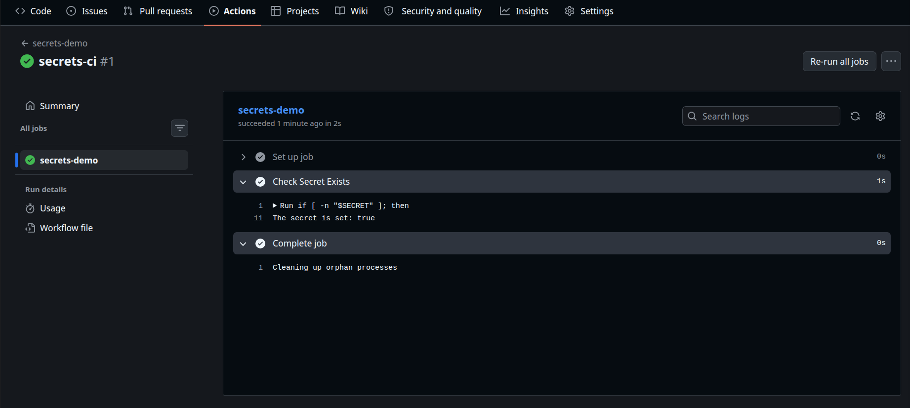
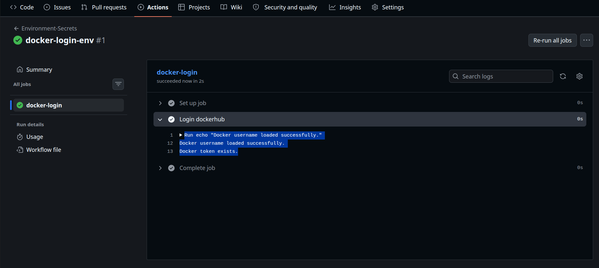
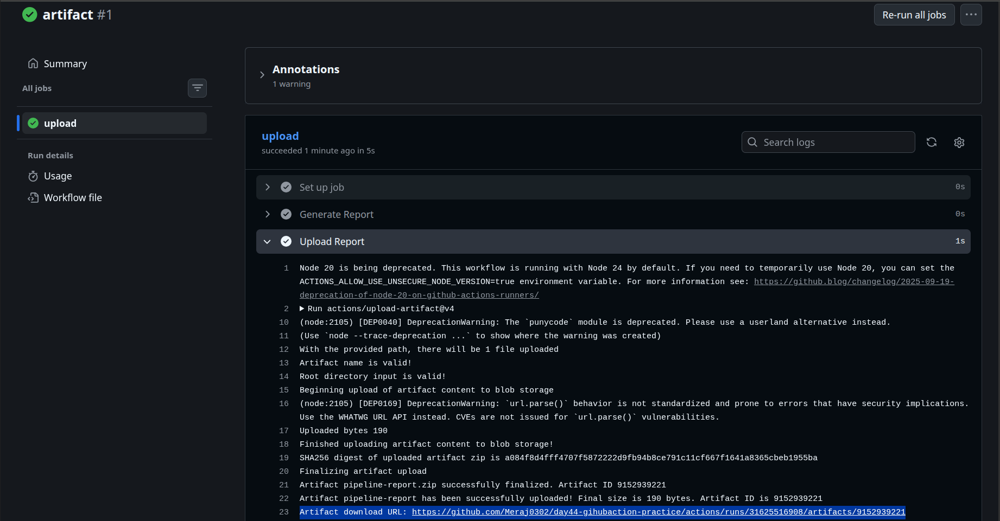
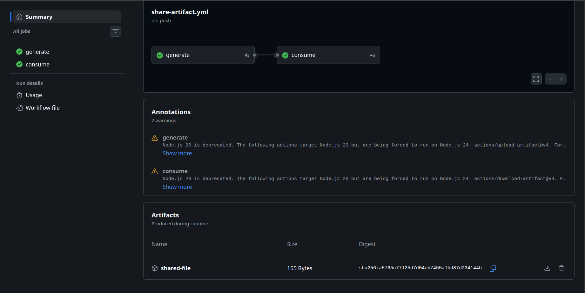
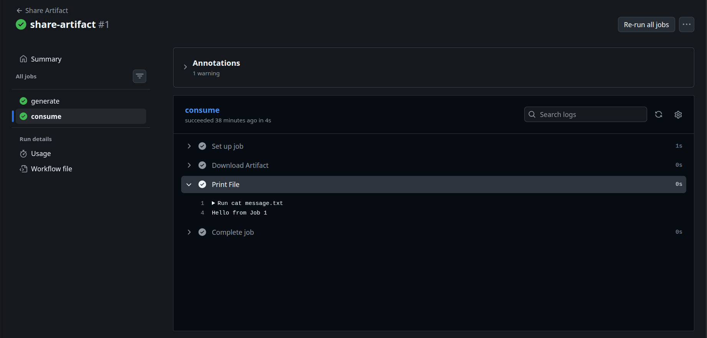
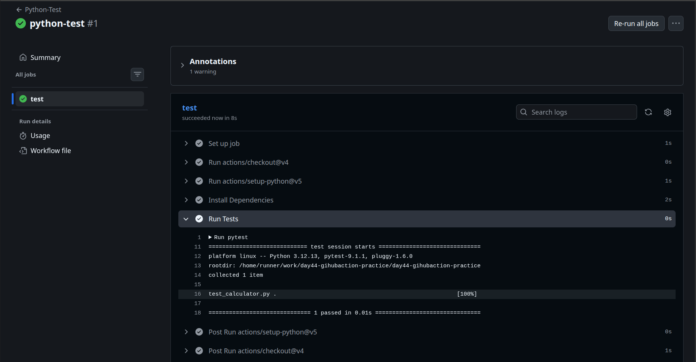
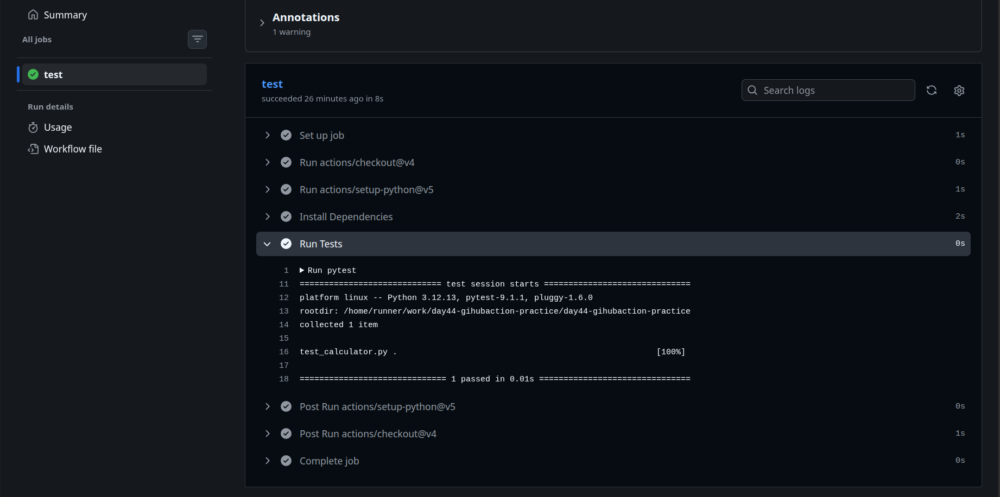
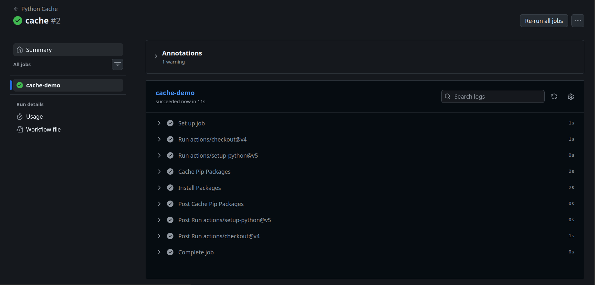

# Day 44 – Secrets, Artifacts & Running Real Tests in CI

> **Goal:** Learn how to securely store sensitive information, save build outputs, share files between jobs, cache dependencies, and run real automated tests in GitHub Actions.

---

# Objective

Until now, our workflows only printed messages.

Today I'll build a workflow that performs real CI tasks:

- Store passwords and tokens securely
- Use GitHub Secrets
- Upload and download artifacts
- Run real tests
- Cache dependencies for faster builds

These are features that use in almost every production CI/CD pipeline.

---

# Workflow Overview

```
             Git Push
                 │
                 ▼
        GitHub Actions Workflow
                 │
      ┌──────────┼───────────┐
      ▼          ▼           ▼
  Secrets     Run Tests   Generate Report
      │          │             │
      └──────────┼─────────────┘
                 ▼
         Upload Artifact
                 │
                 ▼
         Download Artifact
                 │
                 ▼
          Pipeline Success
```

---

# Challenge Task 1 – GitHub Secrets

## What are GitHub Secrets?

GitHub Secrets allow to securely store sensitive values such as:

- API Keys
- Database Passwords
- AWS Credentials
- Docker Hub Tokens
- SSH Keys
- Personal Access Tokens

Secrets are encrypted and can only be accessed inside GitHub Actions workflows.

---

## Create a Secret

Navigate to:

```
Repository
↓
Settings
↓
Secrets and variables
↓
Actions
↓
New repository secret
```

---

## Workflow

```yaml
name: secrets-demo

on:
  push:

jobs:

  secrets-demo:
    runs-on: ubuntu-latest

    steps:
      - name: Check Secret Exists
        env:
          SECRET: ${{ secrets.MY_SECRET_MESSAGE }}
        run: |

          if [ -n "$SECRET" ]; then
            echo "The secret is set: true"
          else
            echo "The secret is set: false"
          fi
```

---

> 

---

## What if you print the secret?

```yaml
run: echo "${{ secrets.MY_SECRET_MESSAGE }}"
```
GitHub **masks** the value.

Example output:

```
***
```

Even if the secret is printed accidentally, GitHub automatically hides it in workflow logs.

---

## Why should you never print secrets?

Although GitHub masks secret values, printing secrets is still a bad security practice because:

- Logs may be shared.
- Secrets could be exposed through scripts or third-party tools.
- It increases the risk of accidental credential leakage.
- Attackers may infer sensitive information from logs.

**Best practice:** Use secrets only where required and never display them.

---

# Challenge Task 2 – Using Secrets as Environment Variables

Secrets can be passed as environment variables.

```yaml
name: Environment-Secrets

on:
  push:

jobs:
  docker-login:
    runs-on: ubuntu-latest

    steps:
      - name: Login dockerhub
        env:
          USERNAME: ${{ secrets.DOCKER_USERNAME }}
          TOKEN: ${{ secrets.DOCKER_TOKEN }}

        run: |
          echo "Docker username loaded successfully."

          if [ -n "$TOKEN" ]; then
            echo "Docker token exists."
          fi

```
---
> 
---

# Challenge Task 3 – Upload Artifacts

Artifacts are files produced during a workflow that can be downloaded later.

Examples:

- Test reports
- Build logs
- ZIP packages
- Coverage reports
- Compiled binaries

---

## Workflow

```yaml
name: Upload Artifact

on:
  workflow_dispatch:

jobs:
  upload:
    runs-on: ubuntu-latest

    steps:
      - name: Generate Report
        run: |
          echo "GitHub Actions Report" > report.txt
          echo "Pipeline executed successfully." >> report.txt

      - name: Upload Report
        uses: actions/upload-artifact@v4
        with:
          name: pipeline-report
          path: report.txt
```

---
> 
---

## Verify

Open:

```
Actions
↓
Workflow Run
↓
Artifacts
```
Download:

```
pipeline-report.zip
```

---

# Challenge Task 4 – Download Artifacts Between Jobs

Sometimes one job creates files that another job needs.

---

## Workflow

```yaml
name: Share Artifact

on:
  push:

jobs:
  generate:
    runs-on: ubuntu-latest
    
    steps:
      - name: Create File
        run: |
          echo "Hello from Job 1" > message.txt

      - name: Upload Artifact
        uses: actions/upload-artifact@v4
        with:
          name: shared-file
          path: message.txt

  consume:
    needs: generate
    runs-on: ubuntu-latest

    steps:
      - name: Download Artifact
        uses: actions/download-artifact@v4
        with:
          name: shared-file

      - name: Print File
        run: cat message.txt
```
---
> 
---

## Output

> 

---

## When are artifacts useful?

Real-world examples:

- Passing build packages between jobs.
- Sharing Docker image metadata.
- Uploading test reports.
- Saving application logs.
- Sharing compiled binaries for deployment.

---

# Challenge Task 5 – Run Real Tests in CI

We'll use a simple Python example.

---

## Project Structure

```
day44-githubaction-practice/
│
├── calculator.py
├── test_calculator.py
└── requirements.txt
```

---

## calculator.py

```python
def add(a, b):
    return a + b
```

---

## test_calculator.py

```python
from calculator import add

def test_add():
    assert add(2, 3) == 5
```

---

## requirements.txt

```
pytest
```

---

## Workflow

```yaml
name: Python-Test

on:
  workflow_dispatch:

jobs:
  test:
    runs-on: ubuntu-latest

    steps:
      - uses: actions/checkout@v4
      - uses: actions/setup-python@v5
        with:
          python-version: "3.12"

      - name: Install Dependencies
        run: |
          pip install -r requirements.txt

      - name: Run Tests
        run: pytest
```
---
> 
---
> 
---

# Challenge Task 6 – Dependency Caching

Installing dependencies every workflow run is slow.

Caching speeds things up.

---

## Workflow

```yaml
name: Python Cache

on:
  push:

jobs:
  cache-demo:
    runs-on: ubuntu-latest

    steps:
      - uses: actions/checkout@v4
      - uses: actions/setup-python@v5
        with:
          python-version: "3.12"

      - name: Cache Pip Packages
        uses: actions/cache@v4
        with:
          path: ~/.cache/pip
          key: ${{ runner.os }}-pip-${{ hashFiles('requirements.txt') }}
          restore-keys: |
            ${{ runner.os }}-pip-

      - name: Install Packages
        run: pip install -r requirements.txt
```
---

> 

---

## First Run

```
Cache Miss
↓
Download Packages
↓
Store Cache
```

---

## Second Run

```
Cache Hit
↓
Reuse Packages
↓
Faster Build
```

---

## What is being cached?

The downloaded Python packages stored in:

```
~/.cache/pip
```

---

## Where is it stored?

The cache is stored by GitHub's caching service and restored automatically for future workflow runs using the same cache key.

---

# Secrets vs Variables

| Feature | Secrets | Variables |
|----------|----------|-----------|
| Encrypted | ✅ | ❌ |
| Visible in Logs | Masked | Visible |
| Good for | Passwords, Tokens, API Keys | Configuration values |
| Editable | Repository Settings | Repository Settings |

---

# Artifact Flow

```
Generate File
      │
      ▼
Upload Artifact
      │
      ▼
Stored by GitHub
      │
      ▼
Download Later
      │
      ▼
Use in Another Job
```

---

# Cache Flow

```
Install Dependencies
       │
       ▼
Cache Created
       │
       ▼
Next Workflow
       │
       ▼
Cache Restored
       │
       ▼
Faster Build
```

---

# Key Takeaways

- GitHub Secrets securely store sensitive information.
- Never hardcode passwords or tokens in workflow files.
- GitHub automatically masks secrets in logs.
- Artifacts allow workflows to save and share files.
- Artifacts can be downloaded from the Actions tab.
- Job artifacts can be shared across multiple jobs.
- Real CI pipelines should run automated tests.
- Caching dependencies significantly reduces workflow execution time.

---

# Quick Revision

| Feature | Purpose |
|----------|---------|
| `secrets` | Store sensitive values securely |
| `env` | Pass secrets as environment variables |
| `upload-artifact` | Save files from a workflow |
| `download-artifact` | Retrieve saved files |
| `actions/cache` | Cache dependencies for faster builds |
| `pytest` | Run automated Python tests |

---

# Interview Questions

### What are GitHub Secrets?

GitHub Secrets are encrypted values used to securely store sensitive information such as API keys, passwords, and access tokens for use in GitHub Actions workflows.

---

### Why should secrets never be hardcoded?

Hardcoding secrets exposes them in source code, making them vulnerable to unauthorized access and accidental leaks.

---

### What are artifacts?

Artifacts are files generated during a workflow that are stored by GitHub and can be downloaded later or shared with other jobs.

---

### When would you use artifacts?

Artifacts are commonly used to store test reports, build outputs, logs, coverage reports, compiled binaries, or deployment packages.

---

### What is dependency caching?

Dependency caching stores downloaded packages between workflow runs, reducing installation time and improving pipeline performance.

---

### What is the difference between secrets and variables?

Secrets are encrypted and masked in logs, making them suitable for sensitive data. Variables are not encrypted and are intended for non-sensitive configuration values.

---

# Folder Structure

```
github-actions-practice/
│
├── .github/
│   └── workflows/
│       ├── secrets.yml
│       ├── upload-artifact.yml
│       ├── share-artifact.yml
│       ├── python-test.yml
│       └── cache.yml
│
├── calculator.py
├── test_calculator.py
├── requirements.txt
└── README.md
```
---