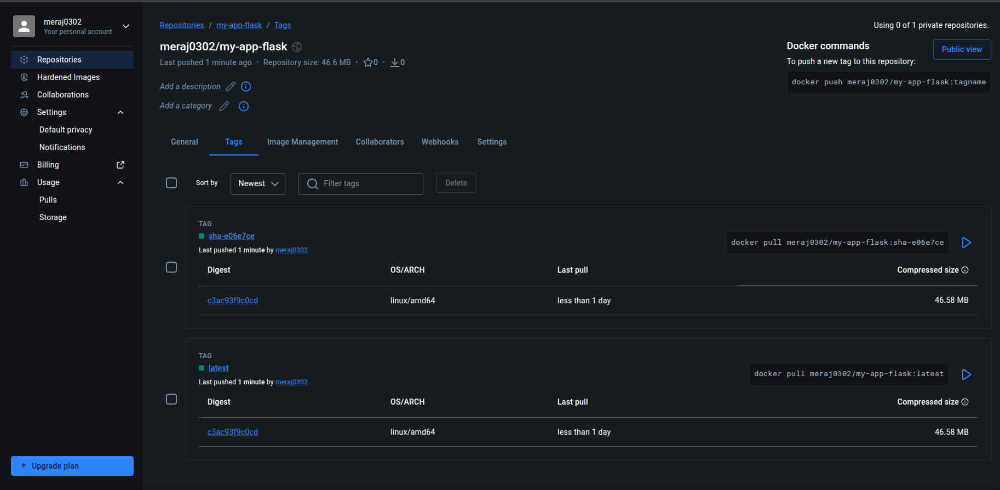
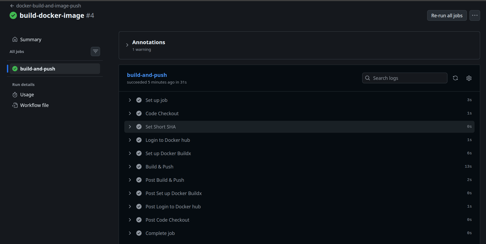
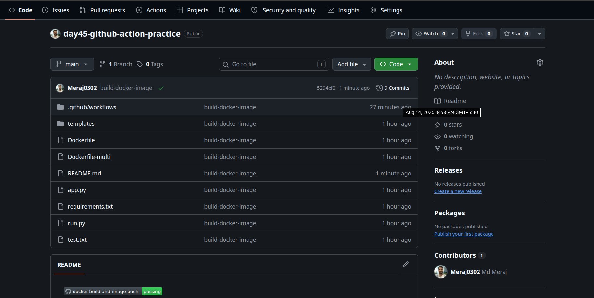
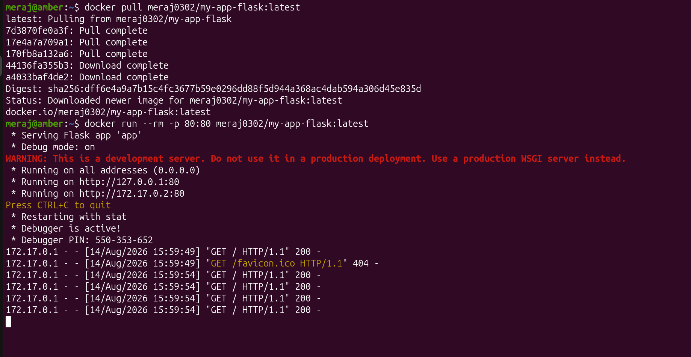
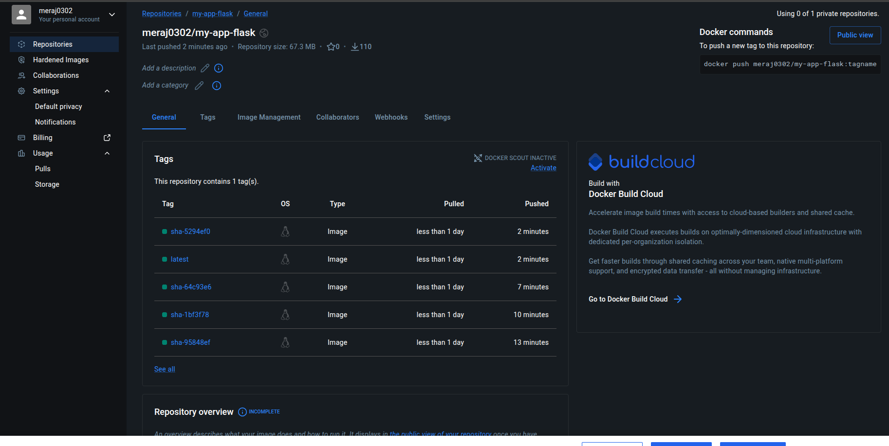

# Day 45 – Docker Build & Push in GitHub Actions

> **Goal:** Build a complete CI/CD pipeline that automatically builds a Docker image and pushes it to Docker Hub whenever code is pushed to the `main` branch.

---

# Objective

In modern DevOps, developers don't manually build Docker images every time they make a change.

Instead, a CI/CD pipeline automatically:

- Detects new code
- Builds the Docker image
- Tags the image
- Pushes it to Docker Hub
- Makes it available for deployment

Today you'll build that complete workflow.

---

# CI/CD Flow

```
           Developer
               │
          git push main
               │
               ▼
       GitHub Actions Trigger
               │
               ▼
        Checkout Repository
               │
               ▼
       Login to Docker Hub
               │
               ▼
        Build Docker Image
               │
               ▼
        Tag Docker Image
               │
               ▼
       Push to Docker Hub
               │
               ▼
   Docker Image Available Online
               │
               ▼
   docker pull username/image
```

---

# Prerequisites

Before starting, ensure you have:

- GitHub Repository
- Dockerfile
- Docker Hub Account
- GitHub Actions enabled
- Repository secrets configured

Required GitHub Secrets:

```
DOCKER_USERNAME

DOCKER_TOKEN
```

---

# Challenge Task 1

Repository structure:

```
github-actions-practice/
│
├── app.py
├── requirements.txt
├── Dockerfile
├── README.md
└── .github/
    └── workflows/
        └── docker-publish.yml
```

---

## Example Dockerfile

```dockerfile
# Base image (OS)
FROM python:3.14-slim

# Working directory
WORKDIR /app

# Copy src code to container
COPY . .

# Run the build commands
RUN pip install --no-cache-dir -r requirements.txt

# expose port 80
EXPOSE 80

# serve the app / run the app (keep it running)
CMD ["python","run.py"]
```

---

# Challenge Task 2 – Build Docker Image

Create:

```
.github/workflows/docker-publish.yml
```
---

In modern DevOps, developers don't manually build Docker images every time they make a change.

Instead, a CI/CD pipeline automatically:

- Detects new code
- Builds the Docker image
- Tags the image
- Pushes it to Docker Hub
- Makes it available for deployment

---

# CI/CD Flow

```
           Developer
               │
          git push main
               │
               ▼
      GitHub Actions Trigger
               │
               ▼
      Checkout Repository
               │
               ▼
      Login to Docker Hub
               │
               ▼
      Build Docker Image
               │
               ▼
       Tag Docker Image
               │
               ▼
       Push to Docker Hub
               │
               ▼
  Docker Image Available Online
               │
               ▼
   docker pull username/image
```
---

# Prerequisites

Before starting, ensure you have:

- GitHub Repository
- Dockerfile
- Docker Hub Account
- GitHub Actions enabled
- Repository secrets configured

Required GitHub Secrets:

```
DOCKER_USERNAME

DOCKER_TOKEN
```

---

# Challenge Task 2 – Build Docker Image

Create:

```
.github/workflows/docker-publish.yml
```

---

## Workflow

```yaml
name: docker-build-and-image-push

on: 
  push: 

jobs:
  build-and-push:
    runs-on: ubuntu-latest
    steps:
      - name: Code Checkout
        uses: actions/checkout@v4

      - name: Login to Docker hub
        uses: docker/login-action@v3
        with:
          username: ${{ vars.DOCKERHUB_USERNAME }}
          password: ${{ secrets.DOCKERHUB_TOKEN }}
          
      - name: Set up Docker Buildx
        uses: docker/setup-buildx-action@v3

      - name: Build & Push
        uses: docker/build-push-action@v6
        with:
          context: .
          push: true
          tags: ${{ vars.DOCKERHUB_USERNAME }}/flask-app:latest
```
---
> 
---

# Understanding the Workflow

## Trigger

```yaml
on:
  push:
```
Runs when code is pushed.

---

## Checkout

```yaml
uses: actions/checkout@v4
```
Downloads repository code.

---

## Docker Login

```yaml
docker/login-action
```
Authenticates securely using GitHub Secrets.

---

## Buildx

```yaml
docker/setup-buildx-action
```

Enables advanced Docker builds.

---

## Build & Push

```yaml
docker/build-push-action
```

Builds the Docker image and optionally pushes it to Docker Hub.

---

# Challenge Task 3 – Push Two Tags

The workflow creates two tags:

```yaml
name: docker-build-and-image-push

on: 
  push: 

env:
  IMAGE_NAME: my-app-flask

jobs:
  build-and-push:
    runs-on: ubuntu-latest
    permissions:
      contents: read
    steps:
      - name: Code Checkout
        uses: actions/checkout@v4

      - name: Set Short SHA
        id: vars
        run: |
          echo "SHORT_SHA=${GITHUB_SHA::7}" >> "$GITHUB_ENV"

      - name: Login to Docker hub
        if: github.ref == 'refs/heads/main'
        uses: docker/login-action@v3
        with:
          username: ${{ vars.DOCKERHUB_USERNAME }}
          password: ${{ secrets.DOCKERHUB_TOKEN }}

      - name: Set up Docker Buildx
        uses: docker/setup-buildx-action@v3

      - name: Build & Push
        uses: docker/build-push-action@v6
        with:
            context: .
            push: ${{ github.ref == 'refs/heads/main' }}

            tags: |
              ${{ vars.DOCKERHUB_USERNAME }}/${{ env.IMAGE_NAME }}:latest
              ${{ vars.DOCKERHUB_USERNAME }}/${{ env.IMAGE_NAME }}:sha-${{ env.SHORT_SHA }}
```
---
> 
---
Benefits:

- `latest` → Always points to the newest image.
- `sha-*` → Identifies the exact commit used to build the image.

---

# Challenge Task 4 – Push Only on Main

The workflow still builds on feature branches, but it only pushes images when the branch is `main`.

```yaml
push: ${{ github.ref == 'refs/heads/main' }}
```

### Feature Branch

```
git push origin feature/login
```

Result:

```
Build Image ✅

Push Image ❌
```

### Main Branch

```
git push origin main
```

Result:

```
Build Image ✅

Push Image ✅
```

---

# Challenge Task 5 – Status Badge

Badge URL:
```
https://github.com/Meraj0302/day45-github-action-practice/actions/workflows/docker-publish.yml/badge.svg
```

Example Markdown:
```markdown

```
---

> 

---

# Challenge Task 6 – Pull & Run

Pull the latest image.

```bash
docker pull meraj0302/my-app-flask:latest
```

Run the container.

```bash
docker run --rm -p 80:80 meraj0302/my-app-flask:latest
```

Verify:
---
> 
---
> 
---

# Full Journey

```
Developer writes code
        │
        ▼
     git add
        │
        ▼
    git commit
        │
        ▼
git push origin main
        │
        ▼
GitHub receives push
        │
        ▼
GitHub Actions starts workflow
        │
        ▼
Checkout Repository
        │
        ▼
Login to Docker Hub
        │
        ▼
Build Docker Image
        │
        ▼
    Tag Image
        │
        ▼
Push Image to Docker Hub
        │
        ▼
Image stored in Docker Hub
        │
        ▼
Developer / Server

docker pull image
        │
        ▼
docker run image
        │
        ▼
Running Container
```

---

# Docker Image Tagging Strategy

| Tag | Purpose |
|------|---------|
| `latest` | Latest stable image |
| `sha-abcdef1` | Exact image built from a specific commit |

Using commit-based tags makes it easy to roll back to a previous version.

---

# Workflow Diagram

```
             Git Push
                 │
                 ▼
          GitHub Actions
                 │
                 ▼
         Checkout Repository
                 │
                 ▼
         Login to Docker Hub
                 │
                 ▼
           Docker Buildx
                 │
                 ▼
         Build Docker Image
                 │
                 ▼
          Tag Image (latest)
                 │
                 ▼
        Tag Image (sha-abcdef1)
                 │
                 ▼
         Push to Docker Hub
                 │
                 ▼
           Docker Registry
                 │
                 ▼
          docker pull image
                 │
                 ▼
            Run Container
```

---

# Quick Revision

| Feature | Purpose |
|----------|---------|
| `docker/login-action` | Authenticate with Docker Hub |
| `docker/setup-buildx-action` | Enable advanced Docker builds |
| `docker/build-push-action` | Build and optionally push Docker images |
| `latest` | Latest image tag |
| `sha-*` | Commit-specific image tag |
| GitHub Secrets | Secure Docker credentials |

---

# Interview Questions

### Why use GitHub Secrets for Docker Hub credentials?

GitHub Secrets securely store sensitive credentials, preventing usernames and tokens from being exposed in source code or workflow logs.

---

### What is the advantage of tagging images with both `latest` and a commit SHA?

The `latest` tag provides the newest image, while the commit SHA tag uniquely identifies the exact version of the source code used to build the image, making rollbacks and debugging easier.

---

### Why use Docker Buildx?

Docker Buildx provides enhanced build capabilities such as multi-platform builds, improved caching, and modern Docker build features.

---

### Why should images only be pushed from the `main` branch?

Restricting image pushes to the `main` branch ensures that only stable, reviewed code is published to the container registry.

---

### What is a CI/CD pipeline?

A CI/CD pipeline automates the process of building, testing, packaging, and delivering software whenever changes are pushed to a version control repository.

---
