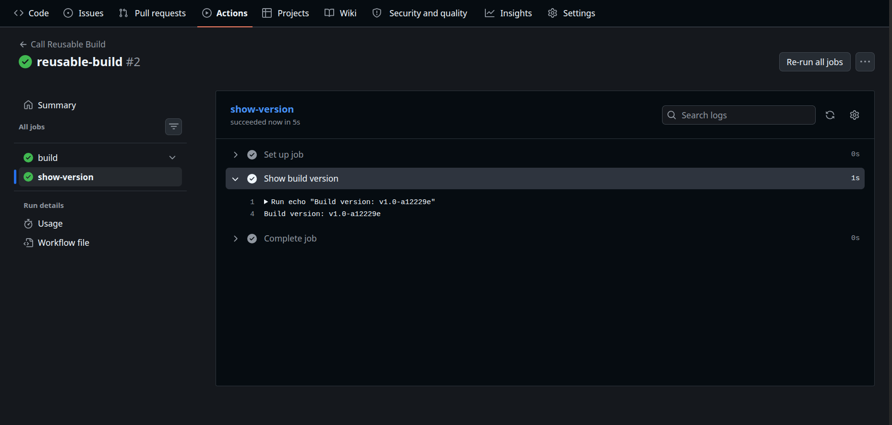
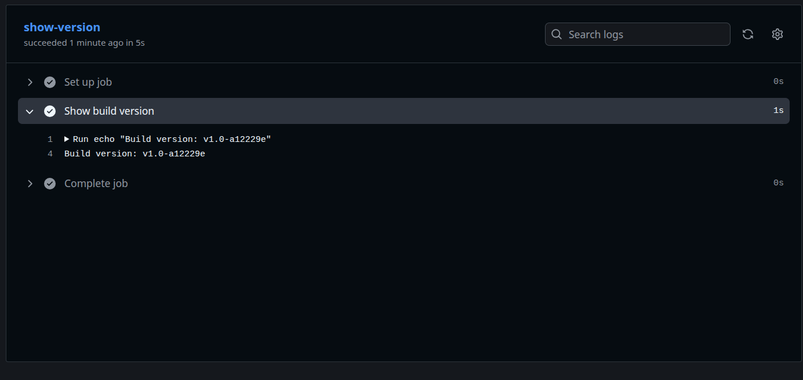
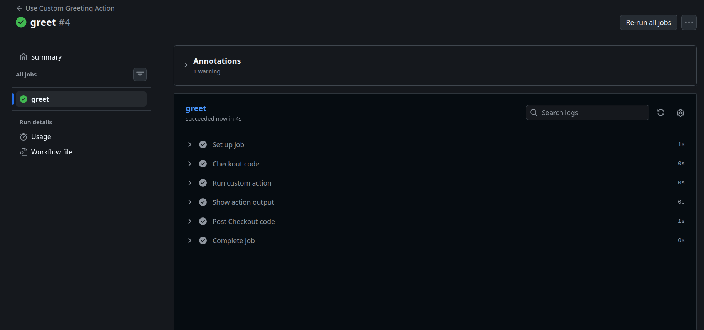

# Day 46 – Reusable Workflows & Composite Actions

## 1. What is a Reusable Workflow?

A reusable workflow is a GitHub Actions workflow that can be called and reused by other workflows.

It helps avoid writing the same jobs and steps again and again.

A reusable workflow uses:

```yaml
on:
  workflow_call:
```

---

## 2. What is `workflow_call`?

`workflow_call` allows one GitHub Actions workflow to call another workflow.

Example:

```yaml
on:
  workflow_call:
```

The called workflow can receive:

- Inputs
- Secrets
- Outputs

---

## 3. Reusable Workflow vs Regular Action

A reusable workflow is called as a **job**:

```yaml
jobs:
  build:
    uses: ./.github/workflows/reusable-build.yml
```

A regular or composite action is called inside a **step**:

```yaml
steps:
  - uses: ./.github/actions/setup-and-greet
```

Simple difference:

- Reusable workflow → reuses complete jobs/workflows
- Action → reuses steps

---

## 4. Where Does a Reusable Workflow Live?

A reusable workflow must be inside:

```text
.github/workflows/
```

Example:

```text
.github/
└── workflows/
    └── reusable-build.yml
```

---

# Task 2 – Reusable Workflow

File:

```text
.github/workflows/reusable-build.yml
```

```yaml
name: Reusable Build

on:
  workflow_call:
    inputs:
      app_name:
        description: "Application name"
        required: true
        type: string

      environment:
        description: "Deployment environment"
        required: true
        default: staging
        type: string

    secrets:
      docker_token:
        required: true

    outputs:
      build_version:
        description: "Generated build version"
        value: ${{ jobs.build.outputs.build_version }}

jobs:
  build:
    runs-on: ubuntu-latest

    outputs:
      build_version: ${{ steps.version.outputs.build_version }}

    steps:
      - name: Checkout code
        uses: actions/checkout@v4

      - name: Show build information
        run: |
          echo "Building ${{ inputs.app_name }} for ${{ inputs.environment }}"
          echo "Docker token is set: true"

      - name: Generate build version
        id: version
        run: |
          SHORT_SHA=$(git rev-parse --short HEAD)
          VERSION="v1.0-${SHORT_SHA}"

          echo "Build version: $VERSION"
          echo "build_version=$VERSION" >> "$GITHUB_OUTPUT"
```

> The Docker token is never printed. We only print that it is set.

---

# Task 3 – Caller Workflow

File:

```text
.github/workflows/call-build.yml
```

```yaml
name: Call Reusable Build

on:
  push:
    branches:
      - main

jobs:
  build:
    uses: ./.github/workflows/reusable-build.yml

    with:
      app_name: "my-web-app"
      environment: "production"

    secrets:
      docker_token: ${{ secrets.DOCKER_TOKEN }}

  show-version:
    needs: build
    runs-on: ubuntu-latest

    steps:
      - name: Show build version
        run: |
          echo "Build version: ${{ needs.build.outputs.build_version }}"
```

---
> 
---

### How It Works

```text
Push to main
     ↓
call-build.yml
     ↓
reusable-build.yml
     ↓
Checkout code
     ↓
Build information
     ↓
Generate version
     ↓
show-version job
     ↓
Print build version
```

---

# Task 4 – Workflow Output

The reusable workflow creates a version such as:

> 

The output flows like this:

```text
Step output
    ↓
Job output
    ↓
Workflow output
    ↓
Caller workflow
```

Important syntax:

```yaml
echo "build_version=$VERSION" >> "$GITHUB_OUTPUT"
```

Job output:

```yaml
outputs:
  build_version: ${{ steps.version.outputs.build_version }}
```

Workflow output:

```yaml
outputs:
  build_version:
    value: ${{ jobs.build.outputs.build_version }}
```

Caller reads it with:

```yaml
${{ needs.build.outputs.build_version }}
```

---

# Task 5 – Composite Action

Create:

```text
.github/actions/setup-and-greet/action.yml
```

```yaml
name: Setup and Greet
description: "Print a greeting, date and runner OS"

inputs:
  name:
    description: "Name to greet"
    required: true

  language:
    description: "Greeting language"
    required: false
    default: "en"

outputs:
  greeted:
    description: "Whether the greeting was printed"
    value: "true"

runs:
  using: "composite"

  steps:
    - name: Print greeting
      shell: bash
      run: |
        if [ "${{ inputs.language }}" = "hi" ]; then
          echo "Namaste ${{ inputs.name }}!"
        elif [ "${{ inputs.language }}" = "es" ]; then
          echo "Hola ${{ inputs.name }}!"
        else
          echo "Hello ${{ inputs.name }}!"
        fi

    - name: Print date and runner OS
      shell: bash
      run: |
        echo "Current date: $(date)"
        echo "Runner OS: $RUNNER_OS"
```


---

# Workflow Using the Composite Action

Create:

```text
.github/workflows/use-greeting.yml
```

```yaml
name: Use Custom Greeting Action

on:
  workflow_call:

jobs:
  greet:
    runs-on: ubuntu-latest

    steps:
      - name: Checkout code
        uses: actions/checkout@v4

      - name: Run custom action
        id: greeting
        uses: ./.github/actions/setup-and-greet
        with:
          name: "Meraj"
          language: "en"

      - name: Show action output
        run: |
          echo "Greeted: ${{ steps.greeting.outputs.greeted }}"
```
> 

---

# Task 6 – Reusable Workflow vs Composite Action

| Feature | Reusable Workflow | Composite Action |
|---|---|---|
| Triggered by | `workflow_call` | `uses:` in a step |
| Can contain jobs? | Yes | No |
| Can contain multiple steps? | Yes | Yes |
| Lives where? | `.github/workflows/` | Usually `.github/actions/setup-and-greet/action.yml` |
| Can accept secrets directly? | Yes, through `workflow_call` | Not directly as workflow secrets; pass values as inputs when appropriate |
| Best for | Reusing complete jobs/workflows | Reusing a group of steps |

---