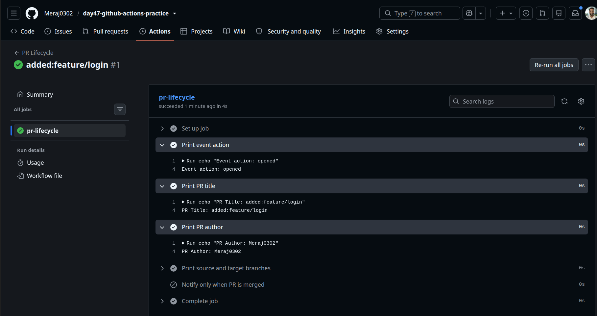
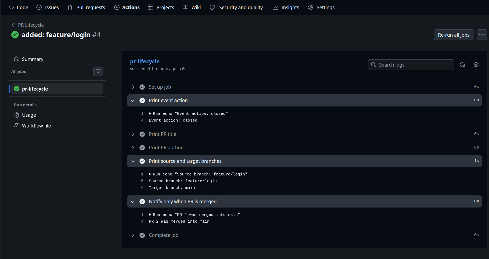
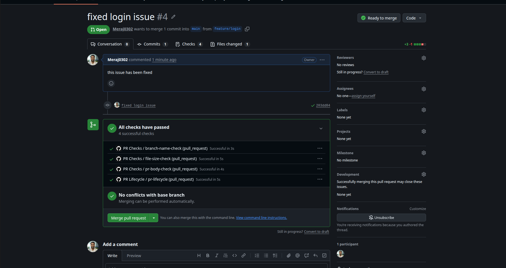
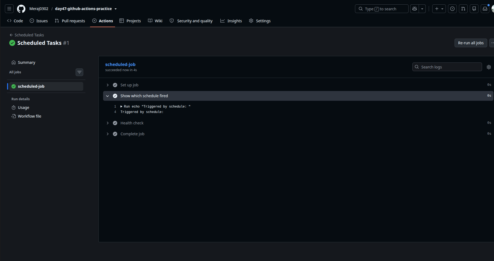
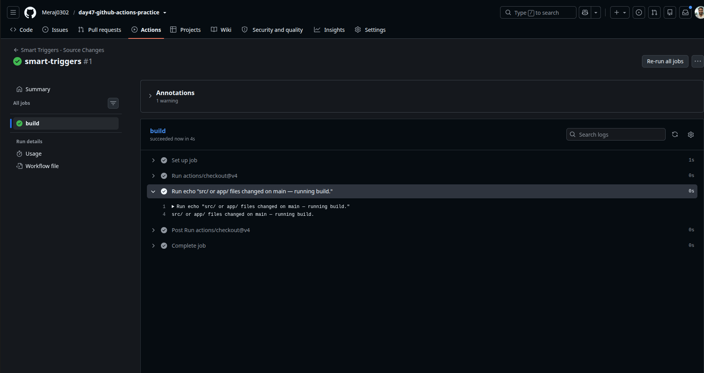
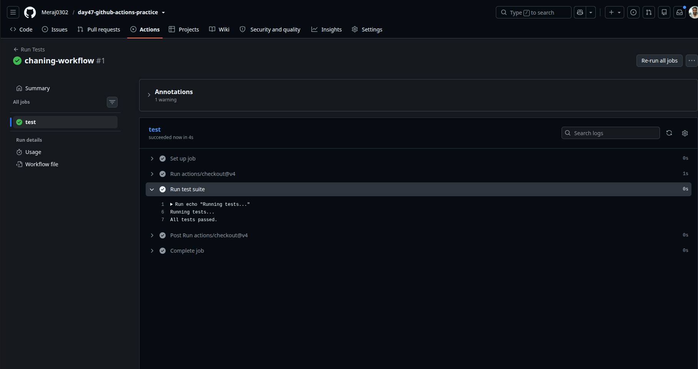
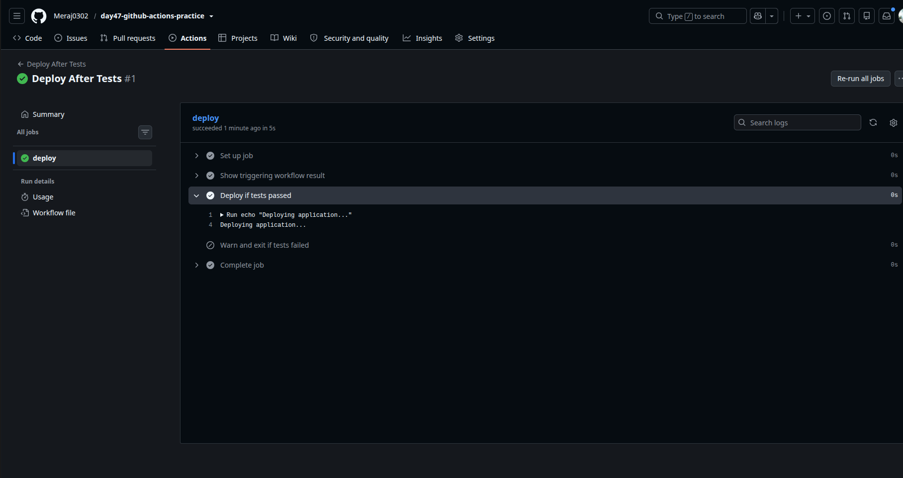

# Day 47 – Advanced Triggers: PR Events, Cron Schedules & Event-Driven Pipelines

---

## Task 1: Pull Request Event Types — `pr-lifecycle.yml`

```yaml
name: PR Lifecycle

on:
  pull_request:
    types: [opened, synchronize, reopened, closed]

jobs:
  pr-lifecycle:
    runs-on: ubuntu-latest
    steps:
      - name: Print event action
        run: echo "Event action: ${{ github.event.action }}"

      - name: Print PR title
        run: echo "PR Title: ${{ github.event.pull_request.title }}"

      - name: Print PR author
        run: echo "PR Author: ${{ github.event.pull_request.user.login }}"

      - name: Print source and target branches
        run: |
          echo "Source branch: ${{ github.event.pull_request.head.ref }}"
          echo "Target branch: ${{ github.event.pull_request.base.ref }}"

      - name: Notify only when PR is merged
        if: github.event.action == 'closed' && github.event.pull_request.merged == true
        run: echo "PR #${{ github.event.pull_request.number }} was merged into ${{ github.event.pull_request.base.ref }}"
```

**How it behaves:** `opened`, `synchronize` (new commits pushed), `reopened`, and
`closed` all fire this workflow with a different `github.event.action` each time.
The merge-notification step only runs when the PR was actually merged, not just closed —
that's the difference between `action == 'closed'` and `pull_request.merged == true`.

---

PR-Opend:
> 

---

PR-Closed
> 

---

## Task 2: PR Validation Workflow — `pr-checks.yml`

```yaml
name: PR Checks

on:
  pull_request:
    branches: [main]

jobs:
  file-size-check:
    runs-on: ubuntu-latest
    steps:
      - uses: actions/checkout@v4

      - name: Fail if any file exceeds 1MB
        run: |
          MAX_SIZE=1048576
          large_files=$(find . -type f -not -path "./.git/*" -size +${MAX_SIZE}c)
          if [ -n "$large_files" ]; then
            echo "The following files exceed 1MB:"
            echo "$large_files"
            exit 1
          else
            echo "All files are within the size limit."
          fi

  branch-name-check:
    runs-on: ubuntu-latest
    steps:
      - name: Validate branch naming convention
        run: |
          BRANCH="${{ github.head_ref }}"
          echo "Checking branch: $BRANCH"
          if [[ "$BRANCH" =~ ^feature/.+ ]] || [[ "$BRANCH" =~ ^fix/.+ ]] || [[ "$BRANCH" =~ ^docs/.+ ]]; then
            echo "Branch name follows convention."
          else
            echo "Branch name '$BRANCH' does not match feature/*, fix/*, or docs/*"
            exit 1
          fi

  pr-body-check:
    runs-on: ubuntu-latest
    steps:
      - name: Warn if PR description is empty
        run: |
          BODY="${{ github.event.pull_request.body }}"
          if [ -z "$BODY" ]; then
            echo "::warning::PR description is empty. Consider adding context for reviewers."
          else
            echo "PR description present."
          fi
```

---

> 

---

**Verification:** opening a PR from a branch like `random-branch` (not matching
`feature/*`, `fix/*`, or `docs/*`) makes `branch-name-check` fail red in the
PR's checks tab, while `pr-body-check` only shows a yellow warning annotation
and still passes — that's the difference between `exit 1` (hard fail) and
`::warning::` (soft warning).

---

## Task 3: Scheduled Workflows — `scheduled-tasks.yml`

```yaml
name: Scheduled Tasks

on:
  schedule:
    - cron: '30 19 * * 1'
    - cron: '0 */6 * * *'
  workflow_dispatch:        

jobs:
  scheduled-job:
    runs-on: ubuntu-latest
    steps:
      - name: Show which schedule fired
        run: echo "Triggered by schedule: ${{ github.event.schedule }}"

      - name: Health check
        run: |
          STATUS=$(curl -s -o /dev/null -w "%{http_code}" https://api.github.com)
          echo "Health check response code: $STATUS"
          if [ "$STATUS" -ne 200 ]; then
            echo "Health check failed with status $STATUS"
            exit 1
          fi
          echo "Health check passed."
```

---

> 

---


### Why scheduled workflows may be delayed or skipped on inactive repos

- GitHub **automatically disables scheduled workflows after 60 days of no repository
  activity** (no pushes/commits). You'd need to manually re-enable the workflow from
  the Actions tab, or push a commit to reactivate it.
- Even on active repos, `schedule` runs are **best-effort, not guaranteed**. Cron jobs
  are queued onto shared GitHub-hosted runner capacity, and during periods of high
  platform load the job can start several minutes late — GitHub explicitly documents
  that high-frequency schedules are the most likely to be delayed or dropped.
- Scheduled workflows **only run off the default branch** of the repo, so a schedule
  defined only on a feature branch will never fire.

---

## Task 4: Path & Branch Filters

### `smart-triggers.yml` — only run when `src/` or `app/` changes

```yaml
name: Smart Triggers - Source Changes

on:
  push:
    branches:
      - main
      - 'release/**'
    paths:
      - 'src/**'
      - 'app/**'

jobs:
  build:
    runs-on: ubuntu-latest
    steps:
      - uses: actions/checkout@v4
      - run: echo "src/ or app/ files changed on ${{ github.ref_name }} — running build."
```

> 

### `skip-docs-only.yml` — skip when only docs change

```yaml
name: Skip Docs-Only Changes

on:
  push:
    branches:
      - main
      - 'release/**'
    paths-ignore:
      - '**/*.md'
      - 'docs/**'

jobs:
  build:
    runs-on: ubuntu-latest
    steps:
      - uses: actions/checkout@v4
      - run: echo "Non-docs files changed on ${{ github.ref_name }} — running build."
```

**Test result:** pushing a change to only a `.md` file causes GitHub to skip
`skip-docs-only.yml` entirely — it won't even show up as a "skipped" run in some
UI views because path-filtered pushes with no matching files don't queue a run
at all in many cases (or show as skipped, depending on required-checks config).

### `paths` vs `paths-ignore` — when to use which

- Use **`paths`** (an allow-list) when only a small, well-defined part of the repo
  should trigger CI — e.g. a monorepo where `src/` or `app/` are the only things
  that affect the build. It's explicit and safe: nothing new can accidentally
  trigger the workflow unless you add it to the list.
- Use **`paths-ignore`** (a deny-list) when almost everything in the repo should
  trigger the workflow except a short, well-known set of exclusions — e.g. "run on
  every change except docs and markdown." It's less maintenance when the "ignore"
  list is short and the "include" list would otherwise be long or hard to predict.
- You **cannot use both `paths` and `paths-ignore` in the same trigger block** —
  GitHub will error. Pick whichever framing keeps the filter smaller/simpler for
  your repo's structure.

---

## Task 5: `workflow_run` — Chaining Workflows Together

### `tests.yml`

```yaml
name: Run Tests

on:
  push:
    branches: [main]

jobs:
  test:
    runs-on: ubuntu-latest
    steps:
      - uses: actions/checkout@v4
      - name: Run test suite
        run: |
          echo "Running tests..."
          # Replace with your real test command, e.g. npm test / pytest
          echo "All tests passed."
```
---
> 
---

### `deploy-after-tests.yml`

```yaml
name: Deploy After Tests

on:
  workflow_run:
    workflows: ["Run Tests"]
    types: [completed]

jobs:
  deploy:
    runs-on: ubuntu-latest
    steps:
      - name: Show triggering workflow result
        run: |
          echo "Triggering workflow: ${{ github.event.workflow_run.name }}"
          echo "Conclusion: ${{ github.event.workflow_run.conclusion }}"

      - name: Deploy if tests passed
        if: github.event.workflow_run.conclusion == 'success'
        run: echo "Deploying application..."

      - name: Warn and exit if tests failed
        if: github.event.workflow_run.conclusion != 'success'
        run: |
          echo "Tests did not succeed (conclusion: ${{ github.event.workflow_run.conclusion }}). Skipping deploy."
          exit 1
```
---

> 

---

## Task 6: `repository_dispatch` — External Event Triggers

### `external-trigger.yml`

```yaml
name: External Trigger

on:
  repository_dispatch:
    types: [deploy-request]

jobs:
  handle-dispatch:
    runs-on: ubuntu-latest
    steps:
      - name: Print client payload
        run: echo "Deploy environment requested: ${{ github.event.client_payload.environment }}"
```

### Firing it manually

```bash
gh api repos/<owner>/<repo>/dispatches \
  -f event_type=deploy-request \
  -f client_payload='{"environment":"production"}'
```

`repository_dispatch` requires a **personal access token with `repo` scope**
(the default `GITHUB_TOKEN` cannot fire this event) — either export it via
`gh auth login` or set `GH_TOKEN` before running the `gh` command above.

### When would an external system trigger a pipeline?

- A **Slack/Teams bot** where a teammate types `/deploy production` and the bot
  calls the dispatch API instead of anyone touching the GitHub UI.
- A **monitoring/alerting tool** (e.g. Datadog, PagerDuty) that automatically
  triggers a rollback workflow when an error-rate or latency alert fires.
- A **CMS or headless commerce platform** that fires a rebuild/redeploy pipeline
  whenever content editors publish new content, without needing a Git push.
- **Cross-repo orchestration** — a "release train" repo that, once its own build
  passes, dispatches events to several downstream repos to kick off their deploys
  in sequence.
- A **ChatOps or ticketing system** (Jira, ServiceNow) that triggers a CI run
  automatically when a ticket moves to "Ready for Deploy."

---